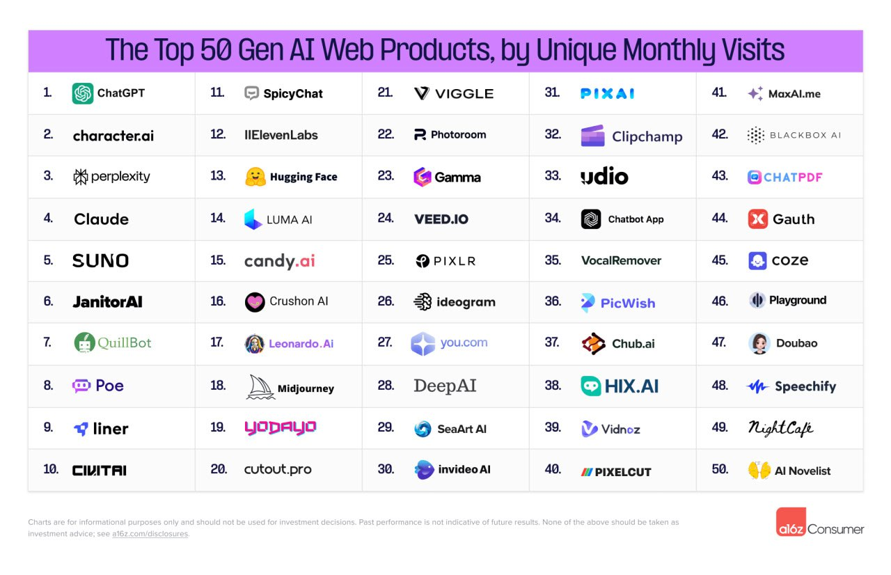

- https://www.reddit.com/r/LocalLLaMA/comments/1eyc2ah/deepseekv2_creates_massive_improvements_in_code/
- [[ai studio from HP]] [Installing & Uninstalling AI Studio | Z by HP AI & Data Science Solutions](https://zdocs.datascience.hp.com/docs/aistudio/setup/installation)
- [Ideogram on X: "Introducing Ideogram 2.0 — our most advanced text-to-image model, now available to all users for free. Today’s milestone launch also includes the release of the Ideogram iOS app, the beta version of the Ideogram API, and Ideogram Search. Here’s what’s new… 🧵 https://t.co/nvD0ogRh2J" / X](https://x.com/ideogram_ai/status/1826277550798278804)
- https://arxiv.org/abs/2408.10774
- [Implement Claude Artifacts Functionality in Web Interface · open-webui/open-webui · Discussion #3487 (github.com)](https://github.com/open-webui/open-webui/discussions/3487) [[Anthropic Claude]] [[Open Webui and Pipelines]]
- [Alex Albert on X: "We just released two new resources for learning prompt engineering. 1. An interactive intro to prompting tutorial for people just getting started with Claude 2. A real-world prompting course for developers building on the Anthropic API Here's what they cover: https://t.co/juIAlC6XLd" / X](https://x.com/alexalbert__/status/1826319786009387496) [[Prompt Engineering]] [[Courses and Training]]
- [The Jamba 1.5 Open Model Family: The Most Powerful and Efficient Long Context Models (ai21.com)](https://www.ai21.com/blog/announcing-jamba-model-family) [[State Space and Other Approaches]]
  id:: 66c7082c-df3a-4d3b-9eda-3bbc2df0c9f7
- https://cosine.sh [[Coding support]]
- 
-
-