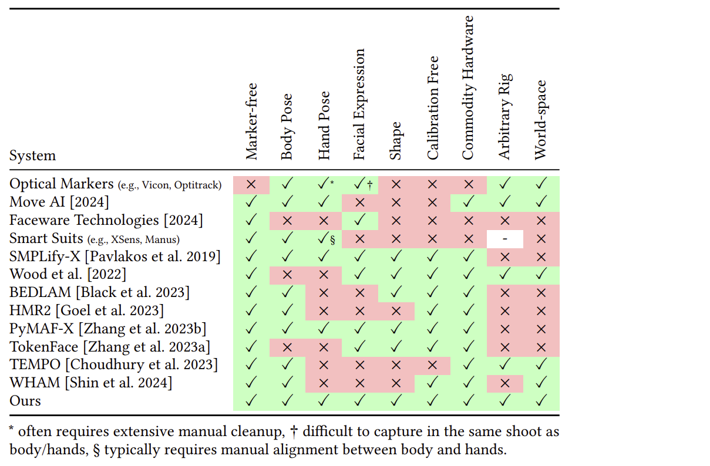

- [(3) Samsung Galaxy Watch 6 | XDA Forums](https://xdaforums.com/f/samsung-galaxy-watch-6.12793/) [[watch]]
- TODO Contact Shay for a [[ComfyUI]] chat [Shay Moradi | LinkedIn](https://www.linkedin.com/in/organised/) [[Projects]]
- [[2410.03017] Tutor CoPilot: A Human-AI Approach for Scaling Real-Time Expertise](https://arxiv.org/abs/2410.03017) [[Education and AI]]
	- [Rose E. Wang | Home](https://rosewang2008.github.io/)
- [Look Ma, no markers](https://microsoft.github.io/SynthMoCap/) [[Human tracking and SLAM capture]]
	- 
- https://www.nytimes.com/2024/10/17/opinion/economy-us-aging-work-force-ai.html [[Social contract and jobs]] [[Convergence]] [[Disruption]]
- https://www.nytimes.com/2024/10/17/opinion/economy-us-aging-work-force-ai.html
- ComfyUI Now Supports Stable Diffusion 3.5! https://blog.comfy.org/sd3-5-comfyui/