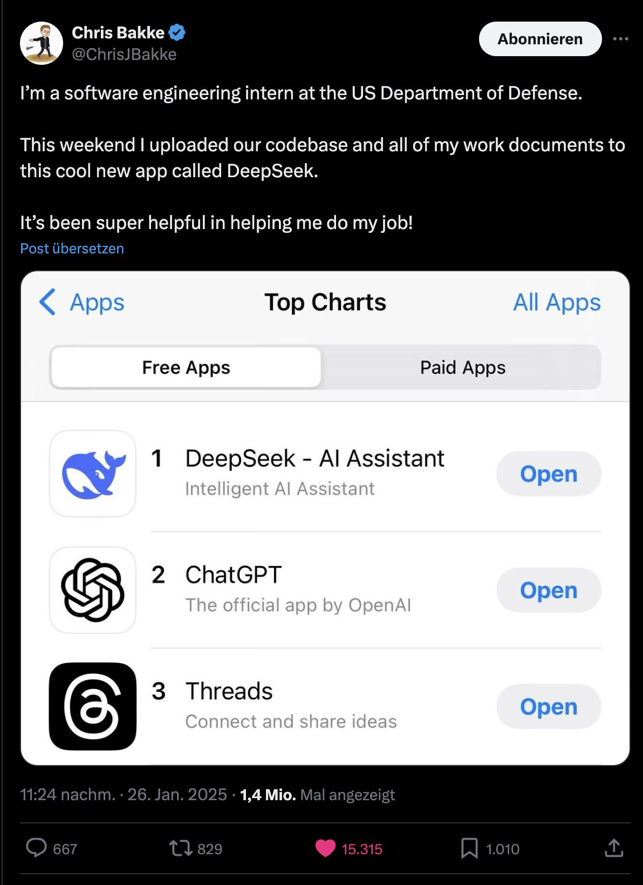

- Qwen/Qwen2.5-VL-72B-Instruct · Hugging Face https://huggingface.co/Qwen/Qwen2.5-VL-72B-Instruct
- Flux LORA Inventory and Model Tester - Google Drive https://docs.google.com/spreadsheets/d/1543rZ6hqXxtPwa2PufNVMhQzSxvMY55DMhQTH81P8iM/htmlview#
- Ollama https://ollama.com/search?o=newest&q=qwen+coder++clne [[Coding support]] [[Roo Cline]]
- FuseAI/FuseO1-DeepSeekR1-Qwen2.5-Coder-32B-Preview · Hugging Face https://huggingface.co/FuseAI/FuseO1-DeepSeekR1-Qwen2.5-Coder-32B-Preview [[Coding support]]
- GitHub - rendercv/rendercv: The engine of the RenderCV App https://github.com/rendercv/rendercv [[LaTeX]]
- GitHub - babycommando/entity-db: EntityDB is an in-browser vector database wrapping indexedDB and Transformers.js over WebAssembly https://github.com/babycommando/entity-db [[Client side DCO]] [[Projects]] [[WebDev and Consumer Tooling]]
- The race for "AI Supremacy" is over — at least for now. https://garymarcus.substack.com/p/the-race-for-ai-supremacy-is-over
- GitHub - zhenye234/LLaSA_training: LLaSA: Scaling Train-time and Test-time Compute for LLaMA-based Speech Synthesis https://github.com/zhenye234/LLaSA_training
- [Raskoll2/LLMcalc: A tool to determine whether or not your PC can run a given LLM](https://github.com/Raskoll2/LLMcalc) [[Ollama]]
- [LibriVox | free public domain audiobooks](https://librivox.org/) [[Voice]] [[Training and fine tuning]]
- [[Deepseek]] 
- [DeepSeek FAQ – Stratechery by Ben Thompson](https://stratechery.com/2025/deepseek-faq/) [[Deepseek]]
- [SnowCait/restr: Nostr REST API proxy](https://github.com/SnowCait/restr) [[Nostr protocol]] [[WebDev and Consumer Tooling]]
- [deepseek-ai/Janus-Pro-7B · Hugging Face](https://huggingface.co/deepseek-ai/Janus-Pro-7B) [[Deepseek]] [[Multimodal]] [[Image Generation]]
- [Run DeepSeek-R1 Dynamic 1.58-bit](https://unsloth.ai/blog/deepseekr1-dynamic) [[Deepseek]] [[Model Optimisation and Performance]]
-
