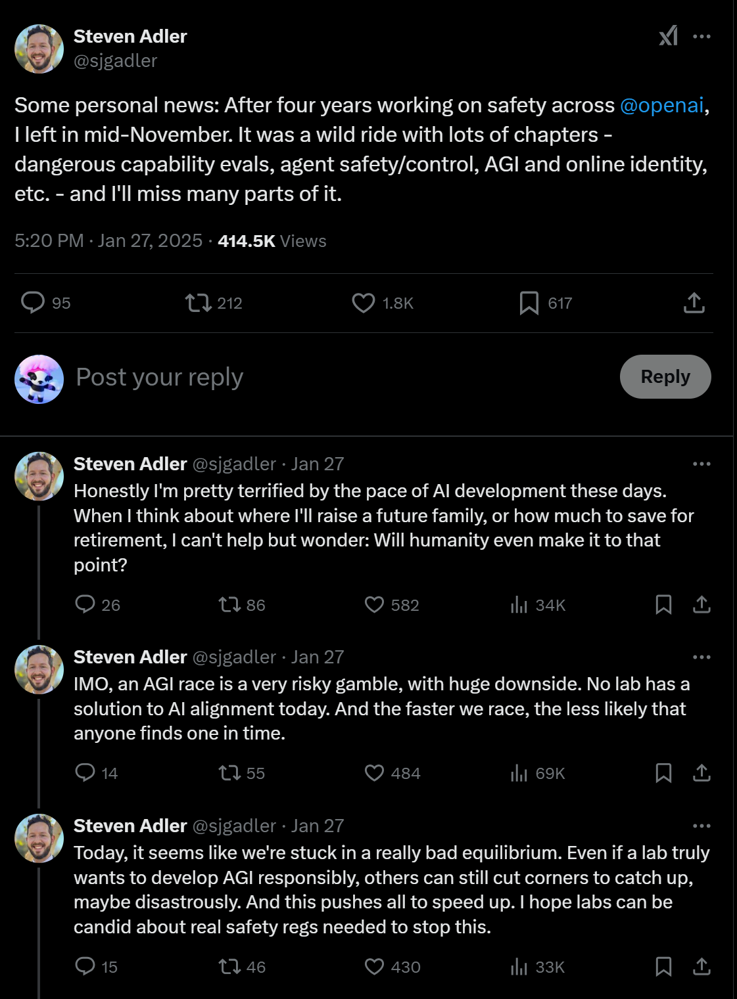

- 
- [Deepseek R1 vs OpenAI o1 - DEV Community](https://dev.to/maximsaplin/deepseek-r1-vs-openai-o1-1ijm) [[Reasoning]] [[OpenAI]] [[Deepseek]]
- [Smithery - Model Context Protocol Registry](https://smithery.ai/) [[Model Control Protocols like MCP]]
- [Bias Unlearning of DeepSeek-R1](https://www.hirundo.io/blog/deepseek-r1-debiased) [[0378 Algorithmic Bias]] [[AI Risk]] [[Safety and alignment]]
- DONE [[Coding support]]  ext:Codium.codium [[VSCode]] [[Deepseek]]
- [Min Choi on X: "1. DeepSeek R1 is the best model you can use in VS Code https://t.co/4fsoTnUt5F" / X](https://x.com/minchoi/status/1884255090292449298) [[Deepseek]] [[Coding support]]
- https://open.spotify.com/episode/56UjKdc6vwHGdOqrU8liqM?si=K-slMWiUT8uFXukAw6eqpQ
- https://goblin.tools/Formalizer
- GitHub - Upsonic/Upsonic: Task oriented AI agent framework for digital workers and vertical AI agents https://github.com/Upsonic/Upsonic
-