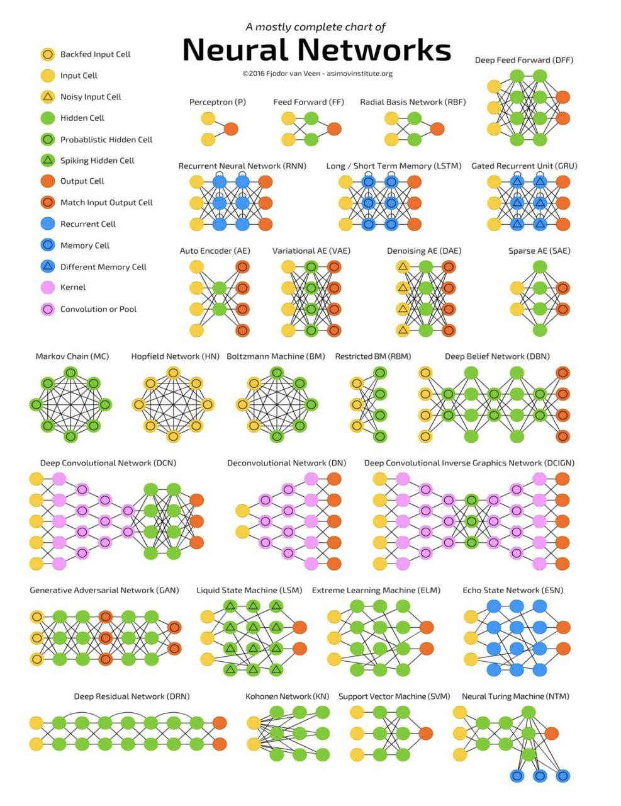

- [[Neural Networks]]
	- 
- codename goose | codename goose https://block.github.io/goose/
-
- Lora photoshoot - what to do? : r/StableDiffusion https://www.reddit.com/r/StableDiffusion/comments/1iggv97/lora_photoshoot_what_to_do/
-
- GitHub - AeroScripts/leapfusion-hunyuan-image2video: A novel approach to hunyuan image-to-video sampling https://github.com/AeroScripts/leapfusion-hunyuan-image2video
-
- https://github.com/matsuoka-601/waterball
- Artists
	- licensee music
	- reactive visuals
		- unity
		- unreal
- Music streaming into games
	- pre hack audio production
	- audio plus engineer smash
	- hyper personalisation to provide local context for global verticals
- {{video https://www.youtube.com/watch?v=xoStajFfrBk}} [[Coding support]]
-