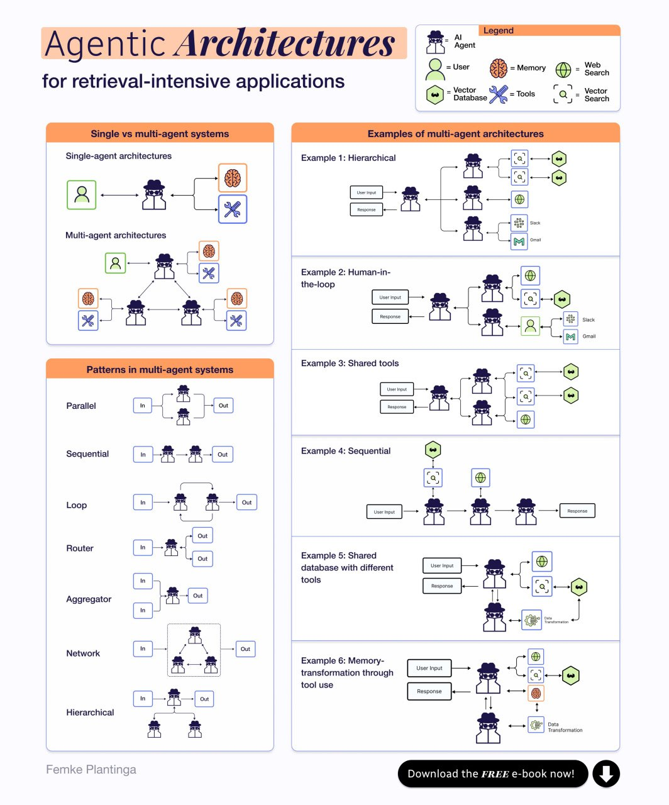

- [Instructional Writeup: How to Make LLMs Reason Deep and Build Entire Projects : r/LocalLLaMA](https://www.reddit.com/r/LocalLLaMA/comments/1jbgwly/instructional_writeup_how_to_make_llms_reason/) [[Reasoning]] [[Coding support]]
	- [justinlietz93/breakthrough_generator: Generates breakthrough ideas from a single prompt through an 8 stage walkthrough, with optional research proposal paper.](https://github.com/justinlietz93/breakthrough_generator) [[Prompt Engineering]]
- [Aman's AI Journal • Primers • Agents](https://aman.ai/primers/ai/agents/) [[AI Agent System]] [[Courses and Training]]
- [Dramatically enhance the quality of Wan 2.1 using skip layer guidance : r/StableDiffusion](https://www.reddit.com/r/StableDiffusion/comments/1jac3wm/dramatically_enhance_the_quality_of_wan_21_using/) [[ComfyUI]] [[Wan Video]]
-
-   [[AI Agent System]] [[AI Agent System]]
  - Pika Released 16 New Effects Yesterday. I Just Open-Sourced All Of Them. (Wan 2.1 I2V Workflow included) : r/StableDiffusion https://www.reddit.com/r/StableDiffusion/comments/1jbjsmk/pika_released_16_new_effects_yesterday_i_just/
- IntellAgent - The multi-agent framework to evaluate your conversational agents https://diamantai.substack.com/p/intellagent-the-multi-agent-framework?
- -