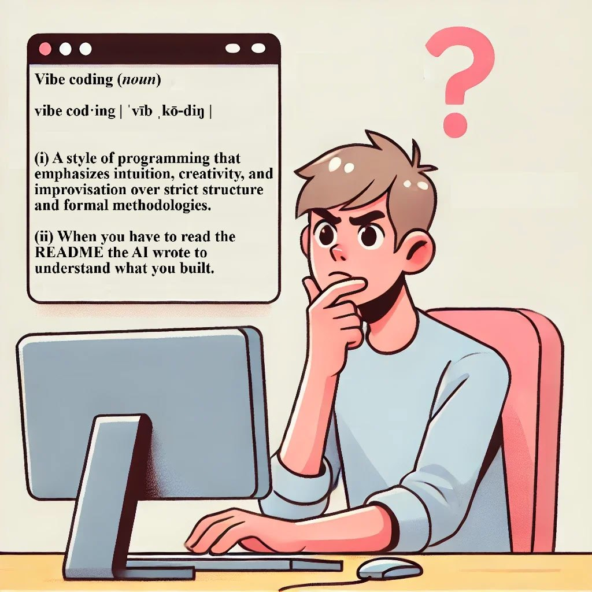

- 
	- assets://wsl.localhost/Ubuntu/home/john/github/logseq/mainKnowledgeGraph/assets/image_1742486016652_0.png
- 
- [[TODO]] national insurANCE GAP [[personal accounts]]
	-
	- ## How to contact the Future Pension Centre
		- Spoke to Thomas at the Future Pension Centre. They can give you more information about your State Pension and filling gaps in your National Insurance record.
		- Telephone: 0800 731 0175
		- 650 gbp to fill, would be beneficial
		- Recommended HMRC helpline 03002003500 - class 2 future pension
		  
		  Hi, Thomas on the future pensions line has said that it would be beneficial for me to pay my 650 ish gap for 23/24 and that I should contact HMRC. I keep getting disconnected from the help-line. He recommended that I ask about class 2 repayment. My NI number is **JB315079D** John Joseph O'Hare 13/09/1974 - 53 barton road, m32 9fa
		-
	-
- [[2501.11433] One Does Not Simply Meme Alone: Evaluating Co-Creativity Between LLMs and Humans in the Generation of Humor](https://arxiv.org/abs/2501.11433)
- https://github.com/canopyai/orpheus-tts
- Wan 2.1 - From 40min to ~10 min per gen. Still experimenting how to get speed down without totally killing quality. Details in video. : r/StableDiffusion https://www.reddit.com/r/StableDiffusion/comments/1jfkjoc/wan_21_from_40min_to_10_min_per_gen_still/
- Understanding RAG Part VIII: Mitigating Hallucinations in RAG - MachineLearningMastery.com https://machinelearningmastery.com/understanding-rag-part-viii-mitigating-hallucinations-in-rag/