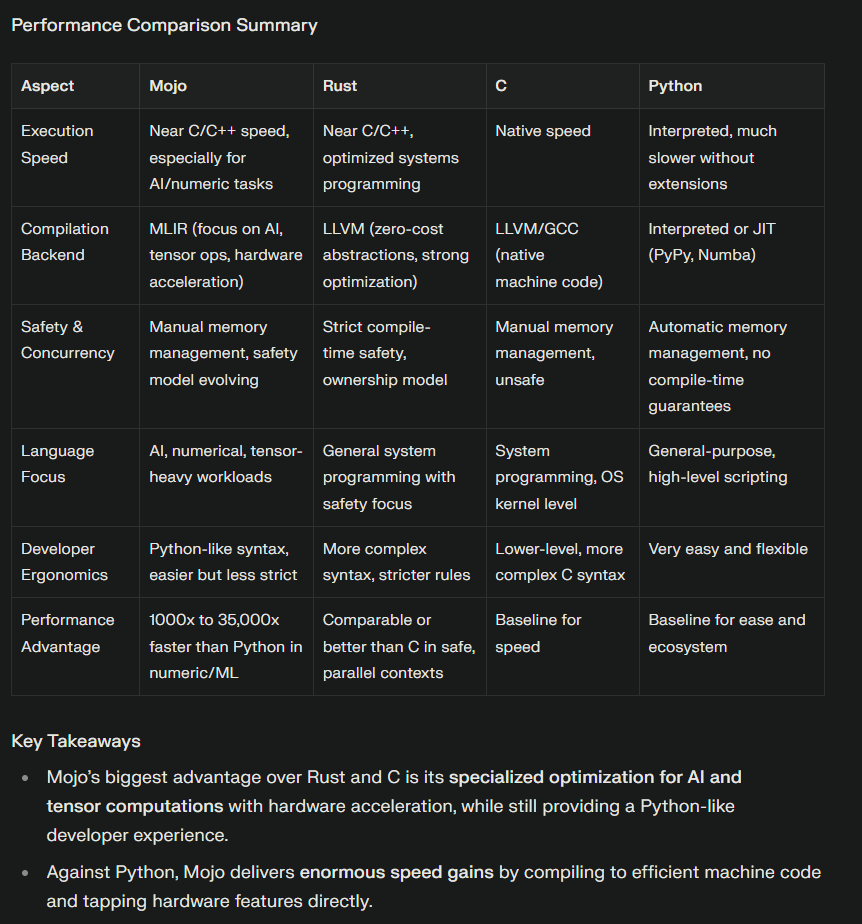

- [How the internet and its bots are sabotaging scientific research](https://theconversation.com/how-the-internet-and-its-bots-are-sabotaging-scientific-research-261796) [[Death of the Internet]]
- [tekaratzas/RustGPT: An transformer based LLM. Written completely in Rust](https://github.com/tekaratzas/RustGPT) [[Rust]] [[Transformers]]
- [MLC LLM | Home](https://llm.mlc.ai/)
- 
- https://www.munduscreatus.be/nanolook-available-now
- https://www.mckinsey.com/industries/financial-services/our-insights/extracting-value-from-ai-in-banking-rewiring-the-enterprise#/
- https://www.web3isgoinggreat.com/
- TODO https://open.spotify.com/episode/1QU7f8LMVh0010GWneKQd5? [[Context Window]]
- https://arxiv.org/abs/2505.03275
- Lionagi again
- {{video https://youtu.be/-KTxDretpMA?feature=shared}}
-