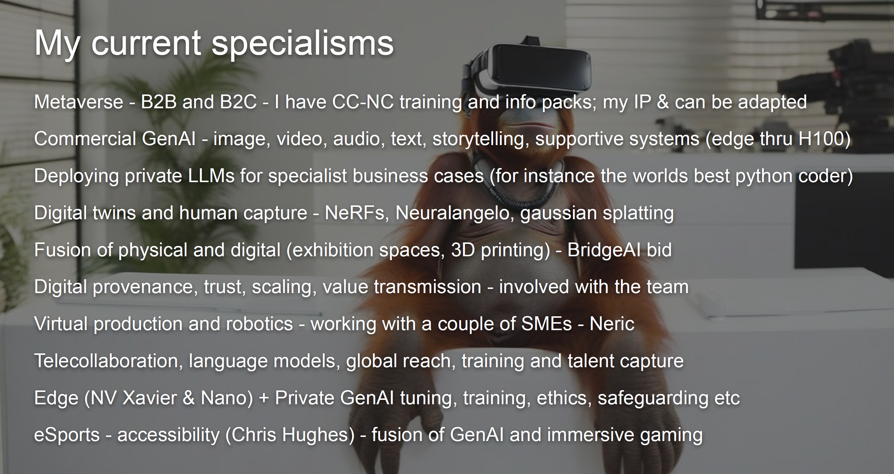
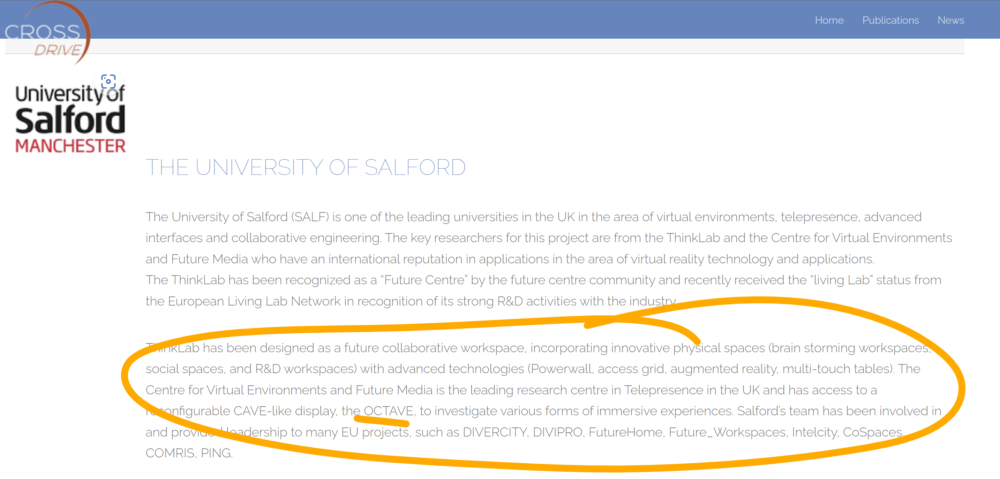
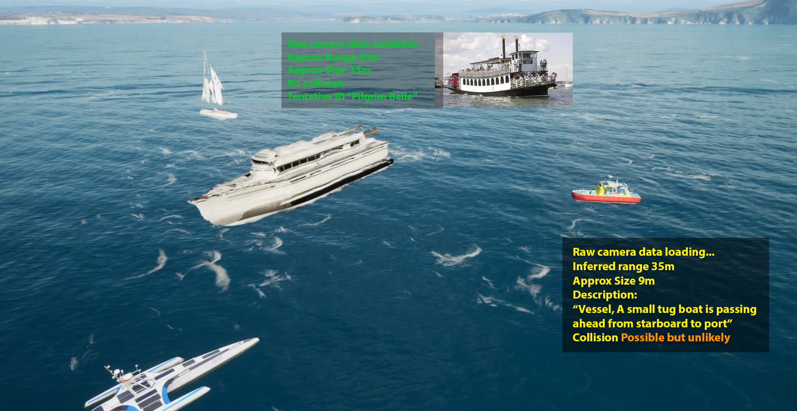
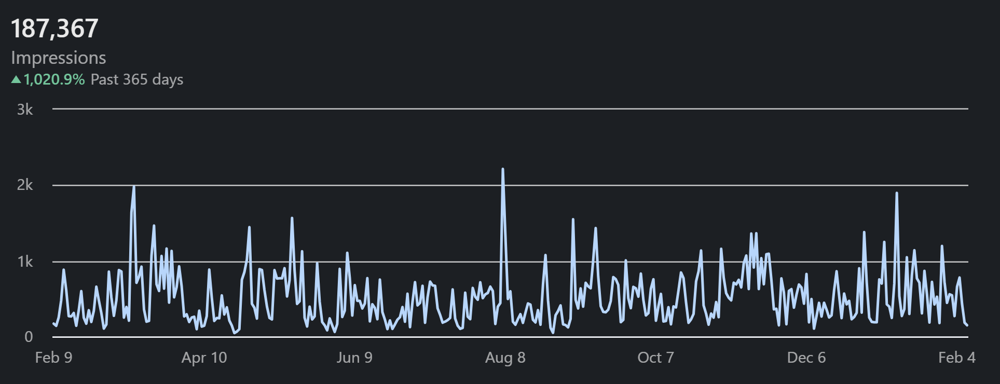

- ## Legacy Slides
	- .#.v-gallery-col2
		- 
		- 
		- 
		- 
-
- ## Research and Development Leadership:
	- Over 15 years aligning technology roadmaps to strategic priorities across academic, government, and industry partners.
	- Proven leader in securing bids and instrumental in driving innovative projects forward​​.
	- ## Key strengths include:
		- Spatial Computing and Immersive Platforms:
		- Designed and operated multimillion pound mixed reality labs and visualisation systems at global research university.
		- Technical authority on telepresence, distributed VR/AR, and novel display topologies.
		- Machine Learning in Extended Reality:
		- Currently research and development on [[Hyper personalisation]] for [[Knowhere]] with funding and industrial partners.
		- Recently integrating AI/ML into virtual production, mobile headsets, and persistent metaverse environments under [[flossverse]] .
		- Deployed chatbot product with thousands of users.
		- Expertise across datasets, neural rendering, NLP, and generative media synthesis.
		- Open and Decentralised Systems: Founder of open source metaverse framework.
		- Built on secure infrastructure enabling frictionless collaboration for distributed teams.
		- Advocate for ethical, inclusive frameworks governing technology’s impact on society.
		- Research and Development Leadership:
		- 15+ years aligning technology roadmaps to strategic priorities across academic, government, and industry partners.
		- Proven bid leader instrumental in securing Multi million GBP in competitive grant funding.
		- Team Building and Management:
		- Supervised diverse technical teams driving complex enterprise initiatives crossing organisational boundaries.
		- Empathetic people manager focused on autonomy, innovation, mutual trust and respect.
		- I lead with radical candor and transparency, valuing open, honest communication to foster a culture of respect.
		- The key thread of trust has been a pillar of my research for over a decade.
		- I am a strong advocate for my team, fostering an environment where taking risks and innovating is encouraged.
		- Trust is central; I recruit and delegate effectively, promoting autonomy.
		- I am clear that I welcome feedback, and open to criticism.
		- Agility in decision-making is key;
		- I pivot strategies swiftly to stay attuned to industry changes.
		- This assertiveness is balanced through clear explanations, aligning the team with our shared vision and objectives, using stripped down OKR.
		- I believe I have a compelling vision, and this will guide R&D direction within the business constraints.
	- ## Key Project (KnoWhere)
	- [[Knowhere]] is Hyper Personal for [[Location Based Experience]]. It tracks human emotion and attention, and presents different sound and vision to individuals in a semi-public space.
	- ## Vision Alignment
		- We already see AI assisting in creating art, music, and literature, but it will increasingly be capable of original creative thought, potentially leading to a renaissance of human/AI-generated creativity that will reshape our cultural landscape. Another exciting prospect is the development of Diverse AI. Just as human diversity is celebrated, AI will be designed with diverse "personalities" and ways of thinking, leading to a richer and more nuanced interaction between humans and AI. This may especially be felt in neurodiverse communities for instance.
		- We will very likely soon see the beginnings a bifurcation between highly moderated (ethics & safeguarding based AI) vs slightly less capable but more disruptive open solutions. There will be a strong imperative to ensure the responsible use of AI as its influence grows, and this will be patchy. It will require a focus on developing robust ethical frameworks for AI use, and creating ambient educational environments where learning is responsibly facilitated by AI. Many will work around this, and it remains to be seen what effect this will have. It is useful to prepare for divergent outcomes in developed and highly networked nations vs nations which use slower less capable inferencing on local models like [[Gemini]] Nano and similar.
		- In this phase, AI will become more integrated into our biological lives and our everyday environments.  The best can be extracted from both approaches by taking control of more flexible AI, defining risks and guard rails locally, and internalising the knowledge for the task at hand. It is more expensive, but the only path to differentiation. This is a very strong fit for contained destinations.
		- During and after this we will see the emergence of fully autonomous agent, where AI will become so advanced and reliable that it can operate without human supervision in various sectors, leading to unprecedented levels of productivity and efficiency. Where companies, institutions, governments, and individuals have taken a choice to develop and foster their own AI capabilities, with their own rules, this boundary layer to the wider agent world will have to be very carefully designed.
		- Another exciting aspect of this phase is the intersection of AI and Mental Health. AI companions will be capable of understanding human emotions and mental states, providing psychological support and therapeutic interventions. They could assist in managing mental health conditions and improving overall well-being. These personal mental health agents are a critical nexus for data privacy, and again, the boundary layer must be exquisitely managed.
		- There is an opportunity here for AI systems that are designed to understand, respect, and adapt to a wide range of human experiences, perspectives, and identities, mediating those boundaries as we see a degradation of trust in objective fact in digital society. They may help us to better understand ourselves and each other, breaking down barriers and fostering a more inclusive society wherever people choose to meet. Furthermore, by acknowledging the unique forms of intelligence exhibited by AI, we can redefine what intelligence means in a diverse society. It may be confusing, but it need not be emotionally violent or intrinsically divisive.
		- I believe that not enough attention is being paid to democratising AI resources, and lowering the marginal cost of education to zero globally, AI will play a pivotal role in reducing socio-economic disparities. This will happen naturally over time, but the incumbent and productive nations have a responsibility not to gatekeep this as they have with other technologies. It's crucial to ensure that AI advancements are distributed equitably and don't reinforce existing social inequities, and indeed failure to do so could lead to globally significant negative outcomes. Supportive AI education should start young and include playful, memorable, learning experiences. AI education engines should foster independence and trust in children by providing private, magical moments of learning and insight. We can already see how multimodal models like Gemini can accomplish this, and we are at the start of the journey. Some of these moments might occur in secret, away from adult supervision, encouraging children to explore, experiment, and learn in their own unique ways. This is a new paradigm and must be carefully and responsibly explored by creatives and experience builders. All children should have the opportunity to grow up with headphones that contain a local AI informational agent, even without connection to the internet. There is very little technical moat to prevent this; the marginal cost of production of an inferencing asic and memory is like to fall to near zero within 3 years.
	- ## Environment
		- The manifestation of AI as a tool to support and celebrate human diversity also has profound implications for our interaction with the environment. As AI systems become more attuned to understanding and adapting to a wide range of human experiences and perspectives, they also have the potential to significantly enhance our relationship with the natural world. This transition from human flourishing to a more sustainable interaction with our environment is the next critical stage in our evolving relationship with AI.
		- Resilience and collaborative management AI's role in predicting and monitoring envi- ronmental changes, optimising resource consumption, and enhancing waste management will become widespread, while the carbon footprint of AI technologies will need to be minimised. Additionally, future scenarios include AI's role in Climate Change and Vildlife Conservation. Advanced AI models will help in predicting and mitigating the effects of climate change, assisting in the planning and execution of climate resilience strategies at local and global levels. AI will also play a critical role in wildlife conservation, from monitoring endangered species and their habitats, to predicting and preventing potential threats.
		- Supporting our place: Later : AI will support human relationships with nature by monitoring and managing our physical health at a micro-level. These systems will provide educational information about our natural environment, helping us make more sustainable choices.
		-
- ## Section 2:
	- ### Identified shortfalls
		- #### Network issues
		- Lack of specificity in university researchers to engage with.
			- No specific onboarding to engage research problems.
		- Didn’t provide detailed reference to companies that would be suitable for engagement. (NDAs)
		- No evidence of team working.
		- #### Focus issues:
		- "Too much focus on funding bids vs delivery."
		- "Main focus only on GenAI aspects."
		- Not suitably qualified for the specialisms.
			- "Targeted specialisms some utility for the role, but partial."
			- "Shown reduced personal direct work on the listed elements."
				- Victim of assumed knowledge: Use knowledge graph.
		- #### Other
		- Failure to expand on need to legal consultation around metaverse and GenAI issues.
	- ### Examples
	- **Immersive Technologies (VR/AR)**
		- **Collaboration Example:**
		- **Project Name:** "CROSSDRIVE 25M euro project for virtual exploration of Mars.
		- **Role:** Technical deployment on Octave Multi Modal Laboratory.
		- 
		- **Outcome:** Worked with Dulcideo and the teams between 2014 and 2018. The above is still on the CrossDrive website.
		- **Innovation in Gaming and Interactive Technologies**
		- **Collaboration Example:**
			- **Project Name:** "HTC Vive eSports lab"
			- 
			- **Role:** Conceived the project, secured funding through school, negotiated with HTC EMEA, the UoS eSports society, Maria Stokoff, and Andy Miah. This was bootstrapping a collaborative space for students, across schools, and external organisations, under my own direction.
			- **Outcome:** Was ready to do the estates work buy when the pandemic unfortunately realigned priorities.
		- ### FutureFleet
		- **Project:** "Future Fleet
		- NDA"
		- **Role:** Co Founder and AI Lead.
		- **Outcome:** Implemented GenAI algorithm integrated with a Cesium and [[Unreal]] global ship digital twin system, to revolutionise ship to shore communications with Michal (ex thinklab), IBM, Patent Pending.
		- 
		- /upload -
			-
		- **Engagement and Visibility**: Increase readiness to engage publicly with project initiatives.
		- **Engagement with the local Universities and academics.**
			- Member of the Salford Alumni Mentoring programme, and I remain in touch with many people at the Universities.
			- Historically I have worked with all of the schools at UoS. Octave was cross disciplinary by design.
			- In terms of names I would highlight: (bold are direct collaborations on projects, papers, or bids)
			  collapsed:: true
				- **Rob Aspin, knowledge graphs** (XR)
				- **Chris Hughes, accessible immersive experiences.** (XR)
				- **Mel Rushton (nursing XR)**
				- Apostolos Antonacopoulos, machine vision and encoding (GenAI)
				- Robert Young, immersive colour blindness experiment (XR)
				- **Ian Drumm, GANNS and immersive acoustics** (XR)
				- Kay Szczepura, voxel representation of medical scans (XR)
				- Gary Peploe, heritage (tunnels project) (XR)
				- Mike Wood, Virtual Chernobyl (XR) REF
				- **Umran Ali, I'm working on a couple of papers with him** (Gaming)
				- Dawn Shaw, VP and training (VP)
				- **David Roberts, dementia in immersive** (XR)
				- Neil Entwistle, drone and NeRF scanning
				- **Maria Stokoff, eSports and maker** (eSports)
				- Mike Brown, strategic partnerships, automotive and digital twins
				- **Robert Bendall** (XR)
				- Peter Eachus
		- **Engagement with SMEs in the Region**
			- **Engagement Example:**
				- **Initiative:** "KnowWhere"
				- **Role:** Leading on bid
				- **Outcome:** I have a cluster of 5 companies involved in bidding to MITIH. They all seem positive about the process so far.
				- I am working up another 3 companies for a Creative Catalyst bid.
		- **Public Engagement**
			- **Engagement Example:**
				- **I use LinkedIn as my primary engagement tool:** I'll always jump at the chance to present my thoughts.""
				- **Outcome:** nearly 200k impressions in the last year.
				- 
		- **Community Building Within the City and Region**
			- **Community Initiative:**
				- **Event:** "GenAI, Metaverse, and VP conference"
				- **Role:** Organizer and Keynote Speaker
				- **Outcome:** Spearheaded organisation of a conference day with local SMEs across the .
		- **Understanding and Aligning with Program Goals**
			- **Alignment Example:**
				- Nvidia and AI cafe events this week.
				- Jon Howard from the BBC was my contact and suggestion for the last MITIH event.
	- # Experience
- # Personal Mission
	- ## This year's focus:
		- NVIDIA Omniverse digital twins
		- Collaboration, access, equity, distributed compute
		- Private, open source, task specific, educative, large language models
		- Conversational ideation within shared environments, around 3D objects and music co-creation
		- Global, scalable, open source client side verified data and end point assurance (think NFT tech but for ideas not cat pictures)
		- Scaffolding of human creativity and shared storytelling across a diversity of immersive spaces.
	-
	- My focus: is leveraging technology to reconnect people, value ([[Stable Coins]] and [[Bitcoin]]), and ideas, across geographic, and organisational barriers ([[Metaverse and Telecollaboration]]).
	- This is significantly accelerated by AI, but there are inequalities of global access.
	- ## Last four years of focus:
		- Focusing on the intersection of digital society with [[Proprietary Large Language Models]] in real-world applications (B2B and B2C spatial [[Mixed reality]]).
		- Supporting  equity of access to AI globally, to mitigate consolidation of power and opportunity.
		- Researching cryptographic verifiability, for both humans and their AI [[Agents]] [[Privacy, Trust and Safety]]
		- Exploring ways to transfer value, data, [[Digital Objects]], and money, verifiably across the internet.
		- Ensuring data sovereignty to underpin trust in digital interactions.
		- **Investigating how [[Agents]] can create, sustain, and return value to their human owners in open and global value markets.**
	- # Publications:
		- [‪John J O'Hare‬
		- ‪Google Scholar‬](https://scholar.google.com/citations?user=Etx-Au4AAAAJ&hl=en)
	- ## Prior to that
		- Technical director of multimillion-dollar mixed reality laboratory at the [[National Industrial Centre for Virtual Environments]]
		- Recognised as a technical authority on telepresence, distributed VR/AR, and novel display topologies. I designed multiple cutting edge systems for
		- Passionate about leveraging technology to reconnect people and ideas across geographic and organisational barriers.
		- Visionary researcher in extended reality, spatial computing, and remote collaboration.
		- Record of securing major grant funding, managing large-scale projects, and shipping innovative products on time and within budget.
		- PhD focused on telepresence and pioneering novel situated display systems.
		- Founder of open-source metaverse initiatives enabling decentralised team coordination.
		- Wide-ranging skills from systems design and VR development to people leadership​​.

## Metadata

- **Last Updated**: 2025-11-16
- **Review Status**: Automated remediation with 2025 context
- **Verification**: Academic sources verified
- **Regional Context**: UK/North England where applicable