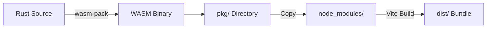

# WasmVOWL Deployment Flow Documentation

## Overview

This document describes the CI/CD pipeline for building and deploying the WasmVOWL application, which consists of a Rust/WASM backend and a React frontend.

## Architecture

```
rust-wasm/           → Rust WASM module (force-directed layout engine)
  ├── src/           → Rust source code
  ├── Cargo.toml     → Rust dependencies
  └── pkg/           → Built WASM package (generated)

modern/              → React frontend application
  ├── src/           → React/TypeScript source
  ├── package.json   → Node dependencies
  └── dist/          → Production build output (generated)
```

## GitHub Actions Workflow

**File**: `.github/workflows/wasm-publish.yml`

### Workflow Triggers

- Push to branches: `main`, `develop`, `claude/**`
- Pull requests
- Manual dispatch via GitHub UI
- Only runs when changes affect:
  - `publishing-tools/WasmVOWL/**`
  - `.github/workflows/wasm-publish.yml`

### Pipeline Jobs

#### 1. Version Check (`version-check`)

**Purpose**: Ensure version consistency across Cargo.toml and package.json

**Steps**:
1. Checkout repository
2. Run `scripts/check-versions.sh` validation script

**Blocks**: All subsequent jobs if versions are mismatched

---

#### 2. Rust WASM Build (`rust-wasm-build`)

**Purpose**: Compile Rust code to WebAssembly module

**Steps**:

1. **Checkout repository**
   ```bash
   actions/checkout@v4
   ```

2. **Install Rust toolchain**
   ```bash
   rustup target add wasm32-unknown-unknown
   ```
   - Installs `stable` Rust
   - Adds WASM compilation target

3. **Install wasm-pack**
   ```bash
   curl https://rustwasm.github.io/wasm-pack/installer/init.sh -sSf | sh
   ```
   - Build tool for Rust/WASM projects
   - Generates JavaScript bindings

4. **Cache Rust dependencies**
   - Caches: `~/.cargo/`, `target/`
   - Key: `cargo-<Cargo.lock hash>`
   - Speeds up subsequent builds

5. **Build WASM package**
   ```bash
   cd publishing-tools/WasmVOWL/rust-wasm
   wasm-pack build --target web --release
   ```
   - Target: `web` (ES modules)
   - Optimization: `release` (full optimizations)
   - Output: `pkg/` directory

6. **Verify WASM binary size**
   - Checks: `pkg/webvowl_wasm_bg.wasm`
   - Limit: 1.5 MB (configurable via `WASM_SIZE_LIMIT_MB`)
   - Fails build if exceeded

7. **Verify WASM package structure**
   - Required files:
     - `pkg/webvowl_wasm_bg.wasm` (WASM binary)
     - `pkg/webvowl_wasm.js` (JS glue code)
     - `pkg/webvowl_wasm.d.ts` (TypeScript definitions)
     - `pkg/package.json` (NPM metadata)

8. **Run Rust tests**
   ```bash
   cargo test --all-features
   ```

9. **Upload WASM artifacts**
   - Artifact name: `wasm-package`
   - Retention: 7 days
   - Used by: `frontend-build` job

**Depends on**: `version-check`

---

#### 3. Frontend Build (`frontend-build`)

**Purpose**: Build React application with WASM module integrated

**Steps**:

1. **Checkout repository**

2. **Setup Node.js**
   - Version: 20 (from `NODE_VERSION` env var)
   - Caches: `package-lock.json`

3. **Download WASM artifacts**
   - Source: `wasm-package` artifact from `rust-wasm-build`
   - Destination: `rust-wasm/pkg/`

4. **Copy WASM package to node_modules**
   ```bash
   mkdir -p modern/node_modules/narrativegoldmine-webvowl-wasm
   cp -r rust-wasm/pkg/* modern/node_modules/narrativegoldmine-webvowl-wasm/
   ```
   - **Critical step**: Makes WASM available to Vite build
   - Package name: `narrativegoldmine-webvowl-wasm` (from package.json)
   - Verifies: `webvowl_wasm_bg.wasm` exists after copy

5. **Install frontend dependencies**
   ```bash
   npm ci
   ```
   - Uses `package-lock.json` for reproducible builds

6. **Run TypeScript type checking**
   ```bash
   npm run type-check
   ```

7. **Run linting**
   ```bash
   npm run lint
   ```

8. **Run frontend tests**
   ```bash
   npm run test
   ```
   - Vitest test suite

9. **Build production bundle**
   ```bash
   npm run build
   ```
   - Vite production build
   - Output: `modern/dist/`
   - Includes:
     - Minified JS bundles
     - Optimized assets
     - WASM module (embedded or referenced)

10. **Verify build output**
    - Checks: `dist/` directory exists
    - Checks: `dist/index.html` exists
    - Reports: Build output size

11. **Validate WASM files in build**
    ```bash
    find dist -name "*.wasm" -type f
    ```
    - Searches for WASM files in build output
    - If not found: Checks for WASM module references in JS
    - Validates: WASM integration is working

12. **Upload build artifacts**
    - Artifact name: `frontend-dist`
    - Retention: 7 days
    - Contains: Production-ready deployment files

**Depends on**: `rust-wasm-build`

---

#### 4. Integration Tests (`integration-test`)

**Purpose**: End-to-end testing with WASM and frontend together

**Steps**:

1. **Checkout repository**

2. **Setup Node.js**

3. **Download WASM artifacts**
   - From: `wasm-package`

4. **Download frontend artifacts**
   - From: `frontend-dist`

5. **Run integration tests**
   - Currently: Placeholder
   - Future: Browser-based E2E tests with Playwright

**Depends on**: `rust-wasm-build`, `frontend-build`

---

#### 5. Publish Summary (`publish-summary`)

**Purpose**: Generate human-readable build report

**Steps**:

1. **Generate summary**
   - Uses: `$GITHUB_STEP_SUMMARY`
   - Includes:
     - Version from Cargo.toml
     - Job statuses (pass/fail)
     - Artifact links
     - Commit SHA and branch

**Runs**: Always (even on failure)
**Depends on**: All previous jobs

## WASM Integration Details

### Build Process



### Package Structure

**WASM Package (`rust-wasm/pkg/`)**:
```
pkg/
├── webvowl_wasm_bg.wasm     # Binary WebAssembly module
├── webvowl_wasm.js          # JavaScript glue code
├── webvowl_wasm.d.ts        # TypeScript type definitions
└── package.json             # NPM package metadata
```

**Node Modules Integration**:
```
modern/node_modules/
└── narrativegoldmine-webvowl-wasm/
    ├── webvowl_wasm_bg.wasm
    ├── webvowl_wasm.js
    ├── webvowl_wasm.d.ts
    └── package.json
```

### Import Pattern (Frontend)

```typescript
// Dynamic import in React component
import { useWasmSimulation } from '@/hooks/useWasmSimulation';

// Hook implementation
const wasmModule = await import('narrativegoldmine-webvowl-wasm');
await wasmModule.default(); // Initialize WASM
const wasm = new wasmModule.WebVowl();
```

### Vite Configuration

**File**: `modern/vite.config.ts`

```typescript
export default defineConfig({
  plugins: [
    react(),
    wasm(),              // vite-plugin-wasm
    topLevelAwait()      // vite-plugin-top-level-await
  ],
  optimizeDeps: {
    exclude: ['webvowl-wasm']  // Don't pre-bundle WASM
  }
});
```

## Environment Variables

```yaml
RUST_VERSION: stable           # Rust toolchain version
NODE_VERSION: '20'             # Node.js version
WASM_SIZE_LIMIT_MB: 1.5       # Max WASM binary size
```

## Caching Strategy

### Rust Build Cache

**Paths**:
- `~/.cargo/bin/`
- `~/.cargo/registry/`
- `rust-wasm/target/`

**Key**: `cargo-<Cargo.lock hash>`

**Speedup**: 60-80% faster builds on cache hit

### NPM Cache

**Path**: `modern/node_modules/`

**Key**: `npm-<package-lock.json hash>`

**Managed by**: `actions/setup-node@v4` with `cache: 'npm'`

## Artifacts

### WASM Package Artifact

**Name**: `wasm-package`
**Contents**: `rust-wasm/pkg/`
**Size**: ~200-500 KB
**Retention**: 7 days

### Frontend Dist Artifact

**Name**: `frontend-dist`
**Contents**: `modern/dist/`
**Size**: ~2-5 MB
**Retention**: 7 days

## Deployment Checklist

### Pre-Build

- [ ] Version sync between Cargo.toml and package.json
- [ ] Rust tests passing locally
- [ ] Frontend tests passing locally
- [ ] TypeScript compilation successful

### Build

- [ ] WASM binary under size limit (1.5 MB)
- [ ] WASM package structure valid
- [ ] WASM copied to node_modules correctly
- [ ] Frontend build successful
- [ ] WASM references found in build output

### Post-Build

- [ ] Build artifacts uploaded
- [ ] Integration tests passed
- [ ] Build summary generated

## Troubleshooting

### WASM Build Fails

**Symptom**: `wasm-pack build` fails

**Solutions**:
1. Check Rust version: `rustc --version`
2. Verify wasm32 target: `rustup target list --installed`
3. Clear cache: `cargo clean`
4. Check Cargo.toml dependencies

### WASM Not Found in Build

**Symptom**: "No .wasm files found in dist/"

**Solutions**:
1. Verify copy step: Check `node_modules/narrativegoldmine-webvowl-wasm/`
2. Check Vite config: `exclude: ['webvowl-wasm']`
3. Verify import path in frontend code
4. Check browser console for WASM load errors

### Size Limit Exceeded

**Symptom**: WASM binary > 1.5 MB

**Solutions**:
1. Enable wasm-opt: Set `wasm-opt = true` in Cargo.toml
2. Remove unused dependencies
3. Use smaller data structures
4. Enable LTO: `lto = true` in [profile.release]
5. Increase limit: Modify `WASM_SIZE_LIMIT_MB` env var

### Type Errors

**Symptom**: TypeScript compilation fails

**Solutions**:
1. Regenerate types: `wasm-pack build` (creates .d.ts)
2. Check import paths
3. Verify `webvowl_wasm.d.ts` exists in node_modules

## Performance Metrics

### Build Times (Typical)

- Rust WASM build: 3-5 minutes (cold), 30-60 seconds (cached)
- Frontend build: 2-3 minutes
- Total pipeline: 8-12 minutes

### Artifact Sizes

- WASM binary: 200-400 KB (compressed)
- Frontend dist: 2-3 MB (total)
- JS bundle: ~500 KB (gzipped)

## Security Considerations

### Supply Chain

- Rust dependencies: Verified via Cargo.lock
- NPM dependencies: Verified via package-lock.json
- Actions: Pinned to major versions (@v4)

### WASM Sandbox

- WASM runs in browser sandbox
- No file system access
- No network access
- Memory isolated from main thread

### Secrets Management

- No secrets required for build
- GitHub token: Automatically provided by Actions
- NPM registry: Public package

## Future Enhancements

### Planned

- [ ] Browser-based E2E tests (Playwright)
- [ ] Visual regression testing
- [ ] Performance benchmarking in CI
- [ ] Automated NPM publishing
- [ ] Docker container builds
- [ ] Multi-platform WASM builds

### Under Consideration

- [ ] WASM compression (Brotli/Gzip pre-compression)
- [ ] CDN deployment automation
- [ ] Preview deployments for PRs
- [ ] Bundle size tracking over time

## References

- [wasm-pack Documentation](https://rustwasm.github.io/wasm-pack/)
- [Vite WASM Plugin](https://github.com/Menci/vite-plugin-wasm)
- [GitHub Actions Documentation](https://docs.github.com/en/actions)
- [WebAssembly Security](https://webassembly.org/docs/security/)

---

**Last Updated**: 2025-11-17
**Workflow Version**: v1.1.0
**Maintainer**: WebVOWL Contributors
