# VisionFlow Key Architecture Diagrams
- **Audience**: Technical ML engineers and researchers new to the project
- **Purpose**: Understand how VisionFlow transforms OWL ontologies into GPU-accelerated 3D knowledge graph visualizations
- **Core Innovation**: Ontological relationships (SubClassOf, DisjointWith, EquivalentClasses) are translated into physical forces that drive self-organizing graph layouts at 60 FPS on 100K+ nodes

---

## 1. System Context (C4 Level 1)
- Shows VisionFlow's external boundaries: who uses it, what it connects to
- Three user personas: Developer (web), Data Scientist (analytics), XR User (immersive VR)
- External dependencies: GitHub for data ingestion, AI services (Claude/Perplexity) for semantic analysis, Nostr for decentralized identity
- Infrastructure: Neo4j graph database + CUDA 12.4 GPU compute

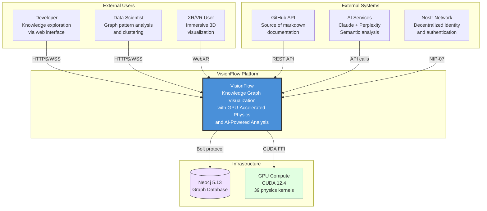

---

## 2. Container Architecture (C4 Level 2)
- Deployable units and their interactions
- **Client Layer**: React 18 + Three.js + WebXR for 3D rendering
- **API Layer**: REST (CQRS handlers) + Binary WebSocket (28 bytes/node) + Voice (Whisper STT / Kokoro TTS)
- **Application Layer**: 24 Actix actors with supervisor hierarchy, event sourcing, CQRS command/query split
- **GPU Layer**: 4 supervisors coordinating 39+ CUDA kernels for physics, clustering (Leiden), graph analytics (SSSP, PageRank)
- **Infrastructure**: Neo4j as source of truth, Whelk OWL 2 EL reasoner for semantic inference

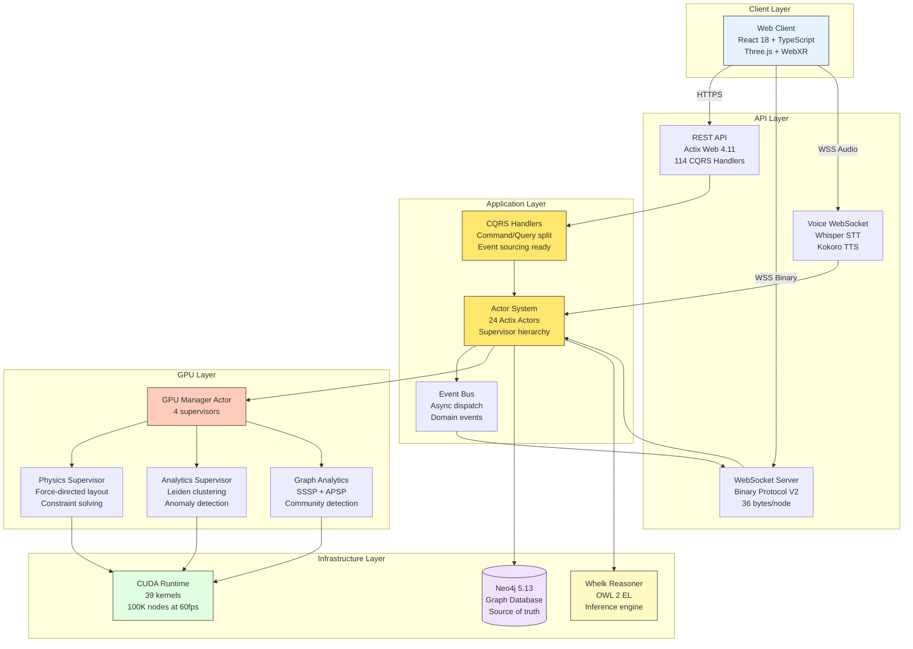

---

## 3. End-to-End Data Pipeline
- The complete flow from GitHub markdown files to 3D rendered graph
- **Data ingestion**: Differential sync (SHA1 comparison) fetches only changed files from GitHub
- **Dual parsing**: Knowledge graph nodes from `public:: true` pages, OWL classes from `### OntologyBlock` sections
- **Reasoning**: Whelk-rs (Rust OWL 2 EL reasoner, 10-100x faster than Java alternatives) computes inferred axioms
- **Constraint generation**: 8 semantic constraint types translate ontological relationships into physics forces
- **GPU simulation**: 39 CUDA kernels compute forces, integrate velocities, update positions at 60 Hz
- **Binary streaming**: 36-byte binary WebSocket protocol (80% bandwidth reduction vs JSON) delivers positions to clients

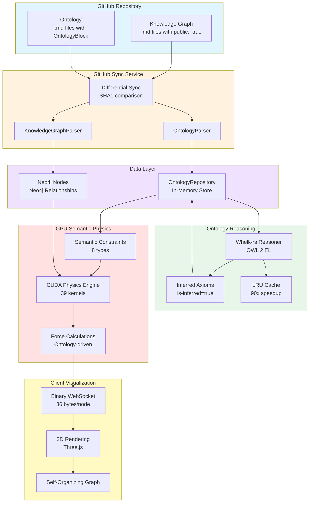

---

## 4. Ontology Reasoning Pipeline
- The core ML-relevant pipeline: how OWL axioms become physics constraints
- **Step 1**: Load classes, asserted axioms, and properties from OntologyRepository
- **Step 2**: Whelk-rs computes inferences (e.g., `Cat SubClassOf Animal` + `Animal SubClassOf LivingThing` => `Cat SubClassOf LivingThing`)
- **Step 3**: Store inferred axioms back with `is_inferred=true` flag
- **Step 4**: Generate physics constraints per axiom type:
	- `SubClassOf` => Spring attraction (k=0.5) — child classes cluster near parents
	- `DisjointWith` => Coulomb repulsion (k=-0.8) — disjoint classes pushed apart
	- `EquivalentClasses` => Strong spring (k=1.0) — synonyms rendered together
	- `ObjectProperty` => Directional alignment — domains/ranges aligned
- **Step 5**: Inferred axioms get 0.3x force multiplier (subtle influence vs asserted)
- **Step 6**: Upload constraint buffers to GPU for real-time simulation

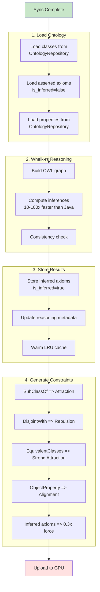

---

## 5. CUDA Physics Kernel Pipeline
- Shows the CPU-to-GPU data flow for each physics simulation frame
- **CPU side**: Generates semantic constraints from ontology, uploads to GPU memory
- **GPU kernels execute sequentially**: Spring forces (attraction), repulsion forces (separation), alignment forces (directional), inferred axiom weighting (0.3x reduction), velocity integration, position update
- **Output**: New node positions downloaded back to CPU for WebSocket broadcast
- **Performance**: 16ms per frame on RTX 3080 with 10K+ nodes and 50K+ constraints

```mermaid
graph LR
    subgraph CPU["CPU - Rust"]
        CONS["Generate<br/>Constraints"]
        UPLOAD["Upload to GPU"]
    end

    subgraph GPUKernels["GPU - CUDA"]
        K1["Kernel 1:<br/>Spring Forces"]
        K2["Kernel 2:<br/>Repulsion Forces"]
        K3["Kernel 3:<br/>Alignment Forces"]
        K_INFER["Apply 0.3x<br/>to inferred"]
        INTEGRATE["Integrate<br/>Velocities"]
        UPDATE["Update<br/>Positions"]
    end

    subgraph Output["Output"]
        POSITIONS["New Node<br/>Positions"]
        DOWNLOAD["Download to CPU"]
    end

    CONS --> UPLOAD
    UPLOAD --> K1
    K1 --> K2
    K2 --> K3
    K3 --> K_INFER
    K_INFER --> INTEGRATE
    INTEGRATE --> UPDATE
    UPDATE --> POSITIONS
    POSITIONS --> DOWNLOAD

    style CPU fill:#fff3e0
    style GPUKernels fill:#ffe1e1
    style Output fill:#e8f5e9
```

---

## 6. GitHub Sync Sequence
- Detailed sequence showing how markdown files become graph nodes and ontology classes
- **Differential sync**: Only processes files whose SHA1 hash has changed (90%+ skip rate on subsequent syncs)
- **File routing**: `public:: true` header => knowledge graph node, `### OntologyBlock` => OWL class/property
- **Post-sync**: Reloads graph into memory, initializes GPU physics, starts 60 Hz simulation loop
- **Binary streaming**: Each frame broadcasts 36 bytes per node (id, xyz position, xyz velocity, group, flags)

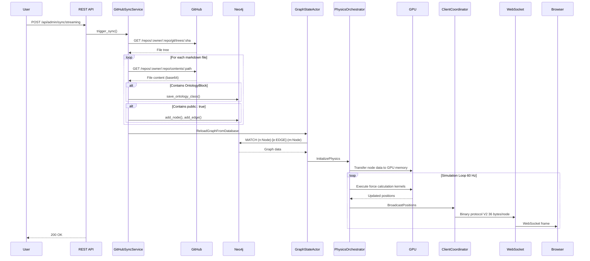

---

## 7. Hexagonal Architecture (Ports and Adapters)
- VisionFlow's core architectural pattern: business logic depends on abstractions, not implementations
- **Inside**: Domain logic + Port traits (interfaces) define what the system needs
- **Boundary**: Adapters implement ports using specific technologies
- **Outside**: Infrastructure (Neo4j, CUDA, HTTP clients, WebSocket)
- **Key ports**: `OntologyRepository`, `KnowledgeGraphRepository`, `InferenceEngine`, `GpuPhysicsAdapter`
- **Benefit for ML engineers**: You can swap the inference engine (Whelk) for any OWL reasoner by implementing the `InferenceEngine` port trait

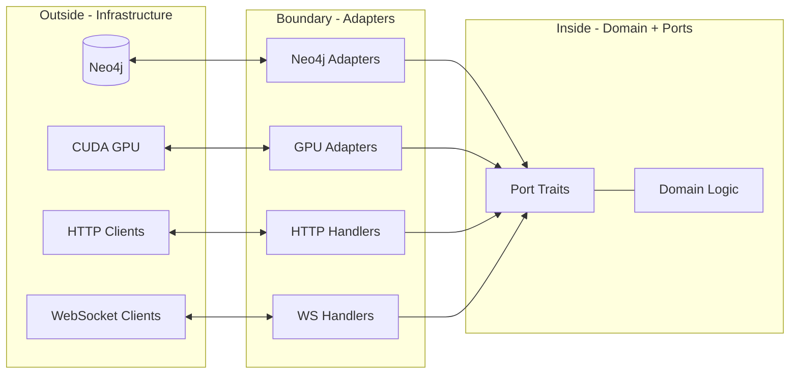

---

## 8. Event-Driven Architecture
- Domain events decouple system components: graph mutations, ontology changes, physics events, settings updates
- **Event Bus**: Central pub/sub with middleware pipeline (logging, metrics, validation, retry)
- **Event Store**: Persistent event log for audit trails and event sourcing
- **Key domain events**: `NodeAdded`, `EdgeRemoved`, `ClassAdded`, `InferenceCompleted`, `SimulationStarted`
- **Automatic inference triggers**: When ontology changes (new class/property/axiom), the event bus auto-triggers Whelk reasoning with configurable debouncing

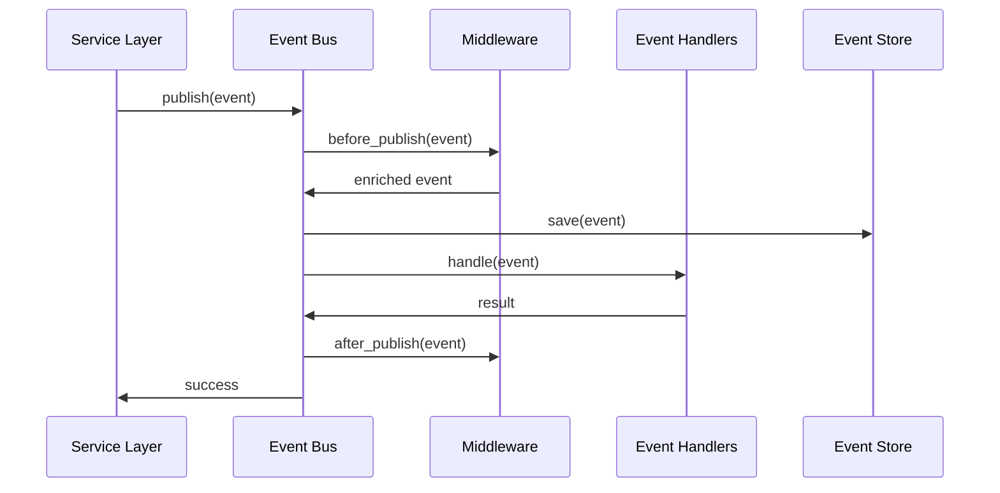

---

## 9. GPU Actor Supervision Tree
- Actix actor system coordinates GPU operations through a supervisor hierarchy
- **GPUManagerActor**: Top-level supervisor, routes messages to specialized child actors
- **GPUResourceActor**: CUDA device management (context creation, memory allocation, data transfer)
- **ForceComputeActor**: Executes physics simulation kernels (preserves iteration state across settings updates)
- **Error recovery**: GPU initialization failures trigger CPU fallback; runtime kernel failures trigger GPU state reset and retry
- **Physics loop**: GraphSupervisor requests physics step => GPUManager delegates to ForceCompute => kernels execute on GPU => positions downloaded via GPUResource => broadcast to clients

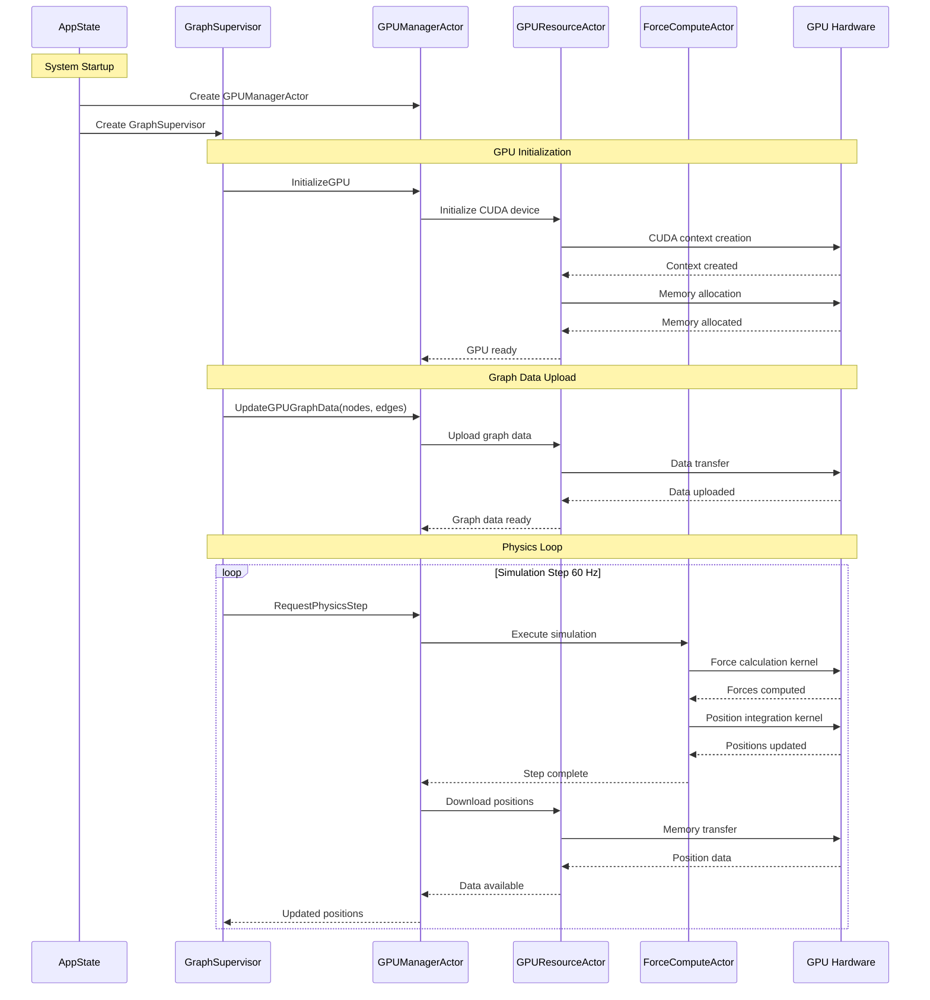

---

## 10. Semantic Forces System
- The core innovation: ontological relationships become physical forces that drive graph self-organization
- **5 force types**: DAG layout (hierarchy), type clustering (grouping), collision detection (overlap prevention), attribute-weighted (custom), edge-type-weighted (per-relationship spring strength)
- **3-tier architecture**: Frontend controls => Rust SemanticPhysicsEngine => CUDA kernels
- **ML relevance**: This is effectively a physics-based embedding where spatial position encodes ontological structure

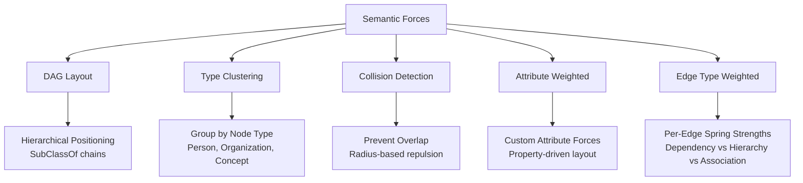

---

## 11. Data Lineage (Source to Display)
- Complete traceability: every pixel on screen traces back to a source file in GitHub
- **GitHub file** => **Sync metadata** (SHA1 hash) => **Neo4j node** (graph storage) => **OWL class** (ontology) => **Asserted axiom** => **Inferred axiom** (by Whelk) => **Semantic constraint** (physics force) => **GPU force computation** => **Node position** (x,y,z) => **Client display** (Three.js render)
- **Key detail**: Inferred axioms produce constraints with 0.3x strength multiplier, creating subtle spatial influence vs the full-strength asserted axioms

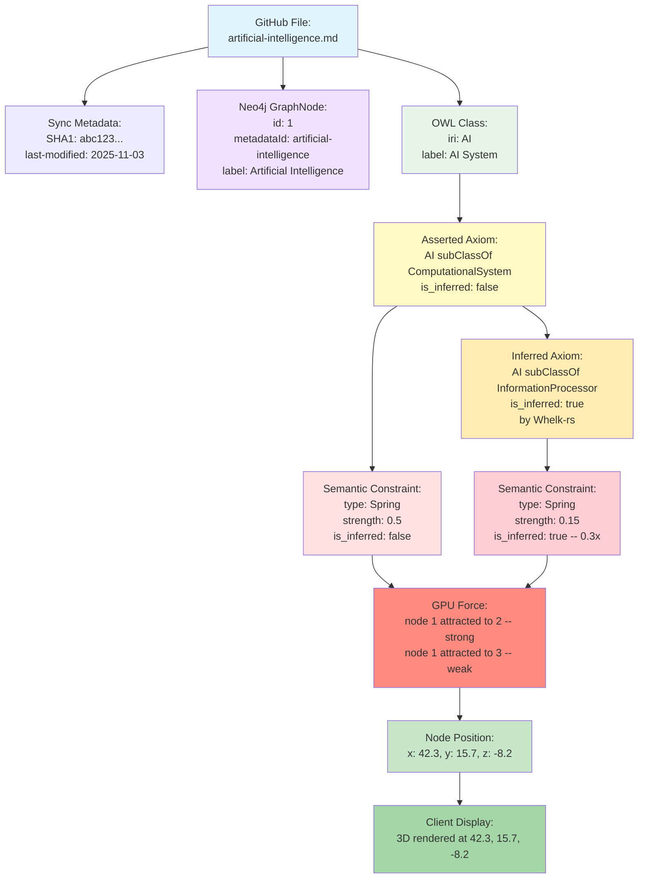

---

## 12. Pipeline Timing (End-to-End)
- Total cold-start latency: ~5.8 seconds from GitHub fetch to first rendered frame
- After initial sync, differential sync achieves 90%+ skip rate
- **GPU physics**: 16ms per frame sustained (60 FPS) even with 100K+ nodes
- **Binary WebSocket**: 50ms transmission latency for full graph update
- **Key optimization**: LRU cache provides 90x speedup for repeated reasoning queries

```mermaid
gantt
    title Complete Data Flow Timing - GitHub to Client
    dateFormat X
    axisFormat %L ms

    section GitHub Sync
    Fetch files          :0, 2000
    Parse content        :2000, 1000
    Store to Neo4j       :3000, 500

    section Reasoning
    Load ontology        :3500, 200
    Whelk-rs inference   :3700, 1500
    Store inferred       :5200, 300

    section GPU Physics
    Generate constraints :5500, 100
    Upload to GPU        :5600, 50
    Compute forces       :5650, 16
    Download positions   :5666, 34

    section Client
    WebSocket transmit   :5700, 50
    Render frame         :5750, 16
```

---

## 13. Ontology-to-Physics Mapping Reference
- How each OWL axiom type translates to a GPU physics force
- This is the bridge between symbolic AI (ontology reasoning) and numerical simulation (GPU physics)

| OWL Axiom Type | Physics Force | Spring Constant | Visual Effect |
|---|---|---|---|
| `SubClassOf(A, B)` | Spring attraction | k=0.5 | Child classes cluster near parents |
| `DisjointWith(A, B)` | Coulomb repulsion | k=-0.8 | Disjoint classes pushed apart |
| `EquivalentClasses(A, B)` | Strong spring | k=1.0 | Synonyms rendered together |
| `ObjectProperty(A, B)` | Directional alignment | k=0.3 | Property domains/ranges aligned |
| **Inferred axiom** (any type) | Same as above | **0.3x multiplier** | Subtle influence vs asserted |

---

## 14. Performance Characteristics
- Benchmarks demonstrating GPU acceleration impact for graph computations

| Operation | CPU (100K nodes) | GPU (100K nodes) | Speedup |
|---|---|---|---|
| Physics Simulation | 1,600ms | 16ms | **100x** |
| Leiden Clustering | 800ms | 12ms | **67x** |
| SSSP Pathfinding | 500ms | 8ms | **62x** |
| Force-Directed Layout | 2,000ms | 20ms | **100x** |

| System Metric | Target | Measured |
|---|---|---|
| Rendering FPS | 60 | 60 sustained at 150K nodes |
| WebSocket Latency | <20ms | <10ms average |
| Graph Query (Cypher) | <100ms | 50ms average |
| Ontology Reasoning | <500ms | 200ms average |
| Whelk-rs vs Java Reasoners | - | **10-100x faster** |
| LRU Cache Hit | - | **90x speedup** |
| Binary Protocol vs JSON | - | **80% bandwidth reduction** |

---

## 15. Solid Sidecar Architecture
- Decentralized data ownership via Linked Data Platform (LDP) using JSON Solid Server as a sidecar container
- **Neo4j => Solid sync**: Rust backend serializes graph data to RDF Turtle, batch-uploads to user-owned pods
- **NIP-98 auth**: Nostr-based decentralized identity for pod access control
- **Real-time notifications**: WebSocket-based resource change events from JSS to clients

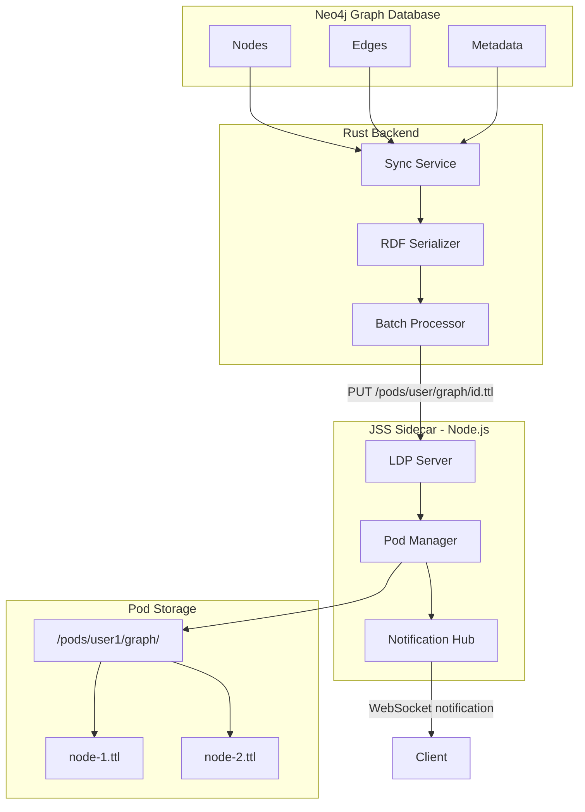

---

## Quick Reference: Technology Stack
- **Language**: Rust 1.75+ (backend), TypeScript (client)
- **Web Framework**: Actix Web 4.11
- **3D Rendering**: Three.js 0.175 + React Three Fiber
- **Graph Database**: Neo4j 5.13 (Cypher queries, Bolt protocol)
- **GPU Compute**: CUDA 12.4 (39 custom kernels via cudarc Rust bindings)
- **OWL Reasoning**: Whelk-rs (Rust OWL 2 EL++ reasoner)
- **Authentication**: Nostr NIP-98 (decentralized, passkey-based)
- **Real-time Protocol**: Custom 36-byte binary WebSocket (80% smaller than JSON)
- **XR Support**: WebXR (Meta Quest 3 with hand tracking)
- **Decentralized Storage**: Solid pods via JSON Solid Server sidecar
