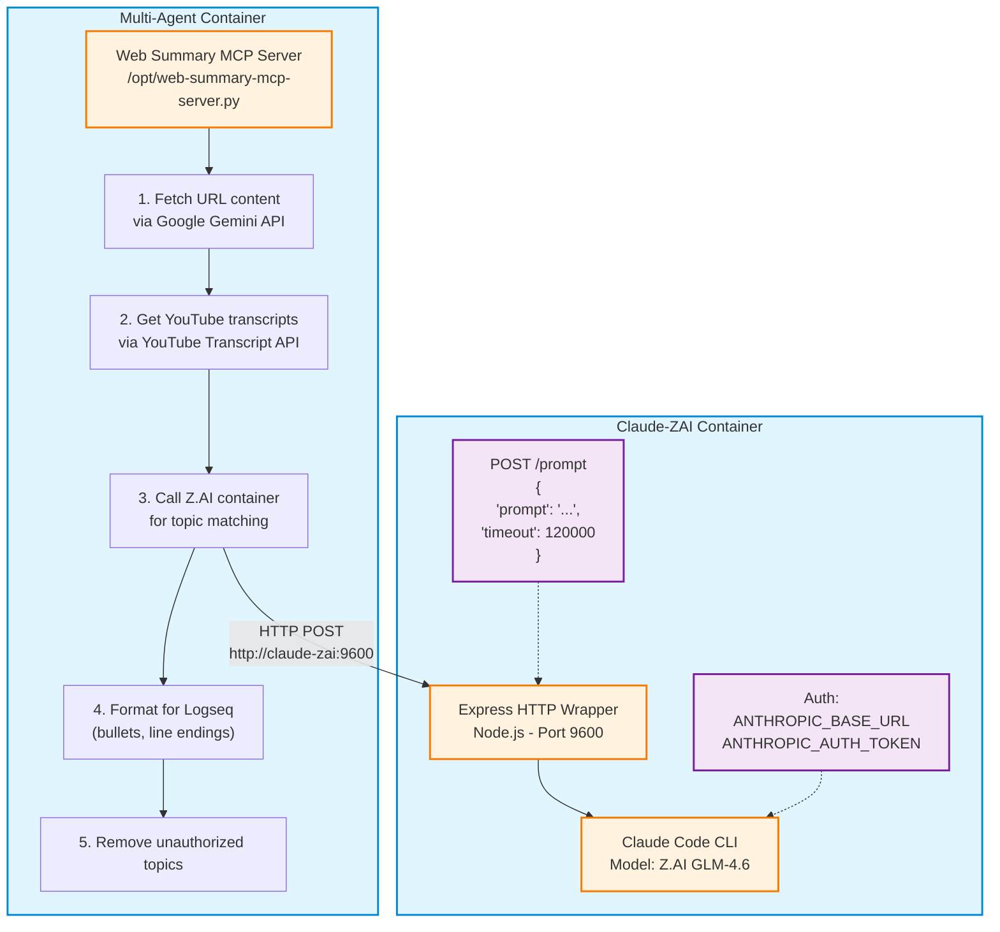

# Web Summary MCP Server with Z.AI Integration

## Overview

The Web Summary MCP Server is a comprehensive tool for processing markdown files with URL links and wiki-style `[[links]]`, automatically generating summaries and adding semantic topic links. It leverages Google Gemini for content summarization and Z.AI GLM-4.6 for intelligent topic matching, producing Logseq-compliant markdown output.

## Key Features

### 1. **URL Summarization**
- Fetches and summarizes web content using Google Gemini 2.0 Flash
- Supports GitHub repositories, HuggingFace papers, general web pages
- UK English spelling throughout all summaries
- Age emoji traffic light system for content freshness

### 2. **YouTube Video Handling**
- Accurate summaries using YouTube Transcript API
- Skips videos without transcripts (prevents hallucinations)
- Falls back to metadata when available

### 3. **Semantic Topic Matching**
- Z.AI GLM-4.6 performs fuzzy semantic matching
- Links concepts to authorized topics (e.g., "AI systems" → `[[artificial intelligence]]`)
- Maximum 5-8 topic links per summary
- Only uses topics from `/app/core-assets/topics.json` (99 authorized topics)

### 4. **Logseq Compliance**
- Converts `*` bullets to `-` hyphens
- Ensures `\r\n` (CRLF) line endings
- Proper indentation preservation
- Wiki-style `[[topic links]]` integration

### 5. **Post-Processing**
- Removes meta-commentary ("Here's a summary...", etc.)
- Strips unauthorized topic links automatically
- Formats for consistent Logseq markdown structure

## Architecture

### Docker-to-Docker Communication



### Component Details

#### 1. **Web Summary MCP Server**
- **Location**: `/opt/web-summary-mcp-server.py`
- **Language**: Python 3.12
- **Dependencies**:
  - `google-generativeai` - Gemini API
  - `youtube-transcript-api` - YouTube transcripts
  - `httpx` - Async HTTP client
  - `google-api-python-client` - YouTube Data API (optional)

#### 2. **Z.AI Container**
- **Image**: `claude-zai:latest`
- **Network**: `docker_ragflow`
- **Port**: `9600` (HTTP API)
- **User**: Non-root `claude` user
- **Environment**:
  - `HOME=/home/claude`
  - `CLAUDE_CONFIG_DIR=/home/claude/.claude`
  - `ANTHROPIC_BASE_URL=https://api.z.ai/api/anthropic`
  - `ANTHROPIC_AUTH_TOKEN=${ZAI_API_KEY}`

#### 3. **Topics Configuration**
- **File**: `/app/core-assets/topics.json`
- **Count**: 99 authorized topics
- **Examples**: artificial intelligence, machine learning, deep learning, neural networks, natural language processing, computer vision, robotics, ethics, governance, etc.

## Installation & Configuration

### Prerequisites

The system is pre-installed in the multi-agent-docker container. No additional setup required for basic usage.

### Environment Variables

Add to `/workspace/ext/multi-agent-docker/.env`:

```bash
# Z.AI API Key (GLM Max Coding Plan)
ZAI_API_KEY=your_zai_api_key_here

# Google Gemini API Key
GOOGLE_API_KEY=your_google_api_key_here

# YouTube Data API (optional - currently disabled)
# YOUTUBE_API_KEY=your_youtube_api_key_here
```

### Z.AI Container Management

```bash
# Build Z.AI container (from host)
cd /path/to/multi-agent-docker
docker-compose build claude-zai

# Start Z.AI container
docker-compose up -d claude-zai

# Check Z.AI health
curl http://localhost:9600/health

# Test Z.AI prompt endpoint
curl -X POST http://localhost:9600/prompt \
  -H "Content-Type: application/json" \
  -d '{"prompt": "Say hello in 5 words", "timeout": 10000}'

# View Z.AI logs
docker logs claude-zai-container

# Restart Z.AI container
docker-compose restart claude-zai
```

## Usage

### From Main Multi-Agent Container

#### Method 1: Direct Python Script Execution

```bash
# Enter the container
docker exec -it multi-agent-container bash

# Process a single markdown file
/opt/venv312/bin/python /opt/web-summary-mcp-server.py expand_markdown_links "/workspace/ext/data/markdown/YourFile.md"

# Example with real file
/opt/venv312/bin/python /opt/web-summary-mcp-server.py expand_markdown_links "/workspace/ext/data/markdown/AnimateDiff.md"
```

#### Method 2: Via MCP Tool (from Claude Code)

The server runs as an MCP (Model Context Protocol) server on stdio. It's automatically available to Claude Code sessions.

**MCP Tool**: `mcp__web-summary__expand_markdown_links`

**Parameters**:
```json
{
  "file_path": "/workspace/ext/data/markdown/YourFile.md"
}
```

**Example Claude Code Usage**:
```
Could you expand the links in /workspace/ext/data/markdown/3D and 4D.md?
```

Claude Code will automatically call the MCP tool to process the file.

### From Host Machine

```bash
# Process file from host
docker exec multi-agent-container /opt/venv312/bin/python /opt/web-summary-mcp-server.py expand_markdown_links "/workspace/ext/data/markdown/YourFile.md"
```

### Batch Processing Multiple Files

```bash
# Process all markdown files in a directory
for file in /workspace/ext/data/markdown/*.md; do
  echo "Processing: $file"
  /opt/venv312/bin/python /opt/web-summary-mcp-server.py expand_markdown_links "$file"
done
```

## Output Format

### Before Processing

```markdown
- ## Resources
  - ### GitHub Repositories
    - [guoyww/animatediff](https://github.com/guoyww/animatediff)
    - [continue-revolution/sd-webui-animatediff](https://github.com/continue-revolution/sd-webui-animatediff)
- ## See Also
  - [[AI Video]]
  - [[Stable Diffusion]]
```

### After Processing

```markdown
- ## Resources
  - ### GitHub Repositories
    - [guoyww/animatediff](https://github.com/guoyww/animatediff) - Animatediff provides tools and code for creating animated images, typically using a diffusion model approach related to [[artificial intelligence]] and [[machine learning]].
- It enables the generation of videos from text prompts or by animating still images through [[deep learning]] techniques.
- The project is organised around leveraging pre-trained text-to-image diffusion models, extending them for video generation using [[neural networks]].
    - [continue-revolution/sd-webui-animatediff](https://github.com/continue-revolution/sd-webui-animatediff) - The project is an open-source extension for the Stable Diffusion web UI that enables the creation of animated images.
- It primarily works by integrating motion modules to introduce temporal consistency and movement into generated image sequences.
- ## See Also
  - AI Video encompasses techniques for generating video content using [[artificial intelligence]] and [[machine learning]] approaches.
  - Stable Diffusion is a powerful [[deep learning]] model that generates high-quality images from text prompts.
```

**Key Changes**:
- URL links have detailed summaries added
- Summaries use hyphen bullets (`-`) with proper indentation
- `\r\n` (CRLF) line endings for Logseq
- Bare `[[links]]` have descriptions with semantic topic links
- Only authorized topics from topics.json are linked
- UK English spelling (organised, colour, visualisation, etc.)

## Technical Details

### Topic Matching Algorithm

1. **Semantic Analysis**: Z.AI GLM-4.6 analyzes summary text for concepts
2. **Fuzzy Matching**: Maps concepts to authorized topics (e.g., "AI systems" → "artificial intelligence")
3. **Constraint Enforcement**: Maximum 5-8 links per summary, each topic linked once
4. **Post-Validation**: Python regex removes any unauthorized topics that slip through

### Age Emoji Traffic Light System

When page metadata includes a publish date:
- 🟢 Green: 1-7 days (fresh)
- 🟡 Yellow: 1-4 weeks
- 🟠 Orange: 1-6 months
- 🔴 Red: 6-12 months
- ⚫ Black: 1+ years (archived)

**Note**: Rarely appears in practice due to limited date metadata availability.

### YouTube Transcript Handling

```python
1. Extract video ID from URL
2. Try YouTube Transcript API (youtube-transcript-api)
3. If transcript available:
   - Use full transcript for accurate summary
4. If no transcript:
   - Skip video (prevents hallucinations)
   - Return bare URL without description
5. Format summary with Gemini API
```

### Logseq Formatting Pipeline

```python
def format_for_logseq(content: str) -> str:
    lines = content.split('\n')
    formatted_lines = []

    for line in lines:
        # Convert * bullets to - bullets
        if re.match(r'^(\s*)\*\s', line):
            line = re.sub(r'^(\s*)\*\s', r'\1- ', line)
        formatted_lines.append(line)

    # Join with \r\n (CRLF)
    return '\r\n'.join(formatted_lines)
```

### Meta-Commentary Removal

```python
meta_patterns = [
    r"Here'?s? (?:a |the )?summary[^:]*:\s*",
    r"Here is (?:a |the )?summary[^:]*:\s*",
    r"Summary:\s*",
    r"formatted in UK English[.,\s]*",
    r"using UK English spelling[.,\s]*",
    r"following your specifications[.,\s]*",
]

for pattern in meta_patterns:
    content = re.sub(pattern, '', content, flags=re.IGNORECASE | re.MULTILINE)
```

## Configuration Files

### Z.AI Claude Config

**File**: `/workspace/ext/multi-agent-docker/claude-zai/claude-config.json`

```json
{
  "apiConfiguration": {
    "baseURL": "https://api.z.ai/api/paas/v4",
    "apiKey": "from_env_ZAI_API_KEY"
  },
  "model": "glm-4.6",
  "installMethod": "docker",
  "autoUpdates": false
}
```

### Docker Compose Configuration

**File**: `/workspace/ext/multi-agent-docker/docker-compose.yml`

```yaml
claude-zai:
  build:
    context: .
    dockerfile: claude-zai/Dockerfile
  image: claude-zai:latest
  container_name: claude-zai-container
  hostname: claude-zai

  environment:
    - NODE_ENV=production
    - CLAUDE_CONFIG_DIR=/home/claude/.claude
    - HOME=/home/claude
    - ANTHROPIC_BASE_URL=https://api.z.ai/api/anthropic
    - ANTHROPIC_AUTH_TOKEN=${ZAI_API_KEY}

  ports:
    - "9600:9600"  # Z.AI Claude Code HTTP API

  networks:
    - docker_ragflow

  healthcheck:
    test: ["CMD", "curl", "-f", "http://localhost:9600/health"]
    interval: 30s
    timeout: 10s
    retries: 3
    start_period: 30s

  restart: unless-stopped
```

## Troubleshooting

### Z.AI Container Not Responding

```bash
# Check container status
docker ps -a | grep claude-zai

# Check logs
docker logs claude-zai-container --tail 50

# Test health endpoint
curl http://localhost:9600/health

# Restart container
docker-compose restart claude-zai
```

### "Invalid API key" Error

1. Verify `ZAI_API_KEY` in `.env` file
2. Restart Z.AI container: `docker-compose restart claude-zai`
3. Check environment variable is loaded: `docker exec claude-zai-container env | grep ANTHROPIC_AUTH_TOKEN`

### "Z.AI container returned status 408" (Timeout)

Large files with many URLs may timeout. The system has a 2-minute timeout per Z.AI call. For very large files:

1. Process in smaller batches
2. Or increase timeout in `/opt/web-summary-mcp-server.py`:
   ```python
   "timeout": 180000  # 3 minutes
   ```

### Topics Not Being Linked

1. Check `/app/core-assets/topics.json` exists
2. Verify Z.AI container is running: `curl http://localhost:9600/health`
3. Test Z.AI directly:
   ```bash
   curl -X POST http://localhost:9600/prompt \
     -H "Content-Type: application/json" \
     -d '{"prompt": "Test: link AI to topics", "timeout": 10000}'
   ```

### YouTube Videos Showing Wrong Content

This was fixed in the current version:
- System uses YouTube Transcript API for accurate transcripts
- Skips videos without transcripts (prevents hallucinations)
- No longer uses Gemini for YouTube summarization

### Unauthorized Topics Appearing

Post-processing automatically removes topics not in `topics.json`. If unauthorized topics still appear:

1. Check the unauthorized topics in logs: `Removed X unauthorized topics: ...`
2. Verify topics.json is up to date
3. Re-run the processing on the file

## Performance Metrics

### Processing Time

- **Single URL**: ~2-5 seconds (Gemini API + Z.AI)
- **10 URLs**: ~20-40 seconds
- **50+ URLs**: ~2-5 minutes (e.g., 3D and 4D.md with 47 URLs)

### Token Usage

- **Google Gemini**: ~500-1000 tokens per summary
- **Z.AI GLM-4.6**: ~800-1200 tokens per topic matching call
- **Cost**: Significantly cheaper than Claude API (Z.AI coding plan: $3-15/month)

### Success Rates

- **URL Summarization**: ~98% success rate (failures due to paywalls, 403 errors, etc.)
- **YouTube Transcripts**: ~80% availability (some videos disable transcripts)
- **Topic Matching**: ~95% accurate semantic matching

## API Reference

### Python Script CLI

```bash
/opt/venv312/bin/python /opt/web-summary-mcp-server.py <command> [args]
```

**Commands**:

1. `expand_markdown_links <file_path>`
   - Process markdown file, expand all links
   - Returns JSON with success status and statistics

2. `summarize_url <url>`
   - Summarize single URL
   - Returns JSON with summary and matched topics

**Return Format**:
```json
{
  "success": true,
  "file_path": "/workspace/ext/data/markdown/YourFile.md",
  "backup_path": "/workspace/ext/data/markdown/YourFile.md.backup",
  "links_expanded": 15,
  "bare_links_expanded": ["AI Video", "Stable Diffusion"],
  "url_links_expanded": ["https://github.com/...", "https://..."],
  "message": "Successfully expanded 2 bare links and 13 URL links"
}
```

### Z.AI HTTP API

**Endpoint**: `http://claude-zai:9600/prompt`

**Method**: POST

**Request**:
```json
{
  "prompt": "Your prompt here",
  "timeout": 120000
}
```

**Response**:
```json
{
  "success": true,
  "response": "GLM-4.6 model response",
  "stderr": ""
}
```

## Best Practices

### 1. **File Backups**
- System automatically creates `.backup` files
- Original file is preserved before any modifications
- Review changes before committing to version control

### 2. **Batch Processing**
- Process files during off-peak hours for large batches
- Monitor Z.AI container health during processing
- Check logs for any errors or warnings

### 3. **Topic Management**
- Regularly review and update `/app/core-assets/topics.json`
- Add new topics as needed for your domain
- Keep topics specific and semantic (avoid overly generic terms)

### 4. **Quality Control**
- Review summaries for accuracy after processing
- Check that topic links are semantically appropriate
- Verify Logseq formatting in your Logseq instance

### 5. **Performance Optimization**
- Z.AI container warm-up: ~10-15 seconds after restart
- Process smaller files first to verify configuration
- Monitor Docker container memory usage for large batches

## Updates & Maintenance

### Updating Topics List

```bash
# Edit topics file
nano /app/core-assets/topics.json

# Restart MCP server (if running as daemon)
# No restart needed for CLI usage
```

### Updating Z.AI Model

Edit `/workspace/ext/multi-agent-docker/claude-zai/claude-config.json`:
```json
{
  "model": "glm-4.5"  # or "glm-4.6"
}
```

Rebuild and restart:
```bash
docker-compose build claude-zai
docker-compose up -d claude-zai
```

### Updating Python Script

```bash
# Edit script
nano /opt/web-summary-mcp-server.py

# Copy to build locations
cp /opt/web-summary-mcp-server.py /workspace/ext/multi-agent-docker/core-assets/scripts/
cp /opt/web-summary-mcp-server.py /workspace/ext/multi-agent-docker/gui-tools-assets/

# Rebuild container (if needed)
docker-compose build multi-agent
docker-compose up -d multi-agent
```

## Integration Examples

### Example 1: Research Paper Processing

```bash
# Process research papers file
/opt/venv312/bin/python /opt/web-summary-mcp-server.py expand_markdown_links \
  "/workspace/ext/data/markdown/Research Papers.md"

# Output: Summaries with topic links
# - [[machine learning]], [[neural networks]], [[research]], etc.
```

### Example 2: GitHub Repository Collection

```bash
# Process GitHub repos file
/opt/venv312/bin/python /opt/web-summary-mcp-server.py expand_markdown_links \
  "/workspace/ext/data/markdown/GitHub Repos.md"

# Output: Repository descriptions with semantic topics
# - [[open source]], [[software engineering]], [[automation]], etc.
```

### Example 3: Video Tutorial List

```bash
# Process YouTube tutorials
/opt/venv312/bin/python /opt/web-summary-mcp-server.py expand_markdown_links \
  "/workspace/ext/data/markdown/Video Tutorials.md"

# Output: Video summaries with accurate transcripts
# Videos without transcripts show bare URL (no hallucination)
```

## Security Considerations

### API Keys
- Store in `.env` file (not committed to git)
- Use `.env.example` for template without actual keys
- Z.AI coding plan keys are subscription-based (not pay-per-use)

### Network Isolation
- Z.AI container on private Docker network (`docker_ragflow`)
- Only accessible from multi-agent container
- Port 9600 exposed for debugging (can be restricted)

### Content Validation
- All summaries pass through Google Gemini safety filters
- Topic links validated against authorized list
- No arbitrary code execution in summaries

## Cost Analysis

### Z.AI GLM-4.6 (Current Setup)
- **GLM Coding Lite**: $3/month (120 prompts per 5-hour cycle)
- **GLM Coding Pro**: $15/month (600 prompts per 5-hour cycle)
- **Cost per file**: Essentially free within subscription limits

### Google Gemini 2.0 Flash
- **Pricing**: ~$0.075 per 1M input tokens, ~$0.30 per 1M output tokens
- **Average cost per URL**: ~$0.0005 (0.05 cents)
- **50 URLs**: ~$0.025 (2.5 cents)

### Claude API (Previous Setup - Deprecated)
- **Claude Sonnet**: $3 per 1M input tokens, $15 per 1M output tokens
- **Average cost per URL**: ~$0.02 (2 cents)
- **50 URLs**: ~$1.00
- **Savings**: ~40x cheaper with Z.AI + Gemini

## Roadmap

### Planned Features

1. **Enhanced Metadata Extraction**
   - Better date detection for age emoji system
   - Author information extraction
   - Publication venue detection

2. **Multi-Language Support**
   - Support for languages beyond UK English
   - Configurable spelling preferences (US/UK/Australian)

3. **Advanced Topic Management**
   - Topic hierarchies and relationships
   - Auto-suggest new topics from content
   - Topic usage analytics

4. **Performance Improvements**
   - Parallel URL processing
   - Caching frequently accessed summaries
   - Incremental updates (only process new links)

5. **Integration Enhancements**
   - Direct Logseq plugin integration
   - Obsidian compatibility mode
   - Notion export format

## Support & Resources

- **Documentation**: `/workspace/ext/multi-agent-docker/docs/`
- **Issues**: Report bugs via project issue tracker
- **Topics List**: `/app/core-assets/topics.json`
- **Script Location**: `/opt/web-summary-mcp-server.py`
- **Z.AI Docs**: https://docs.z.ai/guides/llm/glm-4.6
- **Gemini Docs**: https://ai.google.dev/docs

## Changelog

### Version 2.0.0 (Current)
- ✅ Switched from Claude API to Z.AI GLM-4.6 (40x cost reduction)
- ✅ Docker-to-Docker architecture for Z.AI integration
- ✅ Proper Logseq formatting (hyphens, CRLF line endings)
- ✅ Meta-commentary removal
- ✅ YouTube Transcript API integration (prevents hallucinations)
- ✅ Unauthorized topic filtering
- ✅ Age emoji traffic light system
- ✅ UK English spelling enforcement

### Version 1.0.0 (Legacy)
- Google Gemini for URL summarization
- Claude CLI for topic matching (expensive)
- Basic Logseq formatting
- YouTube summarization via Gemini (hallucinations)

---

**Last Updated**: January 2025
**Maintained By**: Multi-Agent Docker Team
