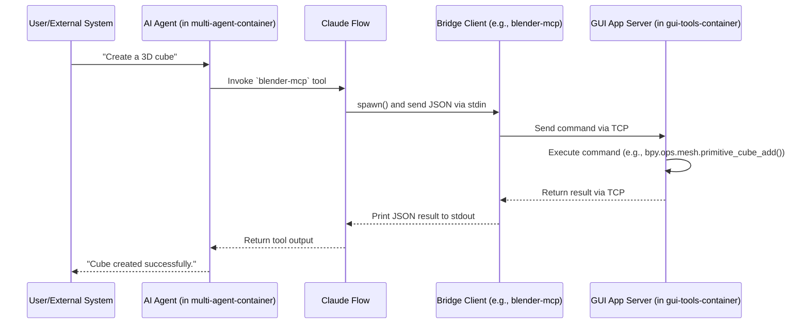

# Architecture Overview

This document describes the architecture of the Multi-Agent Docker Environment, a sophisticated containerized platform that integrates AI agents, MCP (Model Context Protocol) tools, and external application bridges.

### System Architecture Diagram

```mermaid
graph TB
    subgraph "Docker Environment (docker_ragflow network)"
        subgraph "multi-agent-container (Your Workspace)"
            direction LR
            subgraph "Process Management"
                SUPERVISOR[Supervisord] --> WS_BRIDGE[WebSocket Bridge:3002]
                SUPERVISOR --> TCP_SERVER[TCP Server:9500]
            end
            subgraph "Orchestration & Tools"
                CLAUDE_FLOW[Claude Flow Orchestrator]
                MCP_TOOLS[MCP Tools<br/>(imagemagick, kicad, etc.)]
                BRIDGE_CLIENTS[Bridge Clients<br/>(blender, qgis, pbr)]
            end
            CLAUDE_FLOW --> MCP_TOOLS
            CLAUDE_FLOW --> BRIDGE_CLIENTS
        end

        subgraph "gui-tools-container (The Workshop)"
            direction LR
            subgraph "GUI Applications"
                VNC[VNC Server:5901]
                BLENDER_APP[Blender App]
                QGIS_APP[QGIS App]
            end
            subgraph "MCP Servers"
                BLENDER_SERVER[Blender Server:9876]
                QGIS_SERVER[QGIS Server:9877]
                PBR_SERVER[PBR Server:9878]
            end
        end
    end

    subgraph "External User/System"
        USER[User / IDE / Control System]
    end

    USER -- WebSocket --> WS_BRIDGE
    USER -- TCP --> TCP_SERVER
    BRIDGE_CLIENTS -- TCP --> BLENDER_SERVER
    BRIDGE_CLIENTS -- TCP --> QGIS_SERVER
    BRIDGE_CLIENTS -- TCP --> PBR_SERVER

    style multi-agent-container fill:#e3f2fd
    style gui-tools-container fill:#e8f5e9
```

### Core Concepts

1.  **Dual-Container Design**: The system is split into two main containers to separate concerns:
    *   **`multi-agent-container`**: A lightweight, logic-focused container where the AI agents and CLI-based tools reside. It contains the development runtimes (Python, Node.js, etc.) and the `claude-flow` orchestrator. This is the primary interaction point.
    *   **`gui-tools-container`**: A heavier container dedicated to running resource-intensive GUI applications like Blender and QGIS. It runs an XFCE desktop environment accessible via VNC.

2.  **Model Context Protocol (MCP)**: MCP is the communication standard that allows AI agents to discover and interact with tools. All tools, whether local or remote, expose an MCP-compliant interface.

3.  **The Bridge Pattern**: To allow agents in the `multi-agent-container` to control applications in the `gui-tools-container`, we use a bridge pattern.
    *   The agent calls a lightweight "bridge client" (e.g., `blender-mcp`) inside its own container.
    *   This client forwards the request over the internal Docker network via TCP to a corresponding server running inside the GUI application (e.g., a Blender Python addon).
    *   This decouples the agent's logic from the heavy GUI application, improving performance and modularity.

### Process Management

-   **Supervisord**: Manages long-running background services within the `multi-agent-container`, such as the MCP WebSocket Bridge and TCP Server. It ensures these services are always running.
-   **Claude Flow**: The central orchestrator that spawns MCP tool processes on demand. It communicates with tools via `stdio` (standard input/output) using a JSON-based protocol.

### Data Flow: Tool Invocation



### Further Reading

- **[Networking Deep Dive](./02-networking.md)**
- **[Security Features](./03-security.md)**