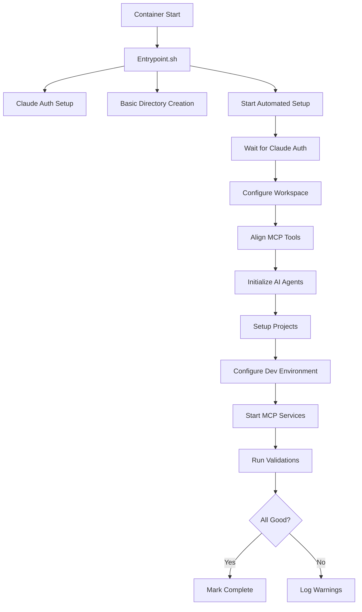

# Automated Setup Documentation

## Overview

The Multi-Agent Docker environment now features comprehensive automated setup that configures everything from Claude authentication to AI agent initialization, all triggered automatically on container startup.

## What Gets Automated

### 1. Claude Code Authentication
- Mounts host `~/.claude` directory directly into container
- No manual configuration required
- Credentials are read-only and secure
- Authentication persists across container restarts

### 2. Workspace Configuration
- Initializes Claude project configuration
- Creates `claude_project.json` with environment context
- Links all MCP tools to workspace
- Updates `.mcp.json` with current environment details

### 3. AI Agent Initialization
- Automatically initializes Goal Planner (GOAP) agent
- Sets up SAFLA Neural agent with multi-tier memory
- Creates agent configuration with ports and features
- Establishes inter-agent communication channels

### 4. MCP Service Management
- Starts all MCP services via supervisor
- Falls back to manual start if supervisor fails
- Waits for health endpoints to respond
- Validates all services are operational

### 5. Development Environment
- Configures git with sensible defaults
- Creates workspace shortcuts and aliases
- Sets up example projects
- Detects and configures external project mounts

## Setup Process

### Initial Configuration

1. **Authenticate Claude on your host system**:
```bash
# On your host machine (not in Docker)
claude login
```

2. **Create `.env` file** for other configurations:
```bash
cd multi-agent-docker
cp .env.example .env
```

2. **Start the container**:
```bash
docker compose up -d multi-agent
```

3. **Monitor setup progress**:
```bash
# Watch the automated setup logs
docker exec -it multi-agent-container setup-logs

# Or check status
docker exec -it multi-agent-container setup-status
```

## Automation Flow



## Monitoring and Control

### Check Status
```bash
docker exec -it multi-agent-container setup-status
```

Output shows:
- Setup component status
- Service availability
- Recent errors
- Health check results

### View Logs
```bash
# Real-time setup logs
docker exec -it multi-agent-container setup-logs

# All automation logs
docker exec -it multi-agent-container cat /app/mcp-logs/automated-setup.log
```

### Re-run Setup
If needed, you can re-run the automated setup:
```bash
# Remove completion marker
docker exec -it multi-agent-container rm -f /workspace/.full_setup_completed

# Re-run setup
docker exec -it multi-agent-container rerun-setup
```

## Automation Markers

The system uses marker files to track progress:

| Marker File | Purpose |
|------------|---------|
| `/workspace/.setup_completed` | Basic setup from setup-workspace.sh |
| `/workspace/.claude_configured` | Claude workspace configured |
| `/workspace/.swarm/.agents_initialized` | AI agents initialized |
| `/workspace/.full_setup_completed` | Full automation completed |

## Customization

### Skip Automation
To skip automated setup, create the completion marker before starting:
```bash
docker exec -it multi-agent-container touch /workspace/.full_setup_completed
```

### Partial Setup
Remove specific markers to re-run parts:
```bash
# Re-initialize agents only
docker exec -it multi-agent-container rm -f /workspace/.swarm/.agents_initialized
docker exec -it multi-agent-container rerun-setup
```

### Custom Project Setup
The automation detects project types in `/workspace/ext`:
- `package.json` → Node.js project
- `Cargo.toml` → Rust project  
- `requirements.txt` → Python project
- `go.mod` → Go project

Add custom logic in `automated-setup.sh` `setup_workspace_projects()` function.

## Troubleshooting

### Setup Hangs
1. Check if waiting for Claude auth:
   ```bash
   docker exec -it multi-agent-container cat /home/dev/.claude/.credentials.json
   ```

2. Check service logs:
   ```bash
   docker exec -it multi-agent-container tail -50 /app/mcp-logs/automated-setup.log
   ```

### Services Not Starting
1. Check supervisor status:
   ```bash
   docker exec -it multi-agent-container supervisorctl -c /etc/supervisor/conf.d/supervisord.conf status
   ```

2. Try manual start:
   ```bash
   docker exec -it multi-agent-container bash -c "cd /workspace && node /workspace/scripts/mcp-tcp-server.js"
   ```

### Authentication Issues
1. Verify environment variables:
   ```bash
   docker exec -it multi-agent-container env | grep CLAUDE_CODE
   ```

2. Update credentials:
   ```bash
   docker exec -it multi-agent-container update-claude-auth
   ```

## Benefits

1. **Zero Manual Setup**: Everything configures automatically
2. **Reproducible**: Same environment every time
3. **Self-Healing**: Services restart if they fail
4. **Progress Tracking**: Know exactly what's configured
5. **Customizable**: Easy to extend for your needs

## Security Notes

- Credentials are only read from environment variables
- Files are created with restrictive permissions (600)
- Tokens are never logged or displayed
- Use Docker secrets for production deployments