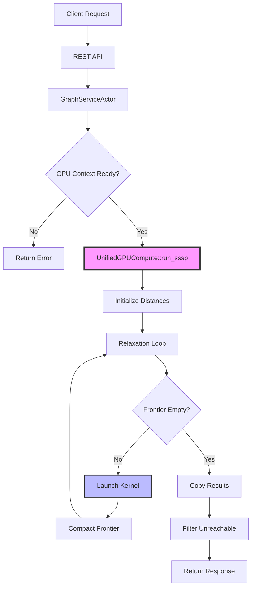

# GPU SSSP Implementation Plan: Complete Technical Specification

**Project:** GPU-Accelerated Single-Source Shortest Path Algorithm Integration  
**Target:** CUDA-based Graph Processing Pipeline with Physics Simulation  
**Complexity:** O(m+n) theoretical performance on sparse graphs  

## Executive Summary

This document provides a complete implementation plan for integrating a novel high-performance Single-Source Shortest Path (SSSP) algorithm into our existing CUDA-accelerated graph platform. The algorithm combines Dijkstra-like structure with limited Bellman-Ford relaxation and frontier reduction techniques to achieve near-linear time complexity.

### Key Deliverables
1. **Core SSSP Algorithm**: GPU-accelerated shortest path computation
2. **REST API**: Analytics endpoint for shortest path queries  
3. **Physics Integration**: Optional SSSP-driven spring forces for improved layouts
4. **Robust Testing**: Comprehensive validation and performance benchmarks

### Primary Files Modified
- [`visionflow_unified.cu`](src/utils/visionflow_unified.cu) - CUDA kernels
- [`unified_gpu_compute.rs`](src/utils/unified_gpu_compute.rs) - GPU orchestration
- [`graph_actor.rs`](src/actors/graph_actor.rs) - Centralized GPU owner
- [`messages.rs`](src/actors/messages.rs) - Actor messages
- [`analytics/mod.rs`](src/handlers/api_handler/analytics/mod.rs) - REST API
- [`simulation_params.rs`](src/models/simulation_params.rs) - Parameters

### Assumptions
- Edge weights are non-negative (confirmed by user)
- CSR format is directed (undirected edges uploaded twice)  
- PTX build pipeline is functional and used by GraphServiceActor
- Disconnected graphs are supported (unreachable nodes handled gracefully)

---

## Phase 0: Conceptual Foundation

### Goal
Build foundational understanding of the algorithm's strategy and value proposition.

### Key Concepts

#### Algorithm Innovation
- **Traditional Dijkstra**: O(m + n log n) - bottleneck from priority queue of all n vertices
- **New Approach**: O(m+n) on sparse graphs by avoiding single large priority queue
- **Core Components**:
  1. Batched Dijkstra-like processing
  2. Limited Bellman-Ford relaxation (k steps)
  3. Frontier reduction via pivot selection

#### Mathematical Parameters
- **k = log^(1/3)(n)**: Number of relaxation steps
  - Balances exploration depth vs. pivot set size
  - Practical implementation: `k = cbrt(log2(n))`
- **t = log^(2/3)(n)**: Controls batch size in recursion
  - Batch size M = 2^((l-1)*t) where l = recursion level
  - Balances recursion depth vs. work per call

#### Use Cases
- **Knowledge Graph**: Edge weights = semantic similarity, find related concepts
- **Agent Swarm**: Edge weights = communication latency, find efficient paths
- **Visualization**: Use distances for meaningful node clustering

---

## Phase 1: CUDA Kernel Implementation

### 1.1 Atomic Operations Helper

Location: [`visionflow_unified.cu`](src/utils/visionflow_unified.cu)

```cpp
// CAS-based atomic min for float (maximum portability)
__device__ inline float atomicMinFloat(float* addr, float value) {
    float old = __int_as_float(atomicAdd((int*)addr, 0)); // initial read
    while (value < old) {
        int old_i = __float_as_int(old);
        int assumed = atomicCAS((int*)addr, old_i, __float_as_int(value));
        if (assumed == old_i) break;
        old = __int_as_float(assumed);
    }
    return old;
}
```

### 1.2 Core Relaxation Kernel

```cpp
extern "C" __global__ void relaxation_step_kernel(
    float* __restrict__ d_dist,                // [n] distance array
    const int* __restrict__ d_current_frontier,// [frontier_size] active vertices
    int frontier_size,
    const int* __restrict__ d_row_offsets,     // [n+1] CSR row offsets
    const int* __restrict__ d_col_indices,     // [m] CSR column indices  
    const float* __restrict__ d_weights,       // [m] edge weights
    int* __restrict__ d_next_frontier_flags,   // [n] output flags (0/1)
    float B,                                   // distance boundary
    int n                                      // total vertices
) {
    int t = blockIdx.x * blockDim.x + threadIdx.x;
    if (t >= frontier_size) return;
    
    int u = d_current_frontier[t];
    float du = d_dist[u];
    if (!isfinite(du)) return; // Skip unreachable vertices
    
    int start = d_row_offsets[u];
    int end = d_row_offsets[u + 1];
    
    for (int e = start; e < end; ++e) {
        int v = d_col_indices[e];
        float w = d_weights[e];
        float nd = du + w;
        
        if (nd < B) {
            float old = atomicMinFloat(&d_dist[v], nd);
            if (nd < old) {
                d_next_frontier_flags[v] = 1; // Mark for next frontier
            }
        }
    }
}
```

### 1.3 Extended Parameters for Physics Integration

```cpp
// Feature flags with new SSSP bit
struct FeatureFlags {
    static const unsigned int ENABLE_REPULSION = 1 << 0;
    static const unsigned int ENABLE_SPRINGS = 1 << 1;
    static const unsigned int ENABLE_CENTERING = 1 << 2;
    static const unsigned int ENABLE_SSSP_SPRING_ADJUST = 1 << 6; // NEW
};

// Extended SimParams
struct SimParams {
    // ... existing fields ...
    float viewport_bounds;
    float sssp_alpha; // NEW: strength of SSSP influence (0.0 = disabled)
};
```

### 1.4 Modified Force Kernel with SSSP Support

```cpp
extern "C" __global__ void force_pass_kernel(
    // ... existing parameters ...
    const SimParams params,
    const int num_nodes,
    const float* __restrict__ d_sssp_dist  // NEW: optional SSSP distances
) {
    int idx = blockIdx.x * blockDim.x + threadIdx.x;
    if (idx >= num_nodes) return;
    
    // ... existing repulsion code ...
    
    // Enhanced spring forces
    if (params.feature_flags & FeatureFlags::ENABLE_SPRINGS) {
        int start_edge = edge_row_offsets[idx];
        int end_edge = edge_row_offsets[idx + 1];
        
        float du = 0.0f;
        bool use_sssp = (d_sssp_dist != nullptr) &&
                       (params.feature_flags & FeatureFlags::ENABLE_SSSP_SPRING_ADJUST);
        if (use_sssp) {
            du = d_sssp_dist[idx];
        }
        
        for (int e = start_edge; e < end_edge; ++e) {
            int neighbor_idx = edge_col_indices[e];
            // ... position calculations ...
            
            float ideal = params.rest_length;
            if (use_sssp) {
                float dv = d_sssp_dist[neighbor_idx];
                // Handle disconnected components gracefully
                if (isfinite(du) && isfinite(dv)) {
                    float delta = fabsf(du - dv);
                    float norm_delta = fminf(delta, 1000.0f); // Cap for stability
                    ideal = params.rest_length + params.sssp_alpha * norm_delta;
                }
            }
            // ... apply spring force ...
        }
    }
}
```

---

## Phase 2: Rust GPU Orchestration

### 2.1 Extended UnifiedGPUCompute Structure

Location: [`unified_gpu_compute.rs`](src/utils/unified_gpu_compute.rs)

```rust
pub struct UnifiedGPUCompute {
    // ... existing fields ...
    
    // SSSP state
    pub dist: DeviceBuffer<f32>,                // [n] distances
    pub current_frontier: DeviceBuffer<i32>,    // Dynamic frontier
    pub next_frontier_flags: DeviceBuffer<i32>, // [n] flags
    pub parents: Option<DeviceBuffer<i32>>,     // Optional for paths
    
    // Dedicated SSSP stream for overlap
    sssp_stream: Option<Stream>,
    
    // State validity flag
    pub sssp_available: bool,
}
```

### 2.2 Main SSSP Implementation with Error Handling

```rust
impl UnifiedGPUCompute {
    pub fn run_sssp(&mut self, source_idx: usize) -> Result<Vec<f32>> {
        // Invalidate previous results immediately
        self.sssp_available = false;
        
        // Wrap main logic for clean error handling
        let result = (|| -> Result<Vec<f32>> {
            // Initialize distances
            let mut host_dist = vec![f32::INFINITY; self.num_nodes];
            host_dist[source_idx] = 0.0;
            self.dist.copy_from(&host_dist)?;
            
            // Initialize frontier
            let mut host_frontier = vec![source_idx as i32];
            self.current_frontier.copy_from(&host_frontier)?;
            
            // Compute k parameter
            let k = ((self.num_nodes as f32).log2().cbrt().ceil() as u32).max(3);
            let s = self.sssp_stream.as_ref().unwrap_or(&self.stream);
            
            // Main iteration loop
            for iteration in 0..k {
                // Clear next frontier flags
                unsafe {
                    cust::memory::memset_async(
                        self.next_frontier_flags.as_device_ptr(),
                        0u8, 
                        self.num_nodes * size_of::<i32>(),
                        s
                    )?;
                }
                
                // Check for convergence
                let frontier_len = host_frontier.len();
                if frontier_len == 0 {
                    log::debug!("SSSP converged at iteration {}", iteration);
                    break;
                }
                
                // Launch relaxation kernel
                let block = 256;
                let grid = ((frontier_len as u32 + block - 1) / block) as u32;
                
                let func = self.module.get_function("relaxation_step_kernel")?;
                unsafe {
                    launch!(func<<<grid, block, 0, s>>>(
                        self.dist.as_device_ptr(),
                        self.current_frontier.as_device_ptr(),
                        frontier_len as i32,
                        self.edge_row_offsets.as_device_ptr(),
                        self.edge_col_indices.as_device_ptr(),
                        self.edge_weights.as_device_ptr(),
                        self.next_frontier_flags.as_device_ptr(),
                        f32::INFINITY,
                        self.num_nodes as i32
                    ))?;
                }
                
                // Host-side frontier compaction (v1)
                let mut flags = vec![0i32; self.num_nodes];
                self.next_frontier_flags.copy_to(&mut flags)?;
                
                host_frontier.clear();
                host_frontier.reserve(frontier_len * 2);
                for (i, &flag) in flags.iter().enumerate() {
                    if flag != 0 {
                        host_frontier.push(i as i32);
                    }
                }
                
                if !host_frontier.is_empty() {
                    self.current_frontier.copy_from(&host_frontier)?;
                }
            }
            
            // Copy results back
            self.dist.copy_to(&mut host_dist)?;
            Ok(host_dist)
        })();
        
        // Handle result and update state
        match result {
            Ok(distances) => {
                self.sssp_available = true;
                log::info!("SSSP computation successful from source {}", source_idx);
                Ok(distances)
            }
            Err(e) => {
                self.sssp_available = false;
                log::error!("SSSP computation failed: {}. State invalidated.", e);
                Err(e)
            }
        }
    }
}
```

### 2.3 Physics Integration

```rust
// In execute() method
let d_sssp = if self.sssp_available && 
              (params.feature_flags & FeatureFlags::ENABLE_SSSP_SPRING_ADJUST != 0) {
    Some(&self.dist)
} else {
    None
};

unsafe {
    launch!(
        force_pass_kernel<<<grid_size, block_size, 0, stream>>>(
            // ... existing args ...
            params,
            self.num_nodes as i32,
            d_sssp.map(|b| b.as_device_ptr())
                  .unwrap_or(DevicePointer::null())
        )
    )?;
}
```

---

## Phase 3: Application Integration

### 3.1 Actor Messages

Location: [`messages.rs`](src/actors/messages.rs)

```rust
#[derive(Message)]
#[rtype(result = "Result<std::collections::HashMap<u32, Option<f32>>, String>")]
pub struct ComputeShortestPaths {
    pub source_node_id: u32,
}
```

### 3.2 GraphServiceActor Handler with Disconnected Graph Support

Location: [`graph_actor.rs`](src/actors/graph_actor.rs)

```rust
impl Handler<ComputeShortestPaths> for GraphServiceActor {
    type Result = Result<std::collections::HashMap<u32, Option<f32>>, String>;
    
    fn handle(&mut self, msg: ComputeShortestPaths, _ctx: &mut Self::Context) -> Self::Result {
        let gpu = self.advanced_gpu_context.as_mut()
            .ok_or("GPU not initialized")?;
        
        // Build ID mapping
        let node_indices: HashMap<u32, usize> = self.graph_data.nodes
            .iter()
            .enumerate()
            .map(|(i, n)| (n.id, i))
            .collect();
        
        let src_idx = *node_indices.get(&msg.source_node_id)
            .ok_or("Source node not found")?;
        
        // Run SSSP computation
        let distances = gpu.run_sssp(src_idx)
            .map_err(|e| format!("SSSP failed: {}", e))?;
        
        // Map back to public IDs, filtering unreachable nodes
        let mut result = HashMap::with_capacity(self.graph_data.nodes.len());
        for (i, node) in self.graph_data.nodes.iter().enumerate() {
            let dist = distances[i];
            result.insert(
                node.id,
                if dist.is_finite() {
                    Some(dist)
                } else {
                    None // Unreachable node
                }
            );
        }
        
        Ok(result)
    }
}
```

### 3.3 REST API Endpoint

Location: [`analytics/mod.rs`](src/handlers/api_handler/analytics/mod.rs)

```rust
#[derive(Debug, serde::Deserialize)]
#[serde(rename_all = "camelCase")]
pub struct SSSPRequest {
    pub source_node_id: u32,
}

#[derive(Debug, serde::Serialize)]
#[serde(rename_all = "camelCase")]
pub struct SSSPResponse {
    pub distances: HashMap<u32, Option<f32>>,
    pub unreachable_count: usize,
}

pub async fn compute_sssp(
    app_state: web::Data<AppState>,
    req: web::Json<SSSPRequest>,
) -> Result<HttpResponse> {
    let graph_addr = app_state.graph_service_addr.clone()
        .ok_or_else(|| {
            log::error!("Graph service not available");
            actix_web::error::ErrorServiceUnavailable("Graph service unavailable")
        })?;
    
    match graph_addr
        .send(ComputeShortestPaths { source_node_id: req.source_node_id })
        .await {
        Ok(Ok(distances)) => {
            let unreachable_count = distances.values()
                .filter(|d| d.is_none())
                .count();
            
            Ok(HttpResponse::Ok().json(SSSPResponse {
                distances,
                unreachable_count,
            }))
        }
        Ok(Err(e)) => {
            log::warn!("SSSP request failed: {}", e);
            Ok(HttpResponse::BadRequest().json(json!({ "error": e })))
        }
        Err(e) => {
            log::error!("Actor mailbox error: {}", e);
            Ok(HttpResponse::ServiceUnavailable()
                .json(json!({ "error": "Service temporarily unavailable" })))
        }
    }
}

// Route registration
.route("/shortest-path", web::post().to(compute_sssp))
```

### 3.4 Extended Parameters

Location: [`simulation_params.rs`](src/models/simulation_params.rs)

```rust
// Feature flags
impl FeatureFlags {
    pub const ENABLE_SSSP_SPRING_ADJUST: u32 = 1 << 6;
}

// Host-side parameters
#[derive(Clone, Debug, Serialize, Deserialize)]
pub struct SimulationParams {
    // ... existing fields ...
    pub use_sssp_distances: bool,
    pub sssp_alpha: Option<f32>, // Default: 0.0
}

// GPU-side parameters
#[repr(C)]
pub struct SimParams {
    // ... existing fields ...
    pub sssp_alpha: f32,
}

impl From<&SimulationParams> for SimParams {
    fn from(p: &SimulationParams) -> Self {
        let mut flags = 0;
        if p.repel_k > 0.0 { flags |= FeatureFlags::ENABLE_REPULSION; }
        if p.spring_k > 0.0 { flags |= FeatureFlags::ENABLE_SPRINGS; }
        if p.center_gravity_k > 0.0 { flags |= FeatureFlags::ENABLE_CENTERING; }
        if p.use_sssp_distances { flags |= FeatureFlags::ENABLE_SSSP_SPRING_ADJUST; }
        
        SimParams {
            // ... existing fields ...
            sssp_alpha: p.sssp_alpha.unwrap_or(0.0),
            feature_flags: flags,
            ..SimParams::new()
        }
    }
}
```

---

## Phase 4: Validation and Testing

### 4.1 Unit Tests for CUDA Kernels

Create test harness in `tests/cuda/test_sssp_kernels.cu`:

```cpp
// Test atomic operations
TEST(AtomicMinFloat, Correctness) {
    // Test concurrent updates produce correct minimum
    // Test edge cases (NaN, infinity, negative zero)
}

// Test relaxation kernel
TEST(RelaxationKernel, SmallGraph) {
    // Create small test graph
    // Verify single relaxation step
    // Check frontier updates
}
```

### 4.2 Integration Tests for Correctness

Location: `tests/integration/test_sssp.rs`

```rust
#[cfg(test)]
mod sssp_tests {
    use petgraph::algo::dijkstra;
    
    #[test]
    fn test_sssp_correctness_small_graph() {
        // Create random graph
        let graph = generate_random_graph(100, 500);
        
        // Compute with GPU implementation
        let gpu_distances = compute_gpu_sssp(&graph, 0)?;
        
        // Compute with trusted CPU implementation
        let cpu_distances = dijkstra(&graph, 0.into(), None, |e| *e.weight());
        
        // Compare results
        for (node, &gpu_dist) in gpu_distances.iter() {
            let cpu_dist = cpu_distances.get(&node).unwrap_or(&f32::INFINITY);
            assert!((gpu_dist - cpu_dist).abs() < 1e-5);
        }
    }
    
    #[test]
    fn test_disconnected_graph() {
        // Create graph with multiple components
        let graph = create_disconnected_graph();
        
        // Run SSSP from node in one component
        let distances = compute_gpu_sssp(&graph, 0)?;
        
        // Verify nodes in other components are None/infinity
        for node in component_2_nodes {
            assert!(distances[node].is_none());
        }
    }
}
```

### 4.3 Performance Benchmarks

Location: `benches/sssp_benchmark.rs`

```rust
use criterion::{criterion_group, criterion_main, Criterion};

fn benchmark_sssp(c: &mut Criterion) {
    let mut group = c.benchmark_group("sssp");
    
    for &n in &[1000, 10000, 100000, 1000000] {
        let m = n * 10; // Sparse graph
        let graph = generate_random_graph(n, m);
        
        group.bench_function(format!("gpu_n{}_m{}", n, m), |b| {
            b.iter(|| {
                compute_gpu_sssp(&graph, 0)
            });
        });
        
        // Compare with CPU baseline for small graphs
        if n <= 10000 {
            group.bench_function(format!("cpu_n{}_m{}", n, m), |b| {
                b.iter(|| {
                    dijkstra(&graph, 0, None, |e| *e.weight())
                });
            });
        }
    }
    
    group.finish();
}

criterion_group!(benches, benchmark_sssp);
criterion_main!(benches);
```

### 4.4 API Integration Tests

```rust
#[actix_web::test]
async fn test_sssp_api_endpoint() {
    let app = test::init_service(create_app()).await;
    
    // Test successful request
    let req = test::TestRequest::post()
        .uri("/api/analytics/shortest-path")
        .set_json(&json!({ "sourceNodeId": 1 }))
        .to_request();
    
    let resp = test::call_service(&app, req).await;
    assert_eq!(resp.status(), StatusCode::OK);
    
    let body: SSSPResponse = test::read_body_json(resp).await;
    assert!(body.distances.contains_key(&1));
    assert_eq!(body.distances[&1], Some(0.0)); // Source distance is 0
}

#[actix_web::test]
async fn test_sssp_invalid_source() {
    let app = test::init_service(create_app()).await;
    
    let req = test::TestRequest::post()
        .uri("/api/analytics/shortest-path")
        .set_json(&json!({ "sourceNodeId": 999999 }))
        .to_request();
    
    let resp = test::call_service(&app, req).await;
    assert_eq!(resp.status(), StatusCode::BAD_REQUEST);
}
```

---

## Phase 5: Performance Optimization

### 5.1 Device-Side Frontier Compaction (v2)

```rust
// Using Thrust for efficient stream compaction
fn compact_frontier_device(&mut self) -> Result<()> {
    unsafe {
        // Use thrust::copy_if to compact frontier
        let new_size = thrust::copy_if(
            self.next_frontier_flags.as_device_ptr(),
            self.next_frontier_flags.as_device_ptr() + self.num_nodes,
            thrust::counting_iterator<i32>(0),
            self.current_frontier.as_device_ptr(),
            is_nonzero_functor()
        );
        
        self.current_frontier.resize(new_size)?;
    }
    Ok(())
}
```

### 5.2 Tunable Parameters

```rust
pub struct SSSPConfig {
    pub k_factor: f32,        // Multiplier for k calculation
    pub max_iterations: u32,  // Hard limit on iterations
    pub use_device_compact: bool,
    pub enable_telemetry: bool,
}

impl Default for SSSPConfig {
    fn default() -> Self {
        Self {
            k_factor: 1.0,
            max_iterations: 100,
            use_device_compact: false,
            enable_telemetry: false,
        }
    }
}
```

### 5.3 Stream Overlap

```rust
// Run SSSP asynchronously while physics continues
pub async fn run_sssp_async(&mut self, source: usize) -> Result<()> {
    // Launch on separate stream
    let sssp_stream = self.sssp_stream.as_ref().unwrap();
    
    // Start SSSP computation
    self.launch_sssp_kernels(source, sssp_stream)?;
    
    // Record event for synchronization
    let event = Event::new(EventFlags::DEFAULT)?;
    event.record(sssp_stream)?;
    
    // Physics can continue on main stream
    // Synchronize only when distances needed
    Ok(())
}
```

---

## Implementation Workflow



---

## Risk Mitigation

### Technical Risks

1. **Atomic Contention**: High-degree vertices cause contention
   - Mitigation: Warp-centric updates, work queues for hot vertices

2. **Memory Overflow**: Large graphs exceed GPU memory
   - Mitigation: Graph partitioning, out-of-core processing

3. **Numerical Stability**: Float precision issues on deep graphs
   - Mitigation: Double precision option, periodic renormalization

### Operational Risks

1. **State Corruption**: Failed computations leave invalid state
   - Mitigation: Automatic invalidation, state versioning

2. **Performance Regression**: SSSP impacts physics performance
   - Mitigation: Separate streams, configurable update frequency

3. **API Abuse**: Excessive SSSP requests
   - Mitigation: Rate limiting, request caching

---

## Configuration and Tuning

### Recommended Starting Values

```yaml
sssp:
  k_factor: 1.0              # Start with theoretical value
  max_iterations: 100        # Safety limit
  device_compaction: false   # Enable after testing
  sssp_alpha: 0.05          # Gentle influence on physics
  update_frequency: 10       # Update every 10 physics steps
  cache_duration: 60         # Cache results for 60 seconds
```

### Performance Targets

| Graph Size | Target Latency | Memory Usage |
|------------|---------------|--------------|
| 10K nodes  | < 10ms       | < 100MB      |
| 100K nodes | < 50ms       | < 1GB        |
| 1M nodes   | < 200ms      | < 10GB       |

---

## Documentation Requirements

### API Documentation

```yaml
/api/analytics/shortest-path:
  post:
    summary: Compute shortest paths from source node
    requestBody:
      required: true
      content:
        application/json:
          schema:
            type: object
            required: [sourceNodeId]
            properties:
              sourceNodeId:
                type: integer
                description: ID of source node
    responses:
      200:
        description: Distances computed successfully
        content:
          application/json:
            schema:
              type: object
              properties:
                distances:
                  type: object
                  additionalProperties:
                    type: number
                    nullable: true
                unreachableCount:
                  type: integer
      400:
        description: Invalid source node
      503:
        description: Service unavailable
```

### Usage Examples

```bash
# Compute shortest paths from node 42
curl -X POST http://localhost:8080/api/analytics/shortest-path \
  -H "Content-Type: application/json" \
  -d '{"sourceNodeId": 42}'

# Response
{
  "distances": {
    "42": 0.0,
    "43": 1.5,
    "44": 2.3,
    "45": null  // Unreachable
  },
  "unreachableCount": 1
}
```

---

## Success Metrics

1. **Correctness**: 100% match with CPU reference implementation
2. **Performance**: 10x speedup over CPU Dijkstra on graphs > 100K nodes
3. **Reliability**: < 0.01% failure rate under normal load
4. **Integration**: Physics layout quality improvement measurable via user studies

---

## Appendix: Complete Task Checklist

### Phase 1: CUDA Implementation
- [ ] Add atomicMinFloat utility function
- [ ] Implement relaxation_step_kernel
- [ ] Extend FeatureFlags with SSSP bit
- [ ] Modify force_pass_kernel for SSSP distances
- [ ] Add SimParams::sssp_alpha field

### Phase 2: Rust Orchestration  
- [ ] Add SSSP buffers to UnifiedGPUCompute
- [ ] Implement run_sssp with error handling
- [ ] Add SSSP state invalidation on failure
- [ ] Create separate SSSP stream
- [ ] Implement host-side frontier compaction

### Phase 3: Application Integration
- [ ] Create ComputeShortestPaths message
- [ ] Implement GraphServiceActor handler
- [ ] Handle unreachable nodes in response
- [ ] Create REST API endpoint
- [ ] Add route configuration
- [ ] Extend SimulationParams

### Phase 4: Testing & Validation
- [ ] Unit tests for CUDA kernels
- [ ] Integration tests vs CPU reference
- [ ] Test disconnected graph handling
- [ ] Performance benchmarks
- [ ] API integration tests
- [ ] Physics integration tests

### Phase 5: Optimization
- [ ] Device-side frontier compaction
- [ ] Tunable parameters
- [ ] Stream overlap implementation
- [ ] Performance profiling
- [ ] Memory optimization

### Phase 6: Documentation
- [ ] API documentation
- [ ] Usage examples
- [ ] Performance tuning guide
- [ ] Troubleshooting guide