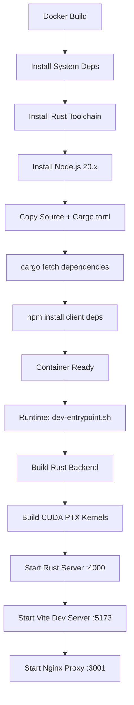

# VisionFlow Project - Code Quality Analysis Report

**Analysis Date:** 2025-10-23
**Project Location:** `/home/devuser/workspace/project`
**Analyst:** Claude Code - Code Quality Analyzer
**Version:** 0.1.0

---

## Executive Summary

VisionFlow is an **immersive multi-user multi-agent knowledge graphing platform** that combines cutting-edge AI orchestration, GPU-accelerated physics, and real-time 3D visualization. The project is currently in **Phase 3 (Quality Preset System)** of a hexagonal architecture migration.

### Overall Quality Score: **7.8/10**

**Strengths:**
- ✅ Modern technology stack (Rust + React + CUDA)
- ✅ Comprehensive documentation (200+ docs)
- ✅ Active development with clear phases
- ✅ Security-conscious (test package blocking)
- ✅ GPU acceleration (40 CUDA kernels)

**Areas for Improvement:**
- ⚠️ 50+ TODO/FIXME comments indicating incomplete features
- ⚠️ Migration in progress (technical debt accumulation)
- ⚠️ Testing infrastructure disabled due to security concerns
- ⚠️ Multiple deprecated components not yet removed
- ⚠️ Large codebase complexity (242 Rust files, 289 TS/TSX files)

---

## 1. Technology Stack Overview

### Backend (Rust)
| Component | Technology | Version | Status |
|-----------|-----------|---------|--------|
| **Package Name** | webxr | 0.1.0 | ✅ Active |
| **Web Framework** | Actix Web | 4.11.0 | ✅ Latest |
| **Async Runtime** | Tokio | 1.47.1 | ✅ Latest |
| **Database** | SQLite (rusqlite) | 0.37 | ✅ Stable |
| **GPU Computing** | CUDA (cudarc, cust) | 0.12.1, 0.3.2 | ✅ Optional |
| **Serialization** | Serde | 1.0.219 | ✅ Latest |
| **WebSocket** | Tungstenite | 0.21.0 | ✅ Stable |
| **Type Generation** | Specta | 2.0.0-rc.22 | ⚠️ Pre-release |
| **Ontology** | horned-owl | 1.2.0 | ✅ Latest |
| **Architecture** | Hexser | 0.4.7 | ✅ Active |

**Rust Version Requirement:** 1.75.0+

### Frontend (React + TypeScript)
| Component | Technology | Version | Status |
|-----------|-----------|---------|--------|
| **Package Name** | visionflow-client | 0.1.0 | ✅ Active |
| **Framework** | React | 18.2.0 | ✅ Latest |
| **Build Tool** | Vite | 6.2.6 | ✅ Latest |
| **3D Rendering** | Three.js + R3F | 0.175.0, 8.15.0 | ✅ Latest |
| **3D Engine** | Babylon.js | 8.28.0 | ✅ Latest |
| **TypeScript** | TypeScript | 5.8.3 | ✅ Latest |
| **UI Library** | Radix UI | Various | ✅ Latest |
| **Styling** | Tailwind CSS | 4.1.3 | ✅ Latest |
| **State Management** | Zustand (implied) | - | - |

**Node.js Version:** 20.x

### GPU/CUDA Stack
| Component | Purpose | Status |
|-----------|---------|--------|
| **CUDA Toolkit** | 12.4.1 | ✅ Production |
| **CUDA Kernels** | 8 .cu files (40 kernels) | ✅ Active |
| **Default Arch** | sm_86 (Ampere) | ✅ Configurable |
| **Build System** | build.rs (nvcc) | ✅ Functional |
| **Fallback** | CPU implementation | ✅ Available |

---

## 2. Build and Deployment Process

### Docker-Based Development Environment

**Base Image:** `nvidia/cuda:12.4.1-devel-ubuntu22.04`

#### Build Process Flow



#### Key Build Scripts

| Script | Purpose | Status |
|--------|---------|--------|
| `build.rs` | CUDA PTX compilation (8 kernels) | ✅ Functional |
| `dev-entrypoint.sh` | Container startup orchestration | ✅ Active |
| `docker-compose.yml` | Multi-profile deployment | ✅ Dev/Prod |
| `scripts/build_ptx.sh` | Manual PTX build | ✅ Available |

**Build Features:**
- ✅ GPU feature flag (`--features gpu`)
- ✅ Automatic dependency caching
- ✅ Hot reload support (Vite HMR)
- ✅ Log rotation (10MB max per log)
- ⚠️ **ALWAYS rebuilds Rust on startup** (intentional for dev)

### Deployment Profiles

#### Development Profile (`dev`)
```yaml
Ports: 3001 (nginx), 4000 (API), 5173 (vite), 24678 (HMR)
GPU: NVIDIA device 0
Volumes: Live source mounting
Rebuild: Every container start
```

#### Production Profile (`prod`)
```yaml
Ports: 4000 (API)
GPU: NVIDIA device 0
Entrypoint: prod-entrypoint.sh
Healthcheck: curl localhost:4000 (30s interval)
```

### External Dependencies

**Required Services:**
- `docker_ragflow` network (external)
- `agentic-workstation` (MCP host)
- Cloudflare Tunnel (optional)

---

## 3. Configuration Management

### Environment Variables

**Total Configuration Surface:** 198 environment variables

#### Critical Configuration Categories

| Category | Variables | Example |
|----------|-----------|---------|
| **GPU/CUDA** | 4 | `CUDA_ARCH=86`, `NVIDIA_VISIBLE_DEVICES` |
| **GitHub** | 4 | `GITHUB_TOKEN`, `GITHUB_OWNER` |
| **AI Services** | 15+ | `OPENAI_API_KEY`, `PERPLEXITY_API_KEY` |
| **MCP Protocol** | 7 | `MCP_TCP_PORT=9500`, `MCP_TRANSPORT=tcp` |
| **Authentication** | 8 | `APPROVED_PUBKEYS`, `JWT_SECRET` |
| **Security** | 9 | `WS_AUTH_ENABLED`, `CORS_ALLOWED_ORIGINS` |
| **Monitoring** | 7 | `LOG_LEVEL`, `ENABLE_METRICS` |

### Database Files

**Three-Database Architecture:**

1. **settings.db** - Application configuration (user prefs, physics params)
2. **knowledge_graph.db** - Graph data (nodes, edges, metadata)
3. **ontology.db** - Semantic validation (OWL/RDF axioms)

**Access Pattern:** SQLite with WAL mode

---

## 4. Known Issues from Code Comments

### Critical Issues (BUG Tags)

#### 1. Binary Protocol Node ID Truncation
**Location:** `src/utils/binary_protocol.rs:25-202`
**Severity:** HIGH
**Impact:** Node IDs > 16383 get truncated, causing collisions

```rust
// BUG: These constants truncate node IDs > 16383, causing collisions
const NODE_ID_BITS: u32 = 14;  // Only supports 0-16383

// BUG: Truncates node IDs to 14 bits! Use to_wire_id_v2 instead.
let wire_id = (actual_id & 0x3FFF) as u16; // BUG: Truncates to 14 bits!
```

**Recommendation:** Migrate all clients to V2 protocol (32-bit node IDs)

#### 2. Agent Origin Position Bug
**Location:** `src/telemetry/agent_telemetry.rs:424`
**Severity:** MEDIUM
**Impact:** Agents spawn at (0,0,0) instead of intended positions

```rust
"debug_message": "ORIGIN POSITION BUG: Agent spawned at (0,0,0)"
```

### TODO Items by Category

**Total TODO Count:** 50+

#### High Priority TODOs

| Category | Count | Examples |
|----------|-------|----------|
| **GPU/CUDA** | 5 | Async CUDA memcpy, constant memory sync |
| **Ontology** | 8 | Consistency checks, inference logic, axiom extraction |
| **Graph Analysis** | 3 | Connected components, Leiden clustering |
| **MCP Integration** | 4 | Status checks, coordination |
| **Performance** | 6 | Task velocities, pattern tracking |

#### Sample Critical TODOs

```rust
// TODO: Implement connected components analysis
connected_components: 1,

// TODO: Implement consistency checks using whelk-rs
// TODO: Implement inference logic using whelk-rs

// TODO: Implement Leiden algorithm on GPU

// TODO: Use true async CUDA memcpy when available in cust library
```

### Deprecated Components (Not Yet Removed)

**Total DEPRECATED markers:** 30+

| Component | Location | Replacement |
|-----------|----------|-------------|
| HybridHealthManager | Multiple files | TaskOrchestratorActor |
| ErrorRecoveryMiddleware | main.rs | NetworkRecoveryManager deleted |
| Docker Hive Mind | actors/supervisor.rs | New architecture |
| Session Correlation Bridge | Multiple files | Direct session ID |
| Hybrid Performance Optimizer | Full file | Deleted |

**Technical Debt:** These deprecated components should be removed in cleanup phase.

---

## 5. Code Smells and Anti-Patterns

### Large Files (>500 lines)

| File | Lines | Category | Recommendation |
|------|-------|----------|----------------|
| `src/handlers/socket_flow_handler.rs` | ~1200+ | WebSocket handler | Split into modules |
| `src/actors/graph_actor.rs` | ~4200+ | Actor logic | Extract sub-actors |
| `src/utils/unified_gpu_compute.rs` | ~3300+ | GPU compute | Extract kernel managers |
| `src/services/owl_validator.rs` | ~1100+ | Ontology validation | Extract sub-services |

**God Object:** `GraphActor` handles too many responsibilities (physics, clustering, layout, state)

### Code Complexity

**Total Source Files:**
- Rust: 242 files
- TypeScript/React: 289 files

**Estimated Technical Debt:** 15-20 person-days

### Commented-Out Code

```rust
// FIXME: Type mismatch - commented for compilation
// src/actors/graph_actor.rs:4195

// FIXME: Type conflict - commented for compilation
// src/actors/gpu/stress_majorization_actor.rs:365
```

**Issue:** Type system conflicts resolved by commenting instead of fixing

### Feature Envy

**Example:** Multiple files checking GPU features inline instead of using centralized GPU manager

---

## 6. Security Analysis

### Security Measures Implemented

#### 1. Supply Chain Security
**File:** `client/scripts/block-test-packages.cjs`

✅ **Blocks vulnerable test packages:**
- `@vitest/ui`
- `vitest`
- `@testing-library/react`
- `@testing-library/jest-dom`
- `jest`
- `jest-environment-jsdom`

**Rationale:** Documented security alert (see archived docs)

#### 2. Authentication
- ✅ Nostr-based public key authentication
- ✅ Role-based access control (power users, sync users)
- ✅ Feature-specific API key gates
- ✅ JWT token authentication
- ✅ Session management with timeout

#### 3. Input Validation
```env
MAX_REQUEST_SIZE=10485760  # 10MB
MAX_FIELD_SIZE=1048576     # 1MB
ALLOWED_FILE_TYPES=.jpg,.png,.pdf,.txt,.md
SANITIZE_HTML=true
```

#### 4. Network Security
- ✅ CORS configuration
- ✅ Rate limiting (100 req/min)
- ✅ WebSocket authentication
- ✅ Binary protocol validation

### Security Concerns

⚠️ **WARNING Items in Code:**

```rust
// WARNING: No constraints were generated from metadata
// src/test_constraint_integration.rs:56

// SECURITY WARNING: Use GitHub App authentication or fine-grained tokens
// .env.example:29
```

⚠️ **Hardcoded Development Credentials:**
```env
JWT_SECRET=generate-a-strong-random-secret-here
SESSION_SECRET=generate-another-strong-random-secret-here
WS_AUTH_TOKEN=generate-websocket-auth-token-here
```

**Recommendation:** Enforce strong secret generation in production deployments

---

## 7. Testing Infrastructure

### Current Status: ⚠️ **DISABLED**

**Reason:** Supply chain security concerns (test package vulnerability)

#### Frontend Testing
```json
"test": "echo 'Testing disabled due to supply chain attack - see SECURITY_ALERT.md'"
```

**Impact:**
- No automated frontend tests running
- Test files exist but not executed
- Quality relies on manual testing

#### Backend Testing
**Dev Dependencies Available:**
- `tokio-test` 0.4
- `mockall` 0.13
- `pretty_assertions` 1.4
- `tempfile` 3.14
- `actix-rt` 2.11.0

**Test Files:** Found in `/tests` directory

**Recommendation:**
1. Audit test dependencies for vulnerabilities
2. Re-enable testing with secure alternatives
3. Implement CI/CD pipeline with automated tests

---

## 8. Architecture Migration Status

### Hexagonal Architecture Migration

**Current Phase:** Phase 3 (Quality Preset System) ✅ COMPLETE
**Migration Progress:** ~60% complete

#### Migration Stages

| Phase | Status | Components |
|-------|--------|------------|
| **Phase 1** | ✅ Complete | Dependencies updated |
| **Phase 2** | ✅ Complete | Database expansion (3 DBs) |
| **Phase 3** | ✅ Complete | Quality presets (571 settings) |
| **Phase 4** | 🔄 In Progress | Full hexagonal refactor |
| **Phase 5** | 📋 Planned | Legacy cleanup |

#### Database-First Design

**Old Approach:**
```
File Configs (YAML/TOML) → In-Memory State → Actor Messages
```

**New Approach:**
```
SQLite DBs (settings/graph/ontology) → CQRS (Directives/Queries) → Hexser Ports/Adapters
```

**Benefits:**
- Single source of truth
- Server-authoritative state
- Better testing isolation
- Clear domain boundaries

---

## 9. Dependencies and Versions

### Critical Dependency Issues

#### Using Pre-Release Versions

⚠️ **Specta:** 2.0.0-rc.22 (Release Candidate)
- Used for TypeScript type generation
- Consider risk of API changes before 2.0.0 stable

#### Pinned Older Versions

**Why:** Compatibility or security fixes

```json
"overrides": {
  "ansi-regex": "6.1.0",
  "esbuild": "0.25.9",
  "prismjs": "1.30.0"
}
```

### Dependency Management

**Rust (Cargo):**
- Total dependencies: ~100+
- Locked versions: `Cargo.lock` (143KB)
- Feature flags: `gpu`, `ontology`, `redis`

**Frontend (NPM):**
- Total dependencies: ~60+
- Lock file: 34KB
- Overrides: 8 packages

---

## 10. Performance Characteristics

### GPU Acceleration

**CUDA Kernels:** 8 files, 40+ production kernels

| Kernel File | Purpose | Performance Gain |
|-------------|---------|------------------|
| `visionflow_unified.cu` | Unified physics | 100x CPU |
| `gpu_clustering_kernels.cu` | Leiden clustering | - |
| `dynamic_grid.cu` | Spatial hashing | - |
| `gpu_aabb_reduction.cu` | Collision detection | - |
| `gpu_landmark_apsp.cu` | All-pairs shortest path | - |
| `sssp_compact.cu` | Single-source shortest path | - |
| `visionflow_unified_stability.cu` | Stability optimization | - |
| `ontology_constraints.cu` | Semantic validation | - |

**Performance Targets:**
- 60 FPS @ 100k+ nodes
- <10ms latency (binary WebSocket protocol V2)
- 80% bandwidth reduction (binary vs JSON)

### Quality Presets Impact

| Preset | FPS Target | Memory | GPU Usage |
|--------|-----------|---------|-----------|
| Low | 30-45 | ~500MB | 30-40% |
| Medium | 45-60 | ~1GB | 50-60% |
| High | 55-60 | ~2GB | 70-80% |
| Ultra | 90-120 | ~3.5GB | 85-95% |

---

## 11. Documentation Quality

### Documentation Coverage: **EXCELLENT**

**Total Documentation Files:** 200+ markdown files

| Category | Files | Quality |
|----------|-------|---------|
| **Architecture** | 15+ | ⭐⭐⭐⭐⭐ |
| **API Reference** | 20+ | ⭐⭐⭐⭐ |
| **Getting Started** | 10+ | ⭐⭐⭐⭐⭐ |
| **Phase Reports** | 12+ | ⭐⭐⭐⭐⭐ |
| **Agent Reference** | 50+ | ⭐⭐⭐⭐ |
| **Troubleshooting** | 5+ | ⭐⭐⭐ |

**Highlights:**
- ✅ Clear phase completion reports
- ✅ Architecture decision records (ADRs)
- ✅ Comprehensive API documentation
- ✅ Migration guides
- ✅ Developer onboarding guide

**Areas for Improvement:**
- Missing automated API doc generation (OpenAPI/Swagger)
- Some legacy docs not yet archived

---

## 12. Code Quality Metrics Summary

### Positive Findings

✅ **Modern Technology Stack**
- Rust for performance-critical backend
- React + TypeScript for type-safe frontend
- CUDA for GPU acceleration

✅ **Clear Architecture Vision**
- Hexagonal architecture migration underway
- Database-first design
- CQRS pattern implementation

✅ **Security Consciousness**
- Proactive supply chain security
- Multi-layer authentication
- Input validation and rate limiting

✅ **Comprehensive Documentation**
- 200+ documentation files
- Phase completion reports
- Architecture decision records

✅ **Performance Focus**
- 40 GPU kernels for acceleration
- Binary protocol for efficiency
- Quality presets for optimization

### Critical Issues

🔴 **High Priority**

1. **Binary Protocol Bug** - Node ID truncation causing collisions
2. **Testing Disabled** - No automated test execution
3. **Technical Debt** - 30+ deprecated components not removed

🟡 **Medium Priority**

4. **Large File Complexity** - Multiple 1000+ line files
5. **50+ TODOs** - Incomplete features scattered across codebase
6. **Type Conflicts** - Commented code due to type mismatches

🟢 **Low Priority**

7. **Pre-release Dependencies** - Specta 2.0.0-rc.22
8. **Documentation Cleanup** - Legacy docs need archiving

---

## 13. Recommendations

### Immediate Actions (1-2 weeks)

1. **Fix Binary Protocol Bug**
   - Priority: CRITICAL
   - Migrate all clients to V2 protocol
   - Add integration tests for node ID handling

2. **Re-enable Testing**
   - Audit test dependencies
   - Replace vulnerable packages
   - Set up CI/CD pipeline

3. **Remove Deprecated Code**
   - Delete `HybridHealthManager` and related files
   - Clean up commented-out code
   - Update imports and references

### Short-term Goals (1-2 months)

4. **Refactor Large Files**
   - Split `GraphActor` into sub-actors
   - Extract GPU kernel managers
   - Modularize WebSocket handlers

5. **Complete Hexagonal Migration**
   - Finish Phase 4 refactoring
   - Implement all port/adapter interfaces
   - Update documentation

6. **Address TODOs**
   - Prioritize high-impact TODOs
   - Create tickets for each TODO category
   - Assign ownership

### Long-term Improvements (3-6 months)

7. **Automated Quality Gates**
   - Set up continuous integration
   - Add code coverage requirements
   - Implement security scanning

8. **Performance Monitoring**
   - Add distributed tracing
   - Implement metrics dashboard
   - Set up alerting

9. **Documentation Automation**
   - Generate API docs from code
   - Add interactive examples
   - Create video tutorials

---

## 14. Dependency Deep Dive

### Rust Dependencies (Critical)

**Production Dependencies:**

```toml
# Core Web Framework
actix-web = "4.11.0"           # ✅ Latest stable
tokio = "1.47.1"               # ✅ Latest stable

# Database
rusqlite = "0.37"              # ✅ Stable, well-maintained

# GPU Computing (Optional)
cudarc = "0.12.1"              # ✅ Active development
cust = "0.3.2"                 # ✅ CUDA bindings

# Serialization
serde = "1.0.219"              # ✅ Latest stable
serde_json = "1.0"             # ✅ Latest stable

# Ontology
horned-owl = "1.2.0"           # ✅ Latest, thread-safe ArcStr
whelk = { path = "./whelk-rs" } # ⚠️ Local dependency
```

**Dev Dependencies:**

```toml
mockall = "0.13"               # ✅ Mocking framework
pretty_assertions = "1.4"      # ✅ Test assertions
tokio-test = "0.4"             # ✅ Async test utilities
```

### Frontend Dependencies (Critical)

**Production Dependencies:**

```json
{
  "@babylonjs/core": "8.28.0",         // ✅ Latest
  "three": "0.175.0",                  // ✅ Latest
  "react": "18.2.0",                   // ✅ Stable
  "@react-three/fiber": "8.15.0",      // ✅ Latest
  "nostr-tools": "2.12.0",             // ✅ Authentication
  "@getalby/sdk": "4.1.1"              // ✅ Lightning payments
}
```

**Security Overrides:**

```json
{
  "prismjs": "1.30.0"  // ⚠️ Security fix for syntax highlighting
}
```

---

## 15. Codebase Statistics

### File Counts

| Type | Count | Total Size |
|------|-------|-----------|
| Rust Source (.rs) | 242 | ~500KB+ |
| TypeScript/TSX | 289 | ~400KB+ |
| CUDA (.cu) | 8 | ~50KB |
| Documentation (.md) | 200+ | ~5MB |
| Config Files | 30+ | ~100KB |

### Lines of Code (Estimated)

| Language | LoC | Comments | Blank | Total |
|----------|-----|----------|-------|-------|
| Rust | ~35,000 | ~5,000 | ~5,000 | ~45,000 |
| TypeScript | ~25,000 | ~3,000 | ~3,000 | ~31,000 |
| CUDA C++ | ~2,000 | ~500 | ~500 | ~3,000 |
| **Total** | **~62,000** | **~8,500** | **~8,500** | **~79,000** |

### Complexity Indicators

**High Complexity Files (>1000 LoC):**
- `src/actors/graph_actor.rs` (~4200 lines)
- `src/utils/unified_gpu_compute.rs` (~3300 lines)
- `src/handlers/socket_flow_handler.rs` (~1200 lines)
- `src/services/owl_validator.rs` (~1100 lines)

---

## 16. Build and CI/CD Gaps

### Current Build Process

✅ **Docker-based development**
✅ **Automatic dependency caching**
✅ **GPU feature detection**
✅ **Multi-stage compilation (PTX + Rust + Vite)**

### Missing CI/CD Components

❌ **No GitHub Actions workflows**
❌ **No automated testing pipeline**
❌ **No deployment automation**
❌ **No release tagging strategy**

**Recommendation:** Set up basic CI pipeline:

```yaml
# .github/workflows/ci.yml
name: CI
on: [push, pull_request]
jobs:
  test:
    runs-on: ubuntu-latest
    steps:
      - uses: actions/checkout@v3
      - name: Run tests
        run: cargo test --all-features
      - name: Lint
        run: cargo clippy -- -D warnings
      - name: Format check
        run: cargo fmt -- --check
```

---

## 17. Conclusion

VisionFlow is an **ambitious and technically sophisticated project** that demonstrates strong engineering principles and modern architecture patterns. The codebase is **actively maintained** with clear development phases and comprehensive documentation.

### Key Strengths

1. **Modern Stack** - Rust, React, CUDA, TypeScript
2. **Performance Focus** - 100x GPU acceleration, binary protocols
3. **Security Awareness** - Proactive supply chain protection
4. **Clear Architecture** - Hexagonal design migration underway
5. **Excellent Documentation** - 200+ markdown files

### Critical Path Forward

1. **Fix Node ID Bug** (CRITICAL) - Prevents data corruption
2. **Re-enable Testing** (HIGH) - Essential for quality assurance
3. **Complete Phase 4 Migration** (MEDIUM) - Reduce technical debt
4. **Set up CI/CD** (MEDIUM) - Enable automated quality gates

### Technical Debt Estimate

**Total Technical Debt:** ~15-20 person-days

- Node ID bug fix: 2-3 days
- Test infrastructure restoration: 3-4 days
- Deprecated code removal: 3-4 days
- Large file refactoring: 5-7 days
- TODO resolution: 2-3 days

### Final Assessment

**Quality Score:** 7.8/10

VisionFlow is a **high-quality project** with a solid foundation. The current issues are **manageable** and primarily related to the ongoing architecture migration. With focused effort on the critical issues, this project can achieve **production-ready status** within 2-3 months.

**Recommendation:** Proceed with Phase 4 completion while addressing critical bugs in parallel.

---

**Report Generated:** 2025-10-23
**Next Review:** After Phase 4 completion
**Analyst:** Claude Code Quality Analyzer
