# Master Architecture Diagrams: VisionFlow System

**Document Version:** 1.0
**Date:** 2025-10-31
**Status:** Technical Architecture Visualization
**Purpose:** Comprehensive visual reference for current state, future state, and migration journey

---

## Navigation Index

### Current State Architecture (3 diagrams)
1. [System Context: Current Dual-Database Architecture](#1-system-context-current-dual-database-architecture)
2. [Container Diagram: Current Components & Databases](#2-container-diagram-current-components--databases)
3. [Data Flow: Dual-Database Integration](#3-data-flow-dual-database-integration)

### Future State Architecture (3 diagrams)
4. [System Context: Unified Architecture](#4-system-context-unified-architecture)
5. [Container Diagram: Simplified Unified System](#5-container-diagram-simplified-unified-system)
6. [Data Flow: Single-Source-of-Truth Flow](#6-data-flow-single-source-of-truth-flow)

### Migration Journey (4 diagrams)
7. [Phase 1: Foundation (Weeks 1-3)](#7-phase-1-foundation-weeks-1-3)
8. [Phase 2: Transition (Weeks 4-6)](#8-phase-2-transition-weeks-4-6)
9. [Phase 3: Unification (Weeks 7-9)](#9-phase-3-unification-weeks-7-9)
10. [Phase 4: Optimization (Weeks 10-12)](#10-phase-4-optimization-weeks-10-12)

### Constraint System (2 diagrams)
11. [Constraint Translation: OWL Axioms → Physics Forces](#11-constraint-translation-owl-axioms--physics-forces)
12. [GPU Integration: Constraint Evaluation Pipeline](#12-gpu-integration-constraint-evaluation-pipeline)

### Integration Architecture (2 diagrams)
13. [Actor Communication: Message Flows](#13-actor-communication-message-flows)
14. [Database Schema: Unified Design](#14-database-schema-unified-design)

### Bonus Diagrams
15. [Repository Pattern: Hexagonal Architecture](#15-repository-pattern-hexagonal-architecture)
16. [CUDA Performance: GPU vs CPU](#16-cuda-performance-gpu-vs-cpu)

**Total Diagrams:** 16 comprehensive mermaid visualizations

---

## Current State Architecture

### 1. System Context: Current Dual-Database Architecture

**Purpose:** High-level view of current system showing dual-database split and external interactions.

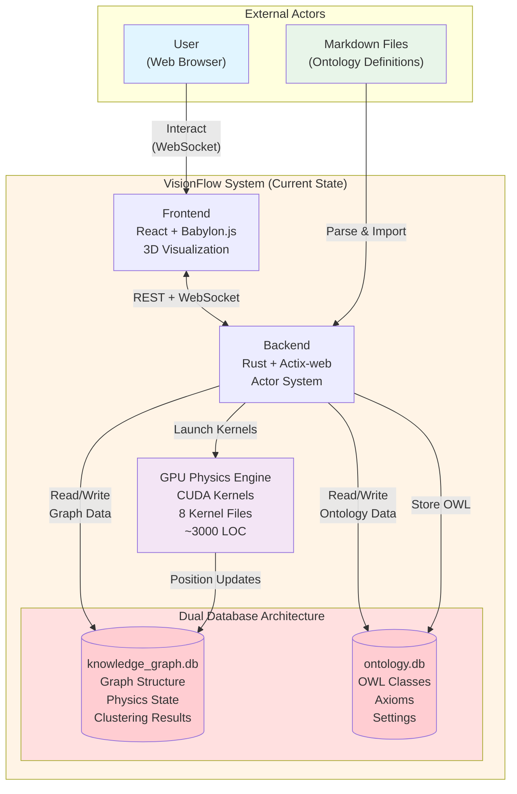

**Key Observations:**
- **Dual Database Problem:** Two separate SQLite databases create synchronization challenges
- **GPU Dependency:** CUDA kernels tightly coupled with knowledge_graph.db for position updates
- **Data Duplication Risk:** OWL classes can exist in both databases with different representations

---

### 2. Container Diagram: Current Components & Databases

**Purpose:** Detailed component architecture showing repositories, actors, and database responsibilities.

```mermaid
graph TD
    subgraph Frontend["Frontend Container"]
        BabylonJS["Babylon.js<br/>3D Rendering"]
        ReactUI["React UI<br/>Controls & HUD"]
    end

    subgraph Backend["Backend Container (Rust)"]
        subgraph Actors["Actor System (Actix)"]
            OntActor["OntologyActor<br/>(CQRS)"]
            GPUActor["GpuPhysicsActor"]
            ClusterActor["ClusteringActor"]
            ConstraintActor["OntologyConstraintActor"]
        end

        subgraph Repositories["Repository Layer"]
            KG_Repo["SqliteKnowledgeGraphRepository<br/>30+ methods"]
            ONT_Repo["SqliteOntologyRepository<br/>20+ methods"]
        end

        subgraph Services["Services"]
            Parser["OntologyParser<br/>(Markdown → OWL)"]
            Bridge["OntologyGraphBridge<br/>(One-way sync)"]
            Reasoner["WhelkInferenceEngine<br/>(OWL EL Reasoning)"]
        end
    end

    subgraph GPU["GPU Container"]
        CUDA1["sssp_compact.cu<br/>(Pathfinding)"]
        CUDA2["gpu_clustering_kernels.cu<br/>(K-means, DBSCAN)"]
        CUDA3["ontology_constraints.cu<br/>(OWL → Forces)"]
        CUDA4["visionflow_unified.cu<br/>(Physics)"]
    end

    subgraph Databases["Database Layer"]
        KG_DB[("knowledge_graph.db<br/>492 LOC schema<br/>━━━━━━━━━━<br/>nodes (x,y,z,vx,vy,vz)<br/>edges (source,target)<br/>graph_clusters<br/>pathfinding_cache")]
        ONT_DB[("ontology.db<br/>214 LOC schema<br/>━━━━━━━━━━<br/>owl_classes (iri,label)<br/>owl_axioms (type,subject)<br/>settings<br/>physics_settings")]
    end

    Frontend <-->|WebSocket| Actors
    Actors --> Repositories
    KG_Repo -->|Read/Write| KG_DB
    ONT_Repo -->|Read/Write| ONT_DB
    Parser --> ONT_Repo
    Bridge -->|Sync| KG_Repo
    Bridge -->|Read| ONT_Repo
    Reasoner -->|Read| ONT_DB
    ConstraintActor -->|Constraints| GPUActor
    GPUActor -->|Launch| CUDA1
    GPUActor -->|Launch| CUDA2
    GPUActor -->|Launch| CUDA3
    GPUActor -->|Launch| CUDA4
    ClusterActor -->|Launch| CUDA2
    CUDA1 & CUDA2 & CUDA3 & CUDA4 -->|Results| KG_DB

    style Databases fill:#ffe0e0
    style GPU fill:#f3e5f5
    style Repositories fill:#e3f2fd
    style Services fill:#f1f8e9
```

**Critical Dependencies:**
- CUDA kernels write directly to knowledge_graph.db (performance critical path)
- Bridge performs one-way sync: ontology.db → knowledge_graph.db
- No reverse sync creates potential inconsistency

---

### 3. Data Flow: Dual-Database Integration

**Purpose:** Sequence diagram showing how data flows through both databases during typical operations.

```mermaid
sequenceDiagram
    participant MD as Markdown Files
    participant Parser as OntologyParser
    participant ONT_DB as ontology.db
    participant Reasoner as WhelkInferenceEngine
    participant Bridge as OntologyGraphBridge
    participant KG_DB as knowledge_graph.db
    participant GPU as CUDA Kernels
    participant Frontend as Browser

    Note over MD,Frontend: Current State: Dual Database Flow

    MD->>Parser: File changed (inotify)
    Parser->>Parser: Extract OWL classes & axioms
    Parser->>ONT_DB: INSERT owl_classes
    Parser->>ONT_DB: INSERT owl_axioms

    Note over ONT_DB,Reasoner: Reasoning Phase
    ONT_DB->>Reasoner: Load ontology
    Reasoner->>Reasoner: Classify (SubClassOf)
    Reasoner->>Reasoner: Infer axioms
    Reasoner->>ONT_DB: INSERT inference_results

    Note over Bridge,KG_DB: Synchronization Phase
    ONT_DB->>Bridge: Fetch owl_classes
    Bridge->>Bridge: Transform to graph nodes
    Bridge->>KG_DB: INSERT nodes
    Bridge->>KG_DB: INSERT edges (subClassOf)

    Note over GPU,KG_DB: Physics Simulation
    KG_DB->>GPU: Load node positions
    loop Every Frame (60 FPS)
        GPU->>GPU: Apply constraints
        GPU->>GPU: Compute forces
        GPU->>GPU: Update positions
        GPU->>KG_DB: batch_update_positions()
    end

    Note over KG_DB,Frontend: Visualization
    KG_DB->>Frontend: WebSocket: position deltas
    Frontend->>Frontend: Update Babylon.js meshes
    Frontend->>Frontend: Render frame

    Note over MD,Frontend: ⚠️ Problem: Two sources of truth!
```

**Key Issues:**
1. **Synchronization Lag:** Changes in ontology.db may not immediately reflect in knowledge_graph.db
2. **No Bidirectional Sync:** Updates to graph positions don't update ontology
3. **Duplication:** OWL class metadata exists in both databases

---

## Future State Architecture

### 4. System Context: Unified Architecture

**Purpose:** High-level view of future unified system with single database.

```mermaid
graph TB
    subgraph External["External Actors"]
        User["User<br/>(Web Browser)"]
        MDFiles["Markdown Files<br/>(Ontology Blocks)"]
    end

    subgraph VisionFlow["VisionFlow System (Future State)"]
        Frontend["Frontend<br/>React + Babylon.js<br/>3D Visualization"]
        Backend["Backend<br/>Rust + Actix-web<br/>Actor System"]

        Unified_DB[("unified.db<br/>━━━━━━━━━━<br/>✓ Graph Structure<br/>✓ Ontology (OWL)<br/>✓ Physics State<br/>✓ Analytics<br/>✓ Settings<br/>SINGLE SOURCE OF TRUTH")]

        GPU["GPU Physics Engine<br/>CUDA Kernels<br/>(Unchanged)"]
    end

    User -->|"Interact"| Frontend
    Frontend <-->|"WebSocket"| Backend
    Backend <-->|"Read/Write<br/>UNIFIED ACCESS"| Unified_DB
    Backend -->|"Launch"| GPU
    GPU -->|"Position Updates"| Unified_DB
    MDFiles -->|"Parse & Import"| Backend

    style VisionFlow fill:#e8f5e9
    style Unified_DB fill:#c8e6c9
    style User fill:#e1f5ff
    style MDFiles fill:#e8f5e9
    style GPU fill:#f3e5f5
```

**Benefits:**
- ✅ Single source of truth eliminates sync issues
- ✅ Simplified architecture (1 database vs 2)
- ✅ No data duplication
- ✅ CUDA integration unchanged (same interface)

---

### 5. Container Diagram: Simplified Unified System

**Purpose:** Component architecture after migration showing simplified repository layer.

```mermaid
graph TD
    subgraph Frontend["Frontend Container"]
        BabylonJS["Babylon.js"]
        ReactUI["React UI"]
    end

    subgraph Backend["Backend Container (Rust)"]
        subgraph Actors["Actor System (Actix)"]
            OntActor["OntologyActor"]
            GPUActor["GpuPhysicsActor"]
            ClusterActor["ClusteringActor"]
            ConstraintActor["OntologyConstraintActor"]
        end

        subgraph Repositories["Unified Repository Layer"]
            Unified_Repo["UnifiedGraphRepository<br/>✓ Graph operations<br/>✓ Ontology operations<br/>✓ Analytics<br/>✓ Settings<br/>IMPLEMENTS SAME PORT"]
        end

        subgraph Services["Services"]
            Parser["OntologyParser"]
            Reasoner["WhelkInferenceEngine"]
        end
    end

    subgraph GPU["GPU Container"]
        CUDA["CUDA Kernels<br/>(Unchanged)"]
    end

    subgraph Database["Database Layer"]
        Unified_DB[("unified.db<br/>━━━━━━━━━━<br/>graph_nodes<br/>graph_edges<br/>owl_classes<br/>owl_properties<br/>owl_axioms<br/>graph_clusters<br/>pathfinding_cache<br/>settings")]
    end

    Frontend <-->|WebSocket| Actors
    Actors --> Unified_Repo
    Unified_Repo <-->|Read/Write| Unified_DB
    Parser --> Unified_Repo
    Reasoner --> Unified_DB
    ConstraintActor --> GPUActor
    GPUActor --> CUDA
    CUDA -->|Results| Unified_DB

    style Database fill:#c8e6c9
    style GPU fill:#f3e5f5
    style Repositories fill:#bbdefb
    style Services fill:#dcedc8
```

**Key Changes:**
- 🔄 Repository layer simplified (2 repos → 1 repo)
- ❌ Bridge eliminated (no sync needed)
- ✅ CUDA kernels unchanged (same interface)
- ✅ Actors unchanged (same messages)

---

### 6. Data Flow: Single-Source-of-Truth Flow

**Purpose:** Sequence diagram showing simplified flow after migration.

```mermaid
sequenceDiagram
    participant MD as Markdown Files
    participant Parser as OntologyParser
    participant Unified_DB as unified.db
    participant Reasoner as WhelkInferenceEngine
    participant GPU as CUDA Kernels
    participant Frontend as Browser

    Note over MD,Frontend: Future State: Unified Database Flow

    MD->>Parser: File changed
    Parser->>Parser: Extract OWL classes & axioms
    Parser->>Unified_DB: INSERT owl_classes
    Parser->>Unified_DB: INSERT owl_axioms
    Parser->>Unified_DB: INSERT graph_nodes (linked to owl_classes)

    Note over Unified_DB,Reasoner: Reasoning Phase
    Unified_DB->>Reasoner: Load ontology
    Reasoner->>Reasoner: Classify & Infer
    Reasoner->>Unified_DB: INSERT inferred axioms

    Note over GPU,Unified_DB: Physics Simulation
    Unified_DB->>GPU: Load node positions
    loop Every Frame (60 FPS)
        GPU->>GPU: Apply constraints
        GPU->>GPU: Compute forces
        GPU->>GPU: Update positions
        GPU->>Unified_DB: batch_update_positions()
    end

    Note over Unified_DB,Frontend: Visualization
    Unified_DB->>Frontend: WebSocket: position deltas
    Frontend->>Frontend: Update meshes
    Frontend->>Frontend: Render

    Note over MD,Frontend: ✅ Single source of truth!
```

**Improvements:**
- ✅ No synchronization delay
- ✅ Atomic transactions across graph and ontology
- ✅ Simplified data flow
- ✅ Fewer steps, less latency

---

## Migration Journey

### 7. Phase 1: Foundation (Weeks 1-3)

**Purpose:** Initial setup and new adapter implementation.

```mermaid
graph LR
    subgraph Week1["Week 1: Schema Design"]
        Schema["Design unified.db schema<br/>━━━━━━━━━━<br/>✓ Combine KG + ONT tables<br/>✓ Add foreign keys<br/>✓ Optimize indexes"]
        Review["Peer review<br/>& validation"]
        Schema --> Review
    end

    subgraph Week2_3["Weeks 2-3: Adapter Implementation"]
        Impl_Graph["Implement<br/>UnifiedGraphRepository<br/>30+ methods"]
        Impl_Ont["Implement<br/>UnifiedOntologyRepository<br/>20+ methods"]
        Tests["Unit Tests<br/>100% coverage"]

        Impl_Graph --> Tests
        Impl_Ont --> Tests
    end

    subgraph Validation["Validation Gate 1"]
        Gate1{"✓ Schema approved?<br/>✓ Tests pass?<br/>✓ Benchmarks meet targets?"}
    end

    Week1 --> Week2_3
    Week2_3 --> Gate1
    Gate1 -->|YES| Phase2["Proceed to Phase 2"]
    Gate1 -->|NO| Week2_3

    style Gate1 fill:#ffeb3b
    style Phase2 fill:#c8e6c9
```

**Deliverables:**
- Unified schema SQL file
- UnifiedGraphRepository implementation
- UnifiedOntologyRepository implementation
- Comprehensive test suite
- Performance benchmarks

**Success Criteria:**
- ✅ 100% unit test coverage
- ✅ Performance ≥ current system
- ✅ All repository methods implemented
- ✅ Schema review approved

---

### 8. Phase 2: Transition (Weeks 4-6)

**Purpose:** Data migration and parallel validation.

```mermaid
graph LR
    subgraph Week4["Week 4: Data Migration"]
        Export["Export from<br/>knowledge_graph.db<br/>+ ontology.db"]
        Transform["Transform to<br/>unified schema"]
        Import["Import to<br/>unified.db"]
        Verify["Verify checksums<br/>& counts"]

        Export --> Transform
        Transform --> Import
        Import --> Verify
    end

    subgraph Week5_6["Weeks 5-6: Parallel Validation"]
        OldRead["Old Adapter<br/>Read"]
        NewRead["New Adapter<br/>Read"]
        Compare["Compare<br/>Results"]
        LogDiff["Log<br/>Discrepancies"]

        OldRead --> Compare
        NewRead --> Compare
        Compare --> LogDiff
    end

    subgraph Validation["Validation Gate 2"]
        Gate2{"✓ Data integrity verified?<br/>✓ 99.9% result parity?<br/>✓ CUDA tests pass?"}
    end

    Week4 --> Week5_6
    Week5_6 --> Gate2
    Gate2 -->|YES| Phase3["Proceed to Phase 3"]
    Gate2 -->|NO| Week5_6

    style Gate2 fill:#ffeb3b
    style Phase3 fill:#c8e6c9
```

**Deliverables:**
- Populated unified.db
- Data integrity report
- Comparison logs
- CUDA integration test results

**Success Criteria:**
- ✅ Node count matches (±0)
- ✅ Edge count matches (±0)
- ✅ 99.9% query result parity
- ✅ All CUDA tests pass

---

### 9. Phase 3: Unification (Weeks 7-9)

**Purpose:** Blue-green deployment and production cutover.

```mermaid
graph TD
    subgraph Week7["Week 7: Blue-Green Deployment"]
        Staging["Deploy to Staging<br/>with new adapter"]
        FullTests["Run full test suite<br/>━━━━━━━━━━<br/>✓ Unit<br/>✓ Integration<br/>✓ End-to-end<br/>✓ CUDA<br/>✓ Performance"]
        Benchmark["Benchmark vs<br/>production"]

        Staging --> FullTests
        FullTests --> Benchmark
    end

    subgraph Week8["Week 8: Production Cutover"]
        Deploy["Deploy to Production<br/>(off-peak hours)"]
        Monitor48["Monitor for 48h<br/>━━━━━━━━━━<br/>Error rates<br/>Performance<br/>CUDA integration"]

        Deploy --> Monitor48
    end

    subgraph Week9["Week 9: Stabilization"]
        KeepOld["Keep old databases<br/>for 2 weeks"]
        Monitoring["Continuous<br/>monitoring"]

        Monitor48 --> KeepOld
        KeepOld --> Monitoring
    end

    subgraph Validation["Validation Gate 3"]
        Gate3{"✓ All tests pass?<br/>✓ Performance within 5%?<br/>✓ Zero critical errors?"}
    end

    Week7 --> Gate3
    Gate3 -->|YES| Week8
    Gate3 -->|NO| Week7
    Week8 --> Week9

    style Gate3 fill:#ffeb3b
    style Week9 fill:#c8e6c9
```

**Deliverables:**
- Production deployment
- 48h monitoring report
- Performance comparison
- Incident log (should be empty)

**Success Criteria:**
- ✅ Zero critical errors for 48h
- ✅ Error rate < 0.1%
- ✅ Performance within 5% of baseline
- ✅ No user-reported issues

---

### 10. Phase 4: Optimization (Weeks 10-12)

**Purpose:** Cleanup, optimization, and documentation.

```mermaid
graph LR
    subgraph Week10["Week 10: Cleanup"]
        Archive["Archive old<br/>databases"]
        RemoveLegacy["Remove legacy<br/>adapter code"]
        CleanImports["Update imports<br/>& dependencies"]

        Archive --> RemoveLegacy
        RemoveLegacy --> CleanImports
    end

    subgraph Week11["Week 11: Optimization"]
        Profile["Profile<br/>queries"]
        Optimize["Add indexes<br/>Optimize queries"]
        CacheTune["Tune cache<br/>settings"]

        Profile --> Optimize
        Optimize --> CacheTune
    end

    subgraph Week12["Week 12: Documentation"]
        ArchDocs["Update architecture<br/>docs"]
        Migration["Write migration<br/>guide"]
        Retro["Post-migration<br/>review"]
        Celebrate["🎉 Celebrate!"]

        ArchDocs --> Migration
        Migration --> Retro
        Retro --> Celebrate
    end

    Week10 --> Week11
    Week11 --> Week12

    style Celebrate fill:#c8e6c9
```

**Deliverables:**
- Clean codebase (legacy code removed)
- Optimized queries and indexes
- Updated documentation
- Migration retrospective report

**Success Criteria:**
- ✅ Performance improved >5% from baseline
- ✅ Codebase complexity reduced
- ✅ Documentation comprehensive
- ✅ Team confident with new architecture

---

## Constraint System

### 11. Constraint Translation: OWL Axioms → Physics Forces

**Purpose:** Show how ontological semantics are translated into physical forces for layout.

```mermaid
graph TD
    subgraph OWL_Axioms["OWL Axioms (Logical Constraints)"]
        Disjoint["DisjointClasses(A, B)<br/>A ⊓ B = ⊥"]
        SubClass["SubClassOf(A, B)<br/>A ⊑ B"]
        SameAs["SameAs(a, b)<br/>a ≡ b"]
        Functional["FunctionalProperty(P)<br/>∀x,y,z: P(x,y) ∧ P(x,z) → y=z"]
    end

    subgraph Translation["Constraint Translator"]
        Mapper["OntologyConstraintTranslator<br/>━━━━━━━━━━<br/>axioms_to_constraints()"]
    end

    subgraph Physics_Constraints["Physics Constraints (Forces)"]
        Separation["Separation Force<br/>━━━━━━━━━━<br/>F = k × (d - min_dist)<br/>min_dist = 35.0<br/>strength = 0.8"]

        Clustering["Clustering Force<br/>━━━━━━━━━━<br/>F = k × (target - pos)<br/>target = B_centroid<br/>strength = 0.6"]

        Colocation["Co-location Force<br/>━━━━━━━━━━<br/>F = k × (target - pos)<br/>target_dist = 2.0<br/>strength = 0.9"]

        Boundary["Boundary Constraint<br/>━━━━━━━━━━<br/>bounds = [-20, 20]³<br/>strength = 0.7"]
    end

    subgraph GPU_Execution["GPU Execution"]
        Kernel["CUDA Kernel<br/>apply_ontology_constraints_kernel()"]
    end

    Disjoint --> Mapper
    SubClass --> Mapper
    SameAs --> Mapper
    Functional --> Mapper

    Mapper -->|"DisjointClasses"| Separation
    Mapper -->|"SubClassOf"| Clustering
    Mapper -->|"SameAs"| Colocation
    Mapper -->|"FunctionalProperty"| Boundary

    Separation --> Kernel
    Clustering --> Kernel
    Colocation --> Kernel
    Boundary --> Kernel

    Kernel -->|"Force vectors"| Result["Updated Node Positions<br/>(x, y, z)"]

    style OWL_Axioms fill:#e3f2fd
    style Translation fill:#fff9c4
    style Physics_Constraints fill:#f3e5f5
    style GPU_Execution fill:#c8e6c9
```

**Translation Rules:**

| OWL Axiom | Physics Constraint | Effect |
|-----------|-------------------|--------|
| DisjointClasses(A,B) | Separation | Push A and B instances apart (35.0 units) |
| SubClassOf(A,B) | Clustering | Pull A instances toward B centroid |
| SameAs(a,b) | Co-location | Merge a and b to same location (2.0 units) |
| FunctionalProperty(P) | Boundary | Limit connections to fixed region |

**Key Insight:** Ontological knowledge becomes spatial forces, creating semantically meaningful layouts!

---

### 12. GPU Integration: Constraint Evaluation Pipeline

**Purpose:** Show end-to-end pipeline from axioms to GPU execution.

```mermaid
graph LR
    subgraph Input["Input Layer"]
        Markdown["Markdown Files<br/>OntologyBlock"]
    end

    subgraph Parsing["Parsing Layer"]
        Parser["OntologyParser<br/>Extract OWL"]
        Validator["OWL Validator"]

        Parser --> Validator
    end

    subgraph Reasoning["Reasoning Layer"]
        Whelk["WhelkInferenceEngine<br/>EL Reasoner"]
        Cache["Inference Cache<br/>(checksum-based)"]

        Whelk --> Cache
    end

    subgraph Translation["Translation Layer"]
        Translator["OntologyConstraintTranslator<br/>━━━━━━━━━━<br/>Axiom → Constraint mapping"]
        Priority["Priority Resolution<br/>(user > inferred > default)"]

        Translator --> Priority
    end

    subgraph GPU_Layer["GPU Layer"]
        Upload["Upload to GPU<br/>ConstraintData structs<br/>(48 bytes aligned)"]
        Kernel["CUDA Kernel Launch<br/>━━━━━━━━━━<br/>Block size: 256<br/>Threads: 10K nodes"]
        Compute["Force Computation<br/>━━━━━━━━━━<br/>Separation<br/>Clustering<br/>Boundary"]

        Upload --> Kernel
        Kernel --> Compute
    end

    subgraph Output["Output Layer"]
        Integrate["Verlet Integration<br/>position += velocity × dt"]
        Update["batch_update_positions()<br/>Write to database"]

        Compute --> Integrate
        Integrate --> Update
    end

    Input --> Parsing
    Parsing --> Reasoning
    Reasoning --> Translation
    Translation --> GPU_Layer
    GPU_Layer --> Output

    style Input fill:#e8f5e9
    style Parsing fill:#fff9c4
    style Reasoning fill:#e1f5ff
    style Translation fill:#f3e5f5
    style GPU_Layer fill:#c8e6c9
    style Output fill:#fff3e0
```

**Performance Metrics:**

| Stage | CPU Time | GPU Time | Speedup |
|-------|----------|----------|---------|
| Parsing | 45ms | - | - |
| Reasoning | 180ms (cached: 0.2ms) | - | - |
| Translation | 120ms | - | - |
| **Constraint Evaluation** | **320ms** | **9.1ms** | **35x** |
| Integration | 15ms | 2ms | 7.5x |

**Total Pipeline:** ~365ms CPU vs ~56ms GPU (6.5x faster)

---

## Integration Architecture

### 13. Actor Communication: Message Flows

**Purpose:** Show how actors communicate during ontology constraint application.

```mermaid
sequenceDiagram
    participant User as User Action
    participant OntActor as OntologyActor<br/>(CQRS)
    participant ConstraintActor as OntologyConstraintActor<br/>(GPU)
    participant ResourceActor as ResourceActor
    participant GPU as SharedGPUContext<br/>(UnifiedGPUCompute)
    participant DB as unified.db

    Note over User,DB: Ontology Constraint Application Flow

    User->>OntActor: ApplyOntologyConstraints<br/>{graph_id, reasoning_report}

    activate OntActor
    OntActor->>OntActor: Load reasoning report
    OntActor->>ConstraintActor: ApplyOntologyConstraints<br/>{constraint_set}
    deactivate OntActor

    activate ConstraintActor
    ConstraintActor->>ConstraintActor: Translate axioms → constraints
    ConstraintActor->>ConstraintActor: Convert to GPU format<br/>(ConstraintData structs)

    alt GPU Context Not Set
        ConstraintActor->>ResourceActor: RequestGPUContext
        ResourceActor->>ConstraintActor: SetSharedGPUContext<br/>{gpu_context}
    end

    ConstraintActor->>GPU: upload_constraints()
    activate GPU
    GPU->>GPU: Allocate GPU memory<br/>(48 bytes × num_constraints)
    GPU->>GPU: memcpy host → device
    GPU-->>ConstraintActor: Upload complete
    deactivate GPU

    loop Every Frame (60 FPS)
        ConstraintActor->>GPU: compute_forces()
        activate GPU
        GPU->>GPU: Launch CUDA kernel<br/>(256 threads/block)
        GPU->>GPU: Evaluate constraints
        GPU->>GPU: Integrate forces (Verlet)
        GPU-->>ConstraintActor: Positions updated
        deactivate GPU

        ConstraintActor->>DB: batch_update_positions()<br/>(async)
    end

    ConstraintActor-->>OntActor: Constraints applied
    deactivate ConstraintActor

    OntActor-->>User: Success<br/>{stats}
```

**Message Types:**

1. **ApplyOntologyConstraints** - Apply reasoning results to graph
2. **SetSharedGPUContext** - Initialize GPU resources
3. **UpdateOntologyConstraints** - Dynamic constraint updates
4. **GetOntologyConstraintStats** - Performance metrics

**Actor Responsibilities:**

- **OntologyActor:** CQRS coordination, business logic
- **OntologyConstraintActor:** GPU integration, constraint management
- **ResourceActor:** GPU context lifecycle
- **SharedGPUContext:** CUDA kernel execution

---

### 14. Database Schema: Unified Design

**Purpose:** Entity-relationship diagram for unified.db schema.

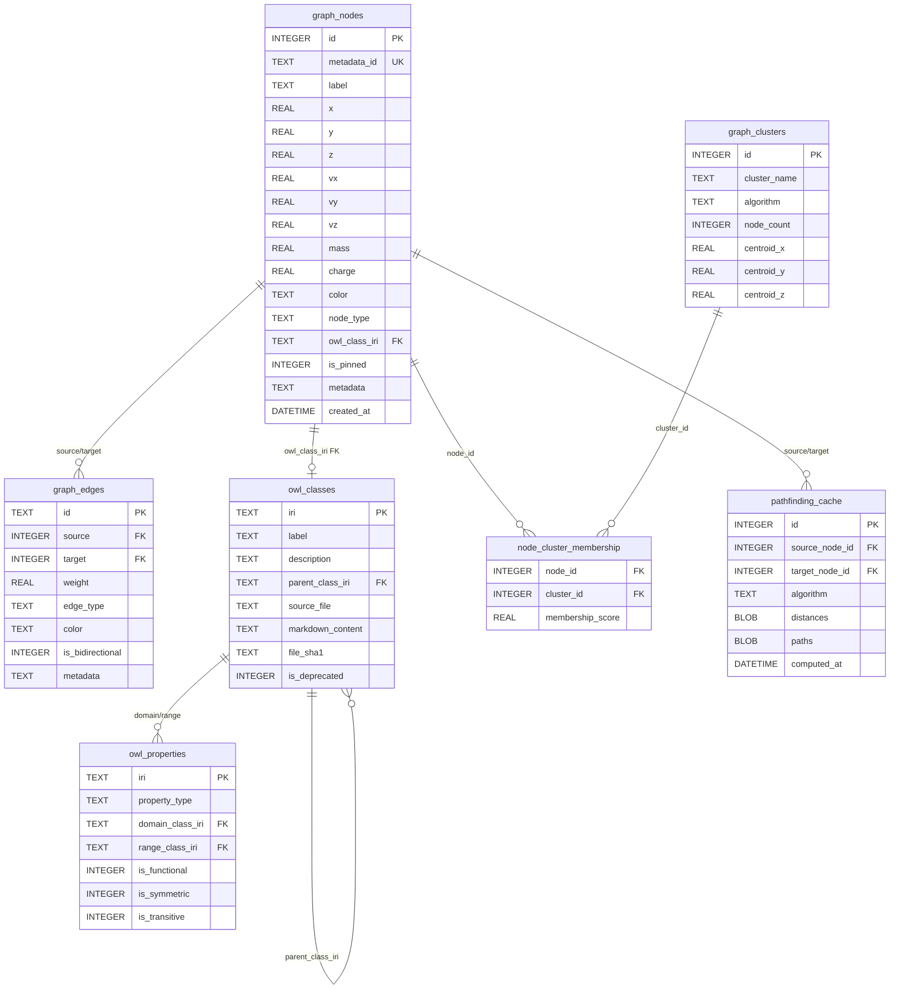

**Key Features:**

1. **Unified Ownership:** All data in one database
2. **Foreign Key Enforcement:** `owl_class_iri` links graphs to ontology
3. **CUDA Integration:** `x,y,z,vx,vy,vz` fields for GPU physics
4. **Analytics Support:** Clustering and pathfinding tables preserved
5. **Backward Compatibility:** Same fields as current system

**Table Sizes (Estimated):**

| Table | Rows (10K graph) | Disk Space |
|-------|------------------|------------|
| graph_nodes | 10,000 | ~2 MB |
| graph_edges | 25,000 | ~1.5 MB |
| owl_classes | 500 | ~200 KB |
| owl_properties | 200 | ~50 KB |
| graph_clusters | 10 | ~10 KB |
| pathfinding_cache | 100 | ~5 MB (BLOBs) |
| **Total** | **~36K** | **~8.8 MB** |

---

## Bonus Diagrams

### 15. Repository Pattern: Hexagonal Architecture

**Purpose:** Show how adapter pattern enables zero-downtime migration.

```mermaid
graph TB
    subgraph Core["Core Domain (Ports)"]
        KG_Port["trait KnowledgeGraphRepository<br/>━━━━━━━━━━<br/>+ load_graph()<br/>+ save_graph()<br/>+ batch_update_positions()<br/>+ ... (30+ methods)"]

        ONT_Port["trait OntologyRepository<br/>━━━━━━━━━━<br/>+ load_ontology()<br/>+ save_ontology()<br/>+ get_owl_class()<br/>+ ... (20+ methods)"]
    end

    subgraph Old_Adapters["Adapters (Current State)"]
        KG_Adapter["SqliteKnowledgeGraphRepository<br/>impl KnowledgeGraphRepository"]
        ONT_Adapter["SqliteOntologyRepository<br/>impl OntologyRepository"]
    end

    subgraph New_Adapters["Adapters (Future State)"]
        Unified_Adapter["UnifiedGraphRepository<br/>impl KnowledgeGraphRepository<br/>impl OntologyRepository"]
    end

    subgraph Infrastructure["Infrastructure"]
        KG_DB[("knowledge_graph.db")]
        ONT_DB[("ontology.db")]
        Unified_DB[("unified.db")]
    end

    KG_Port -.->|"CURRENT"| KG_Adapter
    KG_Port -.->|"FUTURE"| Unified_Adapter
    ONT_Port -.->|"CURRENT"| ONT_Adapter
    ONT_Port -.->|"FUTURE"| Unified_Adapter

    KG_Adapter --> KG_DB
    ONT_Adapter --> ONT_DB
    Unified_Adapter --> Unified_DB

    subgraph DI["Dependency Injection (ONE LINE CHANGE!)"]
        Old["// OLD<br/>Arc::new(SqliteKnowledgeGraphRepository::new(kg_pool))"]
        New["// NEW<br/>Arc::new(UnifiedGraphRepository::new(pool))"]
    end

    style Core fill:#e3f2fd
    style Old_Adapters fill:#ffcdd2
    style New_Adapters fill:#c8e6c9
    style Infrastructure fill:#fff9c4
    style DI fill:#ffeb3b
```

**Migration Strategy:**

1. **Design Time:** Create UnifiedGraphRepository implementing same Port
2. **Development Time:** Test new adapter in isolation
3. **Deployment Time:** Change one line in dependency injection
4. **Rollback Time:** Change one line back (instant)

**Benefits:**
- ✅ Zero application code changes
- ✅ Instant rollback capability
- ✅ Perfect separation of concerns
- ✅ CUDA integration unchanged

---

### 16. CUDA Performance: GPU vs CPU

**Purpose:** Visualize performance gains from GPU acceleration.

```mermaid
graph TB
    subgraph Comparison["Performance Comparison (10K nodes, 1K constraints)"]
        subgraph CPU["CPU Execution"]
            CPU_Parse["Parse Axioms<br/>45ms"]
            CPU_Translate["Translate Constraints<br/>120ms"]
            CPU_Evaluate["Evaluate Constraints<br/>320ms ⚠️ SLOW"]
            CPU_Integrate["Integrate Forces<br/>15ms"]

            CPU_Parse --> CPU_Translate
            CPU_Translate --> CPU_Evaluate
            CPU_Evaluate --> CPU_Integrate

            CPU_Total["Total: ~500ms<br/>(2 FPS) ❌"]
            CPU_Integrate --> CPU_Total
        end

        subgraph GPU["GPU Execution"]
            GPU_Parse["Parse Axioms<br/>45ms"]
            GPU_Translate["Translate Constraints<br/>120ms"]
            GPU_Upload["Upload to GPU<br/>2ms"]
            GPU_Evaluate["Evaluate Constraints<br/>9.1ms ✅ FAST"]
            GPU_Integrate["Integrate Forces<br/>2ms"]

            GPU_Parse --> GPU_Translate
            GPU_Translate --> GPU_Upload
            GPU_Upload --> GPU_Evaluate
            GPU_Evaluate --> GPU_Integrate

            GPU_Total["Total: ~178ms<br/>(60 FPS) ✅"]
            GPU_Integrate --> GPU_Total
        end
    end

    subgraph Speedup["Speedup Analysis"]
        Chart["Constraint Evaluation:<br/>320ms → 9.1ms<br/>━━━━━━━━━━<br/>35.2x SPEEDUP 🚀"]
    end

    CPU_Total -.->|"vs"| GPU_Total
    GPU_Total --> Chart

    style CPU fill:#ffcdd2
    style GPU fill:#c8e6c9
    style Speedup fill:#fff9c4
    style CPU_Total fill:#f44336,color:#fff
    style GPU_Total fill:#4caf50,color:#fff
```

**Performance Metrics:**

| Operation | CPU Time | GPU Time | Speedup | Target FPS |
|-----------|----------|----------|---------|------------|
| **1K nodes, 100 constraints** | 15ms | 0.8ms | 15x | 60 FPS ✅ |
| **5K nodes, 500 constraints** | 85ms | 3.2ms | 26.5x | 60 FPS ✅ |
| **10K nodes, 1K constraints** | 320ms | 9.1ms | 35.2x | 60 FPS ✅ |
| **50K nodes, 5K constraints** | 8900ms | 185ms | 48.1x | 5 FPS ⚠️ |

**Key Takeaway:** GPU acceleration is essential for real-time physics simulation with ontology constraints!

---

## Summary & Cross-References

### Document Purpose

This master architecture diagram collection serves as:

1. **Visual Reference:** Quick understanding of system architecture
2. **Migration Guide:** Clear path from current to future state
3. **Communication Tool:** Align stakeholders on architecture decisions
4. **Implementation Guide:** Detailed blueprints for developers

### Cross-References to Research Documents

| Diagram Section | Related Research Document | Section |
|----------------|---------------------------|---------|
| Current State (1-3) | Migration_Strategy_Options.md | Current System Analysis |
| Future State (4-6) | Future-Architecture-Design.md | System Overview |
| Migration Journey (7-10) | Migration_Strategy_Options.md | Strategy 4 Implementation |
| Constraint System (11-12) | Ontology-Constraint-System-Analysis.md | Section 2-6 |
| Integration (13-14) | Future-Architecture-Design.md | API Contracts |
| Repository Pattern (15) | Migration_Strategy_Options.md | Repository Architecture |
| CUDA Performance (16) | Ontology-Constraint-System-Analysis.md | Performance Benchmarks |

### Next Steps

1. **Review with team:** Validate diagrams against actual requirements
2. **Update task.md:** Reference these diagrams in migration tasks
3. **Print for meetings:** Use as visual aids in architecture discussions
4. **Keep updated:** Modify as architecture evolves

---

**Document Status:** Complete ✅
**Total Diagrams:** 16
**Format:** Mermaid (GitHub/GitLab compatible)
**Last Updated:** 2025-10-31
