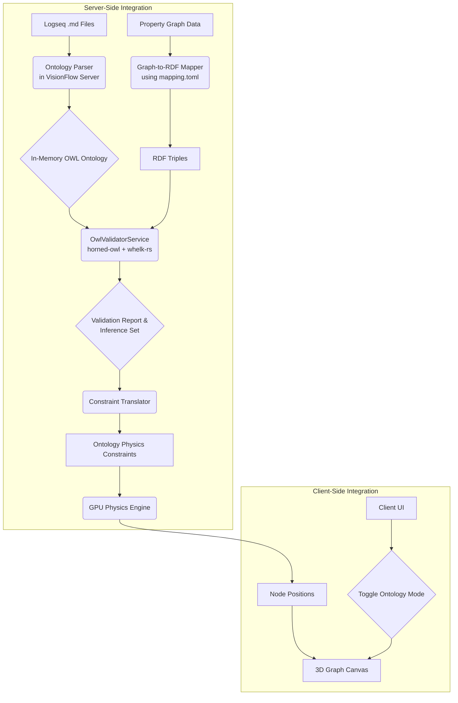

Yes, this plan absolutely makes sense. It is a well-structured, logical, and comprehensive roadmap that follows modern software development best practices. It covers the entire lifecycle from backend scaffolding to frontend integration and final testing.

Here’s a breakdown of what makes this plan strong and a few points for refinement or clarification.

### What Makes This Plan Strong

*   **Phased Approach:** The division into five distinct phases creates a clear, manageable workflow. Each phase builds logically on the previous one.
*   **Separation of Concerns:** The initial scaffolding in Phase 1 correctly proposes a new `ontology` module, which is excellent for keeping this significant feature organized.
*   **Feature Flagging:** Introducing an `ontology_validation` feature flag from the very beginning is a critical best practice. It allows you to merge incomplete work into your main branch without affecting production and enables gradual rollout.
*   **Incremental Implementation:** Phase 2 focuses on a minimal viable product for the core logic (one consistency check, one inference rule), which is the right way to tackle a complex system.
*   **Test-Driven:** The inclusion of a smoke test early in Phase 2 and comprehensive integration tests in Phase 5 shows a commitment to quality.
*   **Clear Integration Points:** The plan correctly identifies the need to integrate with the `PhysicsOrchestratorActor` and create dedicated constraint groups (`ontology_*`).
*   **End-to-End Scope:** The plan covers everything from the deepest backend logic (`horned-owl`) to the user-facing UI controls, including crucial new features like node expansion and pinning.

### Refinements and Clarifying Questions

The plan is excellent. The following points are not criticisms but rather opportunities to refine details and address potential ambiguities before implementation begins.

**1. File Organization and Code Location:**

*   **Observation:** The plan suggests scaffolding new files like `src/ontology/physics/ontology_constraints.rs`.
*   **Refinement:** You already have `src/physics/ontology_constraints.rs` and `src/handlers/api_handler/ontology/mod.rs`. To maintain your existing project structure and keep related logic together, I would recommend **using the existing file locations** rather than creating parallel ones inside `src/ontology`. The `src/ontology` module can house the core services (`owl_validator.rs`, `parser`, `reasoner`) while physics and API integrations remain in their respective top-level modules. This avoids confusion and keeps the architecture clean.

**2. Data Flow for Ontology Processing:**

*   **Observation:** The plan states "Modify existing file handler to parse `Metaverse-Ontology/` files and send the parsed data to the `OntologyActor`."
*   **Question:** The current flow seems to be `FileService -> GraphStateActor`. How should the `OntologyActor` fit in? To avoid parallel, potentially conflicting data pipelines, we should define a clear flow.
*   **Proposed Solution:** A robust flow would be:
    1.  The `FileService`/`MetadataActor` loads the raw markdown/OWL files.
    2.  This data is passed to the `GraphStateActor` to build the primary visual graph.
    3.  The `GraphStateActor` (or a supervisor) then notifies the `OntologyActor`, providing it with the graph data and the raw ontology axioms.
    4.  The `OntologyActor` performs validation and inference, then sends back results (e.g., constraints, inferred edges) to be applied to the graph state and physics engine.

**3. Client-Side Visualization and Interaction:**

*   **Observation:** The plan includes "a new client-side visualization mode" and "node expansion".
*   **Architectural Impact:** This is a significant and excellent feature that implies a shift from loading the entire graph at once to a **partial or lazy-loading model**.
*   **Clarification:** We should explicitly plan for this. When a user clicks to expand a node, the client will make an API call to the backend. The backend needs a new handler that can query the `GraphStateActor` for that node's neighbors and their connections, and return them to the client to be added to the existing visualization. The "node expansion" API endpoint is a critical piece of this.

**4. Node Pinning Mechanism:**

*   **Observation:** The plan includes "node pinning".
*   **Mechanism:** When a user pins a node (e.g., after dragging it), the client should send its ID and new `(x, y, z)` coordinates to the backend via a new API endpoint (e.g., `POST /api/constraints/pin-node`).
*   **Backend Action:** The handler will send a message to the `OntologyActor` or `SemanticProcessorActor` to create a `FixedPosition` constraint, which is then passed to the `PhysicsOrchestratorActor`. This ensures the pinned state is respected by the physics engine.

### Summary Table of Key Architectural Clarifications

| Topic | Observation from Plan | Question/Refinement | Proposed Solution |
| :--- | :--- | :--- | :--- |
| **File Structure** | Create new files under `src/ontology/`. | Should we create new files or use existing ones like `src/physics/ontology_constraints.rs`? | Use existing file locations for physics and API handlers to maintain architectural consistency. Keep core ontology logic in `src/ontology`. |
| **Data Flow** | File handler sends parsed data to `OntologyActor`. | How does this integrate with the existing `GraphStateActor` flow? | Define a clear, sequential data flow: `File Handler -> GraphStateActor -> OntologyActor` to ensure a single source of truth for the graph state. |
| **Node Expansion** | Implement client-side node expansion. | This implies a shift to partial graph loading. How is this managed? | Acknowledge this architectural shift. Design a new API endpoint (`GET /api/graph/neighbors/{nodeId}`) and corresponding actor logic to fetch and return a node's neighbors on demand. |
| **Node Pinning** | Implement client-side node pinning. | How is a pinned state communicated to and enforced by the server-side physics engine? | Create a new API endpoint (`POST /api/constraints/pin-node`). On the backend, this creates a `FixedPosition` constraint and sends it to the `PhysicsOrchestratorActor`. |

With these refinements, your plan is not just sensible—it's an excellent, robust, and technically sound roadmap for implementing this powerful new feature.

# Ontology Integration Plan

This document outlines the plan to integrate the `Metaverse-Ontology` into the VisionFlow platform, enabling a new ontology-driven visualization mode.

## 1. Project Goals

-   **Integrate Ontology Parsing:** Embed the logic from the `logseq-owl-extractor` directly into the VisionFlow server to load and parse the hybrid Logseq/Markdown ontology files at runtime.
-   **Implement Ontology Services:** Build the planned actor and service components (`OntologyActor`, `OwlValidatorService`) as described in the architecture documents.
-   **Map Graph to RDF:** Use the `ontology/mapping.toml` to translate the existing property graph into a formal RDF structure for validation and reasoning.
-   **Enable Semantic Physics:** Translate OWL axioms (e.g., `DisjointClasses`) and inferred relationships into GPU-accelerated physics constraints.
-   **Create Client Visualization Mode:** Add a new mode to the client that allows users to view the graph with the ontology-driven layout and semantic visual cues.
-   **Deprecate Stubs:** Exclude and deprecate the `ontology.toml` file as it was a previous stub.

## 2. Architecture Overview

The integration will follow the architecture laid out in `docs/specialized/ontology/hornedowl.md`.

## 3. Detailed Implementation Plan

This plan is broken down into sequential phases. Each phase contains a checklist of tasks with detailed justifications and file locations.

### Phase 1: Server-Side Foundation & Scaffolding

**Justification:** This phase establishes the complete module structure and dependencies for the ontology feature. By creating all necessary files and configurations upfront, we ensure that the compiler recognizes the new module and that subsequent development can proceed smoothly without further setup. This approach minimizes integration friction and allows for incremental, testable implementation.

| Task | File(s) / Location | Justification & Details |
| :--- | :--- | :--- |
| **Create `ontology` module** | `src/ontology/mod.rs`, `src/lib.rs` | Defines the new `ontology` module and registers it in the main library crate. |
| **Scaffold `OwlValidatorService`** | `src/ontology/services/owl_validator.rs` | Creates the placeholder for the core validation and reasoning engine, as designed in `docs/specialized/ontology/hornedowl.md`. |
| **Scaffold `OntologyActor`** | `src/ontology/actors/ontology_actor.rs` | Creates the asynchronous actor responsible for managing validation jobs, aligning with the server's actor-based architecture. |
| **Scaffold `ConstraintTranslator`** | `src/ontology/physics/ontology_constraints.rs` | Creates the service that will bridge the logical ontology layer with the GPU physics engine. |
| **Scaffold `api_handler`** | `src/ontology/handlers/api_handler.rs` | Establishes the API endpoints for client-server communication regarding ontology features. |
| **Integrate parser code** | `src/ontology/parser/` | Re-uses the proven parsing logic from `Metaverse-Ontology/logseq-owl-extractor` for handling the hybrid markdown format. |
| **Add dependencies** | `Cargo.toml` | Adds `horned-owl` (parser) and `whelk-rs` (reasoner) under an `ontology` feature flag, making the entire feature optional and preventing dependency bloat for builds that don't need it. |
| **Define actor messages** | `src/actors/messages.rs` | Creates the message contracts for communication with the `OntologyActor`, ensuring type-safe interaction within the actor system. |
| **Add feature flag** | `src/handlers/api_handler/analytics/mod.rs` | Adds the `ontology_validation` flag to the `FeatureFlags` struct, allowing the feature to be toggled on and off via the API. |
| **Register `OntologyActor`** | `src/app_state.rs` | Conditionally starts the `OntologyActor` at application startup based on the `ontology` feature flag, integrating it into the server's lifecycle. |

**Phase 1: Server-Side Foundation & Scaffolding** [likely done, check]
Create new Rust module `ontology` within `src/`.
Scaffold `src/ontology/services/owl_validator.rs`.
Scaffold `src/ontology/actors/ontology_actor.rs`.
Scaffold `src/ontology/physics/ontology_constraints.rs`.
Scaffold `src/ontology/handlers/api_handler.rs`.
Integrate `logseq-owl-extractor` source code into a new `src/ontology/parser` module.
Add `horned-owl` and `whelk-rs` to `Cargo.toml` under an `ontology` feature flag.
Define `OntologyActor` messages in `src/actors/messages.rs` to accept parsed ontology data.
Add `ontology_validation: bool` feature flag to the `FeatureFlags` struct.
Register the new `OntologyActor` in `app_state.rs`, guarded by the feature flag.
**Phase 2: Core Ontology Logic Implementation**
Modify existing file handler to parse `Metaverse-Ontology/` files and send the parsed data to the `OntologyActor`.
Implement the graph-to-RDF mapping logic in `OwlValidatorService` using `ontology/mapping.toml`.
Implement a basic consistency check (e.g., `DisjointClasses`) in `OwlValidatorService`.
Implement a basic inference rule (e.g., `inverseOf`) in `OwlValidatorService`.
Create a smoke test in `tests/ontology_smoke_test.rs` to verify loading and basic validation.
**Phase 3: Physics & Constraint Integration**
Implement the `ConstraintTranslator` service in `src/ontology/physics/ontology_constraints.rs`.
Implement translation for `DisjointClasses` axioms to generate separation forces.
Implement translation for `SubClassOf` axioms to generate alignment/attraction forces.
Integrate the `ConstraintTranslator` with the `PhysicsOrchestratorActor` to apply the new constraints.
Add new "ontology_*" constraint groups to the physics engine for toggling.
**Phase 4: API and Client Integration**
Implement REST and WebSocket endpoints in `src/ontology/handlers/api_handler.rs` as per `ontology-api-reference.md`.
**Implement a new API endpoint for node expansion** that returns neighbors of a given node.
Add a new "Ontology" tab or section to the client's main control panel.
Add a UI toggle to control the `ontology_validation` feature flag via the settings API.
Implement client-side logic to call the `/api/ontology/validate` endpoint.
Implement client-side logic to receive and display validation reports and inferred data.
Create a new client-side visualization mode that renders the graph using the ontology-driven layout.
**Implement client-side logic for node expansion** (on-click fetching and adding neighbors to the graph).
**Implement client-side logic for node pinning** (fixing node positions on drag-end in ontology mode).
**Phase 5: Cleanup and Finalization**
Ensure the old `ontology.toml` stub file is removed and no longer referenced.
Write comprehensive integration tests for the end-to-end ontology validation and visualization workflow.
Update the main `README.md` and project documentation to reflect the new ontology integration feature.
Conduct performance testing on large graphs and optimize the validation and constraint generation pipeline.