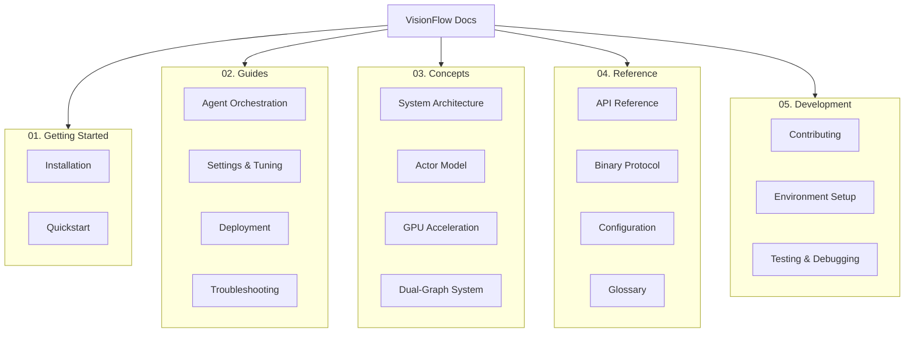

This plan follows documentation best practices by implementing the [Diátaxis framework](https://diataxis.fr/), which organises content into four modes: tutorials, how-to guides, conceptual explanation, and technical reference. This structure is logical, scalable, and user-friendly.

The instructions are broken down into three phases:
1.  **Clean-up**: Aggressively remove obsolete reports, notes, and legacy files.
2.  **Restructure**: Reorganise the remaining files into a clear, hierarchical structure.
3.  **Index**: Establish `docs/README.md` as the primary, user-friendly index for all documentation.

---

Phase 0: refactor ext/README.md as the master github readme with best in class information from across the current version which has duplication and out of date information. choose the best of the mermaid disgrams, keep the image links, and ensure the readme is a complete overview of the project. This will be the main entry point for anyone exploring the project's documentation from the web. Use UK spelling throughout.

### **Phase 1: Aggressive Clean-up**

First, check, intelligently integrate then remove all files that are not part of the living documentation. This includes one-time reports, temporary notes, and summaries of completed tasks. The content of these files is preserved in your Git history and should not clutter the main documentation.

**Action:** Delete the following files and directories.

<details>
<summary><strong>Files and Directories to Delete (Click to expand)</strong></summary>

*   **Entire `reports` directory:**
    *   `docs/reports/`

*   **Root-level reports and summaries:**
    *   `docs/EXECUTIVE_PRODUCTION_SUMMARY.md`
    *   `docs/GPU_SAFETY_IMPLEMENTATION_REPORT.md`
    *   `docs/HIVE_MIND_IMPLEMENTATION_COMPLETE.md`
    *   `docs/IMPLEMENTATION_GAP_ANALYSIS.md`
    *   `docs/PHASE_2_VALIDATION_REPORT.md`
    *   `docs/PRODUCTION_IMPLEMENTATION_COMPLETE.md`
    *   `docs/PRODUCTION_READINESS_ASSESSMENT_PHASE3.md`
    *   `docs/VALIDATION_COMPLETE_REPORT.md`
    *   `docs/panic-fixes-report.md`
    *   `CODEBASE_ISSUES_AUDIT.md`
    *   `DEADLOCK_RECOVERY_SUMMARY.md`
    *   `PHYSICS_PARAMETER_FLOW_COMPLETE_VERIFICATION.md`

*   **Legacy notes and temporary files:**
    *   `docs/README_NEW_FEATURES.md`
    *   `docs/VISUALIZATION_ENHANCEMENTS.md`
    *   `docs/diagnose_issues.md`
    *   `docs/architecture/frontend-mcp-issue.md`

</details>

---

### **Phase 2: Restructure and Consolidate**

Next, create a new, logical directory structure. Move and merge the remaining files into their new locations. This organises content by its purpose, making it easier for users to find what they need.

**Action:** Create the following directory structure and populate it by moving and merging the old files as described in the table below.

#### New Document Tree Structure

```
docs/
├── README.md
├── 01-getting-started/
│   ├── README.md
│   ├── installation.md
│   └── quickstart.md
├── 02-guides/
│   ├── README.md
│   ├── agent-orchestration.md
│   ├── settings-and-tuning.md
│   └── troubleshooting.md
├── 03-concepts/
│   ├── README.md
│   ├── system-architecture.md
│   ├── actor-model.md
│   ├── gpu-acceleration.md
│   └── dual-graph-system.md
├── 04-reference/
│   ├── README.md
│   ├── api.md
│   ├── binary-protocol.md
│   ├── configuration.md
│   └── glossary.md
└── 05-development/
    ├── README.md
    ├── contributing.md
    ├── environment-setup.md
    ├── testing.md
    └── debugging.md
```

#### Content Migration Plan

| New File Path | Action | Source File(s) to Merge and Move |
| :--- | :--- | :--- |
| **Getting Started** |
| `docs/getting-started/README.md` | Create | New index for the section. |
| `docs/getting-started/installation.md` | Move & Merge | `docs/getting-started/installation.md` |
| `docs/getting-started/quickstart.md` | Move & Merge | `docs/getting-started/quickstart.md`, `docs/guides/quick-start.md` |
| **Guides** |
| `docs/guides/README.md` | Create | New index for the section. |
| `docs/guides/agent-orchestration.md` | Move & Merge | `docs/features/agent-orchestration.md`, `docs/MCP_AGENT_VISUALIZATION.md`, `docs/multi-mcp-agent-visualization.md`, `docs/bots-implementation.md`, `docs/architecture/daa-setup-guide.md`, `docs/technical/mcp_tool_usage.md` |
| `docs/guides/settings-and-tuning.md` | Move & Merge | `docs/guides/settings-guide.md`, `docs/features/adaptive-balancing.md`, `docs/features/AUTO_BALANCE.md`, `docs/deadlock_recovery_system.md` |
| `docs/guides/troubleshooting.md` | Move & Merge | `docs/TROUBLESHOOTING.md`, `docs/architecture/gpu-compute-improvements.md` |
| `docs/guides/development-workflow.md` | Move & Merge | `docs/development/index.md` |
| `docs/guides/deployment-with-docker.md`| Move & Merge | `docs/deployment/index.md`, `docs/deployment/docker.md`, `docs/deployment/docker-mcp-integration.md`, `docs/deployment/docker-profiles.md`, `docs/deployment/multi-agent-setup.md` |
| **Concepts** |
| `docs/concepts/README.md` | Create | New index for the section. |
| `docs/concepts/system-architecture.md` | Move & Merge | `docs/architecture/index.md`, `docs/architecture/system-overview.md`, `docs/architecture/data-flow.md`, `docs/technical/decoupled-graph-architecture.md` |
| `docs/concepts/actor-model.md` | Move & Merge | `docs/server/actors.md`, `docs/architecture/claude-flow-actor.md` |
| `docs/concepts/gpu-acceleration.md` | Move & Merge | `docs/architecture/gpu-compute.md`, `docs/server/gpu-compute.md`, `docs/architecture/visionflow-gpu-migration.md` |
| `docs/concepts/dual-graph-system.md` | Move & Merge | `docs/architecture/parallel-graphs.md` |
| **Reference** |
| `docs/reference/README.md` | Create | New index for the section. |
| `docs/reference/api.md` | Move & Merge | `docs/api/index.md`, `docs/api/analytics-endpoints.md`, `docs/api/multi-mcp-visualization-api.md`, `docs/api/rest/graph.md`, `docs/api/rest/settings.md`, `docs/api/websocket-protocols.md` |
| `docs/reference/binary-protocol.md` | Move & Merge | `docs/binary-protocol.md` |
| `docs/reference/configuration.md` | Move & Merge | `docs/CONFIGURATION.md`, `docs/configuration/index.md`, `docs/configuration/quick-reference.md`, `docs/architecture/CASE_CONVERSION.md` |
| `docs/reference/glossary.md` | Move | `docs/glossary.md` |
| **Development** |
| `docs/development/README.md` | Create | New index for the section. |
| `docs/development/contributing.md` | Move | `docs/contributing.md` |
| `docs/development/environment-setup.md` | Move | `docs/development/setup.md` |
| `docs/development/testing.md` | Move | `docs/development/testing.md` |
| `docs/development/debugging.md` | Move | `docs/development/debugging.md` |

---

### **Phase 3: Establish `README.md` as the Primary Index**

Finally, augment the content of `ext/README.md` with a new, well-structured index. This file will become the main entry point for anyone exploring the project's documentation.

**Action:** Replace the contents of `docs/README.md` with the following Markdown, which is an alternative to the existing `ext/README.md`. This new file will serve as the primary index for all documentation.

```markdown
# VisionFlow Documentation

Welcome to the official documentation for VisionFlow, a high-performance, GPU-accelerated platform for real-time 3D visualisation of AI multi-agent systems and knowledge graphs.

This documentation provides a comprehensive guide for users, developers, and operators. Whether you are getting started, developing new features, or deploying to production, you will find the necessary information here.

## Documentation Structure

Our documentation is organised into several key areas to help you find information quickly.



## Quick Links

*   **New to VisionFlow?** Start with the **[Getting Started](./getting-started/README.md)** guide.
*   **Want to perform a specific task?** Check our **[How-to Guides](./guides/README.md)**.
*   **Need to understand the architecture?** Read the **[Concepts](./concepts/README.md)** documentation.
*   **Looking for technical details?** Dive into the **[Reference](./reference/README.md)** section.
*   **Want to contribute?** See the **[Development](./development/README.md)** guides.

## Navigation by Role

### For Users & Analysts
- **Installation**: [getting-started/installation.md](./getting-started/installation.md)
- **First Visualisation**: [getting-started/quickstart.md](./getting-started/quickstart.md)
- **Tuning and Settings**: [guides/settings-and-tuning.md](./guides/settings-and-tuning.md)

### For DevOps & System Administrators
- **Deployment with Docker**: [guides/deployment-with-docker.md](./guides/deployment-with-docker.md)
- **Configuration Reference**: [reference/configuration.md](./reference/configuration.md)
- **Troubleshooting**: [guides/troubleshooting.md](./guides/troubleshooting.md)

### For Developers & Contributors
- **System Architecture**: [concepts/system-architecture.md](./concepts/system-architecture.md)
- **API Reference**: [reference/api.md](./reference/api.md)
- **Development Workflow**: [guides/development-workflow.md](./guides/development-workflow.md)
- **Contributing Guide**: [development/contributing.md](./development/contributing.md)
```