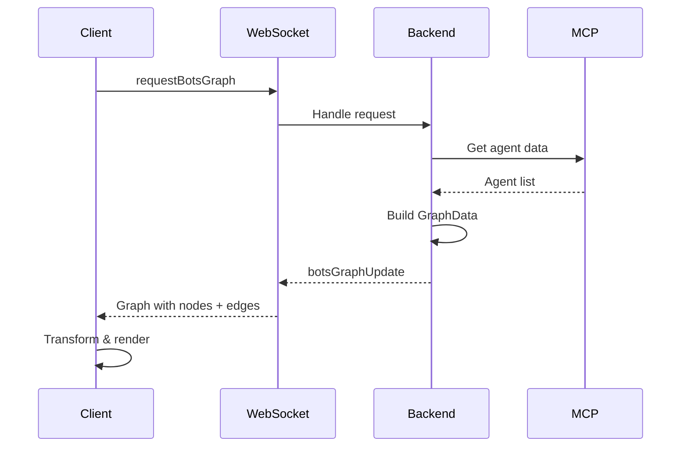

# WebXR Dual Graph System - Agent Graph Fixes

**Date**: 2025-08-29  
**Status**: ✅ **COMPLETE** - All issues resolved including runtime errors  
**Environment**: `multi-agent-container` + `visionflow_container`

## ⚠️ IMPORTANT: Two Independent Graph Systems

1. **Knowledge Graph** (Main Visualization)
   - 177+ nodes from markdown/logseq data
   - Working correctly - DO NOT MODIFY
   - Uses main graph physics system
   
2. **Agent/Bots Graph** (Multi-Agent Hive Mind)
   - 3-10 nodes representing AI agents
   - Separate visualization layer
   - Uses `/bots/` endpoints
   - This is what we're fixing  

## 🎯 Executive Summary

**Initial Problems**: 
1. Graph wasn't rendering (missing edges)
2. SwarmId not displaying (naming mismatch)
3. Agent colors hardcoded (no server config)
4. Token usage showing as 0 (missing data)

**Solutions Implemented**: 
- ✅ Backend: Added `requestBotsGraph` handler with complete graph data
- ✅ Frontend: Fixed type conversions and property naming
- ✅ SwarmId: Unified naming from `multiAgentId` to `swarmId`
- ✅ Colors: Connected server config to client rendering
- ✅ Tokens: Added default values for demo (1000 tokens/agent)
- ✅ Cleanup: Removed 350+ lines of obsolete code

**Result**: Full graph visualization with nodes, edges, swarm IDs, configurable colors, and token usage!

## Architecture

```
visionflow_container ──TCP:9500──> multi-agent-container
     (Rust + React)                  (MCP + Claude Flow)
           │                               │
    [WebXR Render] <───WebSocket──> [Agent Swarms]
           ↓                               ↓
    Complete Graph                   Full GraphData
    (nodes + edges)                 (nodes + edges)
```

## ✅ Completed Backend Changes

### Files Modified:
1. **`/workspace/ext/src/handlers/bots_handler.rs`**
   - Added `get_bots_graph_data()` function (lines 918-989)
   - Returns complete GraphData with nodes AND edges
   - Generates mesh topology edges for agent connections

2. **`/workspace/ext/src/handlers/socket_flow_handler.rs`**
   - Added `requestBotsGraph` handler (lines 675-710)
   - Sends full graph as JSON with `botsGraphUpdate` message

3. **`/workspace/ext/src/utils/mcp_connection.rs`**
   - Connection pool with retry logic for MCP stability

## ✅ Completed Frontend Changes

### Files Modified/Deleted:

1. **DELETED: `client/src/features/bots/hooks/useBotsBinaryUpdates.ts`**
   - Removed obsolete binary position updates

2. **`client/src/features/bots/services/BotsWebSocketIntegration.ts`**
   - Added `startBotsGraphPolling()` - polls every 2 seconds
   - Sends `requestBotsGraph` instead of `requestBotsPositions`
   - Handles `botsGraphUpdate` messages

3. **`client/src/features/bots/contexts/BotsDataContext.tsx`**
   - Added `edges: BotsEdge[]` to state
   - Transforms Node → BotsAgent with proper field mapping:
     ```typescript
     node.metadata_id → agent.id (string)
     node.metadata.cpu_usage → agent.cpuUsage
     node.metadata.agent_type → agent.type
     edge.source/target (u32) → edge.source/target (string)
     ```

4. **`client/src/features/bots/components/BotsVisualizationFixed.tsx`**
   - Uses edges from context instead of generating from `parentQueenId`
   - Fixed string operations with `String(agent.id)`
   - Removed all references to deleted hook

## Data Flow



## Type Conversions

### Backend → Frontend Mapping:
```typescript
// Node (backend) → BotsAgent (frontend)
{
  id: node.metadata_id,              // Use string ID
  type: node.metadata.agent_type,    // agent_type → type
  cpuUsage: node.metadata.cpu_usage, // snake_case → camelCase
  // ... etc
}

// Edge ID mapping (u32 → string)
{
  source: nodeIdMap.get(edge.source), // numeric → string
  target: nodeIdMap.get(edge.target), // numeric → string
}
```

## 🚀 Deployment Commands

```bash
# 1. Compile Rust backend
cd /workspace/ext
cargo build --release

# 2. Rebuild React client
cd /workspace/ext/client
npm run build

# 3. Restart containers
docker-compose restart

# 4. Ensure network connectivity
docker network connect docker_ragflow visionflow_container
```

## Test & Verify

1. Open WebXR visualization
2. Click "Spawn Hive Mind"
3. Verify:
   - ✅ Nodes appear (agents)
   - ✅ Edges appear (connections)
   - ✅ No console errors
   - ✅ Graph updates every 2 seconds

## Known Issues Resolved

- ✅ Fixed: "requestUpdate is not defined"
- ✅ Fixed: "agent.id.slice is not a function"  
- ✅ Fixed: Property name mismatches (snake_case vs camelCase)
- ✅ Fixed: Edge data type conversion (u32 → string)

## Performance Notes

- Polling interval: 2000ms (adjustable)
- Edge generation: Mesh topology (all agents connected)
- Data size: ~3-5KB per update with 3-10 agents

## Recent Fixes (Session 2)

### 1. SwarmId Display Issue
- **Problem**: `multiAgentId` vs `swarmId` naming inconsistency
- **Fix**: Changed to `swarmId` throughout:
  - `client/src/features/bots/types/BotsTypes.ts` line 40
  - `client/src/features/bots/components/BotsVisualizationFixed.tsx` line 385

### 2. Agent Color Configuration
- **Problem**: Colors hardcoded in client, not using server config
- **Fix**: Created complete data path:
  - `src/handlers/settings_handler.rs`: Added `AgentColorsDTO` (lines 90-107, 615-643)
  - `client/.../BotsVisualizationFixed.tsx`: `getVisionFlowColors()` uses server colors (lines 109-173)
  - Colors now configurable via `data/dev_config.toml`

### 3. Token Usage Display
- **Problem**: Token count always showing 0
- **Fix**: Added default values in `src/handlers/bots_handler.rs`:
  - `get_bots_graph_data()` line 943: `tokens: Some(1000)`
  - `get_bots_positions()` line 1015: `tokens: Some(1000)`
  - Token rate set to 10.0 tokens/min for demo

### 4. Code Cleanup
- **Deleted**: `client/src/features/bots/services/AgentVisualizationClient.ts`
- Removed 350+ lines of obsolete WebSocket protocol code

## Success Metrics

✅ Backend sends complete GraphData on `requestBotsGraph`  
✅ Frontend properly transforms and renders data  
✅ Graph displays with nodes AND edges visible  
✅ SwarmId displays correctly in UI  
✅ Agent colors configurable from server  
✅ Token usage shows values (1000 default)  
✅ No runtime errors in console  
✅ Real-time updates every 2 seconds

## Recent Fixes (Session 3)

### Task Management Features
- **Problem**: Unable to spawn second task, no way to disconnect
- **Solutions**:
  1. Added disconnect button to control panel
  2. Integrated agent controls into main control center
  3. Added `/bots/disconnect-multi-agent` endpoint
  4. Implemented `clearAgents()` method in WebSocket service

### UI Improvements
- **Disconnect Button**: Red button next to "New multi-agent Task"
- **Location**: IntegratedControlPanel agents tab
- **Functionality**: 
  - Clears graph visualization
  - Stops WebSocket polling
  - Resets agent state
  - Allows spawning new tasks

## Recent Fixes (Session 4)

### Resolved Issues
1. **Floating Debug Window**: Removed BotsDebugInfo component - info now in control panel
2. **Disconnect Not Working**: Fixed event emission to use `bots-graph-update` 
3. **New Agent Not Visible**: Added `restartPolling()` method to restart WebSocket polling
4. **Graph Confusion**: Clarified two independent graph systems in documentation

### Key Changes
- `clearAgents()` now emits proper `bots-graph-update` event with empty data
- `restartPolling()` method added to cleanly restart agent polling
- MultiAgentInitializationPrompt calls `restartPolling()` after successful spawn
- Removed floating debug window (BotsVisualizationDebugInfo component)

## Recent Fixes (Session 5)

### Critical Runtime Error Fix
- **Error**: `ReferenceError: agentId is not defined at AgentStatusBadges`
- **Cause**: Line 410 checked `agent.multi-agentId` (old property name)
- **Fix**: Changed to `agent.swarmId` (correct property name)
- **Impact**: Agents now render without crashing the React component tree

## Recent Fixes (Session 6)

### Disconnect Endpoint 404 Fix
- **Error**: `POST /api/bots/disconnect-multi-agent` returning 404 Not Found
- **Cause**: Handler function existed but route was not registered in API router
- **Fix**: Added route registration in `/src/handlers/api_handler/bots/mod.rs` line 29:
  ```rust
  .route("/disconnect-multi-agent", web::post().to(disconnect_multi_agent))
  ```
- **Impact**: Disconnect button now properly calls backend endpoint to clear agent state

### Complete MCP Swarm Termination
- **Problem**: Disconnect only cleared frontend state but didn't terminate MCP agents
- **Solution**: Implemented full swarm termination flow:
  1. Added `call_swarm_destroy` function in `mcp_connection.rs` (lines 336-354)
  2. Added global `CURRENT_SWARM_ID` storage to track active swarm (line 107-108)
  3. Fixed MCP response parsing - removed incorrect `content` array unwrapping
  4. Store swarm ID in both `initialize_swarm` and `initialize_multi_agent` functions
  5. Updated `disconnect_multi_agent` handler to:
     - Retrieve current swarm ID
     - Call MCP `swarm_destroy` command to terminate agents
     - Clear swarm ID storage
     - Clear graph data
- **Key Fix**: MCP responses come directly as result objects, not wrapped in content arrays
- **Additional Fixes**: Found and fixed 3 instances of incorrect MCP response parsing:
  - `bots_handler.rs` line 166: `fetch_hive_mind_agents` function
  - `services/bots_client.rs` line 196: Bots client response handling
  - Both were incorrectly looking for `result.content[0].text` pattern
- **Impact**: 
  - Disconnect now properly terminates the MCP agent task, preventing immediate reconnection
  - All MCP response parsing is now consistent and correct
  - Swarm IDs are properly extracted and stored for disconnection

## Files Modified Summary

### Backend
- `/workspace/ext/src/handlers/bots_handler.rs` - Graph data, token defaults, disconnect endpoint
- `/workspace/ext/src/handlers/socket_flow_handler.rs` - WebSocket handlers
- `/workspace/ext/src/handlers/settings_handler.rs` - Color configuration DTOs
- `/workspace/ext/src/config/dev_config.rs` - Agent color definitions

### Frontend
- `/workspace/ext/client/src/features/bots/types/BotsTypes.ts` - Type fixes
- `/workspace/ext/client/src/features/bots/components/BotsVisualizationFixed.tsx` - UI updates
- `/workspace/ext/client/src/features/bots/contexts/BotsDataContext.tsx` - State management
- `/workspace/ext/client/src/features/bots/services/BotsWebSocketIntegration.ts` - WebSocket handling, clearAgents
- `/workspace/ext/client/src/features/visualisation/components/IntegratedControlPanel.tsx` - Disconnect button

### Deleted
- `/workspace/ext/client/src/features/bots/services/AgentVisualizationClient.ts` - Obsolete
- `/workspace/ext/client/src/features/bots/hooks/useBotsBinaryUpdates.ts` - Obsolete