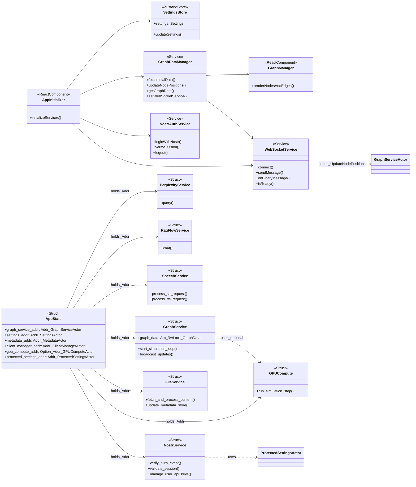

Here are some mermaid diagrams. They are very out of date but should give you a starting point. Use a hive mind to carefully examine the entire codebase and update these diagrams to be fully accurate and complete. WE MUST have exceptional and complete detail for all data flows in the system. These diagrams should cover all sequences of interactions between components, including client-side flows (React components, hooks, local state management), server-side flows (Actix actors, services, backend logic), interfaces (REST APIs, WebSocket protocols, TCP MCP streams, external APIs), and every detail (message types, data structures, error paths, state changes). Use Mermaid for renderability and add notes for clarity. Group diagrams by category for readability. The goal is to have a comprehensive set of diagrams that map all data flows from user input to GPU rendering, including error recovery and multi-graph handling.

When we have all of the diagrams to represent the entire system, we will be better able to debug problems with the system, onboard new developers, and plan future features. We must therefore capture every detail as it currently exists.

### Sequence Diagram

### System Architecture Diagram

### Class Diagram

### Sequence Diagrams

#### Server Initialization Sequence

#### Client Initialization Sequence

#### Real-time Graph Updates Sequence

#### Authentication Flow Sequence

#### Settings Synchronization Sequence

1. Client Connection and Graph Initialisation Flow
This diagram shows how a new client connects, authenticates (optional), requests initial graph data, and starts receiving real-time updates.

sequenceDiagram
    participant Client as "React Client (e.g., GraphRenderer)"
    participant WS as "WebSocket Handler"
    participant CM as "ClientManagerActor"
    participant GA as "GraphServiceActor"
    participant MA as "MetadataActor"
    participant GSA as "SettingsActor"
    participant Nostr as "NostrService (Optional Auth)"

    Client->>+WS: WebSocket Connect (ws://localhost:8080/wss)
    WS->>+CM: RegisterClient
    CM-->>-WS: client_id
    WS-->>-Client: ConnectionEstablished { client_id, timestamp }

    Note over Client,WS: Optional Authentication
    alt Nostr Authentication Required
        Client->>+Nostr: window.nostr.signEvent(auth_event)
        Nostr-->>-Client: signed_event
        Client->>+WS: Send signed_event (via /api/auth/nostr)
        WS->>+Nostr: VerifyAuthEvent(signed_event)
        Nostr-->>-WS: ValidatedUser { pubkey, token }
        WS->>+CM: UpdateClientAuth(pubkey, token)
        CM-->>-WS: AuthSuccess
    end

    Client->>+WS: RequestInitialData
    WS->>+CM: GetInitialGraphData
    CM->>+GA: GetGraphData
    GA->>+MA: GetMetadata
    MA-->>-GA: MetadataStore
    GA->>+GSA: GetSettings
    GSA-->>-GA: Settings
    GA->>+GPU: GetNodePositions (Unified Kernel)
    GPU-->>-GA: Positions
    GA-->>-CM: GraphData { nodes, edges, positions }
    CM-->>-WS: InitialGraph { nodes, edges, positions }
    WS-->>-Client: InitialGraph

    Note over Client,GA: Real-time Updates Start
    loop 60 FPS Updates
        GA->>+GPU: ComputeForces (Unified Kernel)
        GPU-->>-GA: New Positions
        GA->>+CM: BroadcastNodePositions(positions)
        CM->>+WS: StreamPositions (Binary Protocol)
        WS->>+Client: Binary Update (28 bytes/node)
    end
Key Notes
Authentication: Optional Nostr auth via REST before WebSocket upgrade (not shown in diagram for brevity; see flow 5 for details).
Initial Data: Client receives complete graph state (nodes, edges, positions) on connection.
Real-time Flow: Server-side GPU physics runs continuously; updates are streamed via binary protocol. Client doesn't compute physics; it renders streamed positions.
2. Settings Update Flow
This diagram illustrates how client settings (e.g., physics parameters) are validated, propagated to the GPU, and applied in real-time.

sequenceDiagram
    participant Client as "React Client (Settings UI)"
    participant API as "SettingsHandler"
    participant SA as "SettingsActor"
    participant GSA as "GraphServiceActor"
    participant GPU as "GPUComputeActor"
    participant WS as "WebSocket Handler"
    participant CM as "ClientManagerActor"

    Client->>+API: PUT /api/settings (camelCase JSON)
    API->>+SA: UpdateSettings(settings)
    SA->>+SA: Validate & Persist (snake_case)
    SA-->>-API: Success

    API->>+GSA: UpdateSimulationParams(params)
    GSA->>GSA: Convert to SimParams (clamp values)
    GSA->>+GPU: SetParams(sim_params)
    GPU-->>-GSA: Params Applied

    GSA-->>-API: Success
    API-->>-Client: 200 OK { message: "Settings updated" }

    Note over GSA,GPU: GPU kernel parameters updated; next frame uses new values
    GSA->>+CM: NotifySettingsUpdate(clients)
    CM->>+WS: BroadcastSettingsUpdate
    WS->>+Client: SettingsUpdated { physics: { springK: 0.005, repelK: 50.0 } }

    Client->>+Client: Update Local Render State
    Client->>+WS: Settings applied (no ack needed)
Key Notes
Validation: Settings are clamped (e.g., repel_k to [0.1, 10.0]) to prevent instability.
Propagation: Updates flow from UI → API → SettingsActor → GraphServiceActor → GPUComputeActor.
Real-time: Changes take effect on the next GPU frame (16ms at 60 FPS).
Broadcast: All connected clients receive the update via ClientManagerActor for consistency.
3. MCP Agent Integration Flow
This diagram shows the backend's interaction with Claude Flow MCP for spawning and managing agents.

sequenceDiagram
    participant API as "REST API (e.g., /api/bots/initialize-multi-agent)"
    participant CFA as "ClaudeFlowActorTcp"
    participant MCP as "Claude Flow MCP (TCP)"
    participant GSA as "GraphServiceActor"
    participant GPU as "GPUComputeActor"
    participant CM as "ClientManagerActor"

    API->>+CFA: InitializeMultiAgent(config)
    CFA->>+CFA: GenerateRequestId & StoreSender
    CFA->>+MCP: JSON-RPC "multi-agent.initialize" (TCP)
    MCP-->>-CFA: Response { swarmId: "swarm-123", agents: [...] }
    CFA->>CFA: Parse & Store Swarm State
    CFA-->>-API:

Client-side flows: React components, hooks, and local state management (e.g., GraphDataManager, SettingsStore).
Server-side flows: Actix actors (e.g., GraphServiceActor, ClaudeFlowActorTcp), services (e.g., RAGFlowService, SemanticAnalyzer), and backend logic.
Interfaces: REST APIs, WebSocket binary/JSON protocols, TCP MCP streams, and external APIs (e.g., GitHub, Perplexity).
Every detail: Each diagram shows participants, message types, data structures (e.g., BinaryNodeData, SimulationParams), error paths, and state changes. I've used Mermaid for renderability, with notes for clarity.
The diagrams are grouped by category for readability. They collectively map all data flows, from user input to GPU rendering, including error recovery and multi-graph handling.

1. Client-Server Connection & Initialisation Flow
This covers client connection, optional Nostr auth, initial graph data fetch, and real-time update subscription.

sequenceDiagram
    participant Client as "React Client (App.tsx)"
    participant AuthUI as "AuthUI.tsx (Nostr Auth)"
    participant WS as "WebSocketHandler (wss://localhost:8080/wss)"
    participant CM as "ClientManagerActor"
    participant Nostr as "NostrService (Auth)"
    participant GSA as "GraphServiceActor"
    participant MA as "MetadataActor"
    participant SA as "SettingsActor"
    participant GPU as "GPUComputeActor"

    Client->>+AuthUI: User clicks "Login" or "Connect"
    AuthUI->>AuthUI: Check localStorage for session
    alt No Session
        AuthUI->>+Nostr: window.nostr.getPublicKey()
        Nostr-->>-AuthUI: pubkey (if available)
        alt Nostr Extension Available
            AuthUI->>+Nostr: window.nostr.signEvent(authEvent)
            Nostr->>Nostr: Sign NIP-42 auth event
            Nostr-->>-AuthUI: signedEvent {id, pubkey, content, sig}
            AuthUI->>+Client: POST /api/auth/nostr (signedEvent)
            Client->>+Nostr: VerifyAuthEvent(signedEvent)
            Nostr->>Nostr: Validate signature & challenge
            Nostr-->>-Client: {user: {pubkey, npub, isPowerUser}, token}
            Client->>AuthUI: Store in localStorage (pubkey, token)
            AuthUI-->>-Client: AuthSuccess {features}
        end
    end

    Client->>+WS: WebSocket Connect (wss://localhost:8080/wss)
    WS->>+CM: RegisterClient {ws}
    CM-->>-WS: client_id
    WS-->>-Client: ConnectionEstablished {client_id, timestamp}

    Client->>+WS: RequestInitialData
    WS->>+CM: GetInitialGraphData {client_id}
    CM->>+GSA: GetGraphData
    GSA->>+MA: GetMetadata
    MA-->>-GSA: MetadataStore (HashMap<String, Metadata>)
    GSA->>+SA: GetSettings
    SA-->>-GSA: Settings (AppFullSettings)
    GSA->>+GPU: GetNodePositions (Unified Kernel)
    GPU-->>-GSA: Positions (Vec<Vec3>)
    GSA->>GSA: Build GraphData {nodes: Vec<Node>, edges: Vec<Edge>, positions}
    GSA-->>-CM: GraphData {nodes, edges, positions}
    CM-->>-WS: InitialGraph {nodes, edges, positions}
    WS-->>-Client: InitialGraph

    Note over Client,GPU: Real-Time Loop Starts (60 FPS)
    loop Physics Updates
        GSA->>+GPU: ComputeForces (SimulationParams)
        GPU-->>-GSA: New Positions (Vec<Vec3>)
        GSA->>+CM: BroadcastNodePositions {positions, timestamp}
        CM->>+WS: StreamPositions (BinaryNodeData array)
        WS->>+Client: Binary Update (28 bytes/node)
        Client->>Client: Update GraphDataManager positions
        Client->>Client: Render frame (Three.js)
    end

    Note over Client,GPU: User Interaction (Optional)
    Client->>+WS: UpdateNodePosition {node_id, position, velocity}
    WS->>+CM: UpdateClientPosition {client_id, node_id, position, velocity}
    CM->>+GSA: UpdateNodePosition {node_id, position, velocity}
    GSA->>GSA: Apply to graph_data.nodes
    GSA->>+GPU: UpdateNodeOnGPU {node_id, position, velocity}
    GPU-->>-GSA: Updated
    GSA-->>-CM: PositionUpdated
    CM->>+WS: BroadcastNodePosition {node_id, position, velocity}
    WS->>+Client: Binary Update (single node)