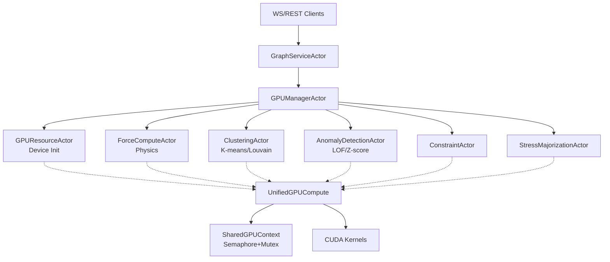

# GPU Physics Engine Audit & Remediation Plan

**Scope:** GPU kernels and orchestration (CUDA/PTX/C++), Rust host/control (actors, FFI, memory, concurrency), clustering/anomaly/layout pipelines, algorithms and performance optimization

**Status:** Active development system - Focus on correctness and performance, defer security/testing frameworks

---

## Quick Navigation

- [Critical Action Items](#critical-action-items-immediate)
- [Performance Optimization Tasks](#performance-optimization-tasks)  
- [Architecture & Algorithms](#architecture-and-algorithms-analysis)
- [Code Inventory](#gpu-kernel-inventory-and-host-orchestration)
- [Validation Strategy](#validation-approach)

---

## Critical Action Items (IMMEDIATE)

### Physics Core - Uninitialized Constant Memory
**Priority: P0 - BLOCKS ALL PHYSICS**
- [ ] **H-01: Fix uninitialized c_params constant memory**
  - **Issue:** [src/utils/visionflow_unified.cu:71](src/utils/visionflow_unified.cu#L71) declares `__constant__ SimParams c_params` but [src/utils/unified_gpu_compute.rs:1027-1030](src/utils/unified_gpu_compute.rs#L1027) never initializes it (only TODO comment at line 601)
  - **Impact:** All physics kernels read zeros for spring_k, repel_k, damping, dt → simulation non-functional
  - **Fix:** Implement `module.get_global("c_params")` + `copy_from(&[params])` in `execute()` before kernel launches
  - **Validation:** Verify non-zero forces, responsive parameter changes, add kernel debug print
  - **Files:** [unified_gpu_compute.rs:1017-1030](src/utils/unified_gpu_compute.rs#L1017), [visionflow_unified.cu:70-128](src/utils/visionflow_unified.cu#L70)

### Concurrency - Deadlock Elimination  
- [ ] **H-02: Fix lock order inversion in GPU arbitration**
  - **Issue:** [src/actors/gpu/shared.rs:354-439](src/actors/gpu/shared.rs#L354) - `acquire_gpu_access` locks semaphore→mutex, `acquire_exclusive_access` locks all-semaphores→mutex → circular wait
  - **Impact:** System deadlock under concurrent GPU access (Thread A holds permit waiting for lock, Thread C holds lock waiting for permits)
  - **Fix:** Replace semaphore+mutex with single `tokio::sync::RwLock` (normal=read, exclusive=write)
  - **Validation:** Stress test with concurrent normal+exclusive access, static lock order analysis
  - **Files:** [shared.rs:407-434](src/actors/gpu/shared.rs#L407)

### Transfer Performance - Synchronous Blocking
- [ ] **H-03: Convert "async" transfers to true async GPU-to-host DMA**
  - **Issue:** [src/utils/unified_gpu_compute.rs:2753-2755](src/utils/unified_gpu_compute.rs#L2753) - `start_position_transfer_async()` uses blocking `copy_to()`, events recorded after completion
  - **CPU-side AABB bottleneck:** [unified_gpu_compute.rs:1093-1114](src/utils/unified_gpu_compute.rs#L1093) - Full position sync + CPU loop every frame
  - **Impact:** CPU blocked 2-5ms/transfer, no compute/transfer overlap, double-buffering provides zero benefit
  - **Fix:**
    - Replace `copy_to()` with `async_copy_to(&transfer_stream)` (if available in cust)
    - Move AABB to GPU reduction kernel
    - Remove busy-wait loops in `get_node_positions_async()`
  - **Validation:** nsys profile showing DtoH/kernel overlap, 2-5ms latency reduction
  - **Files:** [unified_gpu_compute.rs:2728-2762](src/utils/unified_gpu_compute.rs#L2728), [unified_gpu_compute.rs:1093-1114](src/utils/unified_gpu_compute.rs#L1093)

---

## Performance Optimization Tasks

### Algorithmic Scalability - O(n²) → O(n log n)
- [ ] **H-04: Replace O(n²)/O(n³) stress majorization with approximations**
  - **Issue:**
    - [gpu_clustering_kernels.cu:570-640](src/utils/gpu_clustering_kernels.cu#L570) - `stress_majorization_step_kernel` has nested loop `for(j=0; j<num_nodes; j++)` inside per-node kernel
    - [physics/stress_majorization.rs:263-273](src/physics/stress_majorization.rs#L263) - Floyd-Warshall O(n³) for all-pairs shortest paths
  - **Impact:** 10k nodes = 100M ops/step, not interactive; 100k nodes impossible
  - **Fix:**
    - Replace Floyd-Warshall with landmark/pivot SSSP (sample k pivots, approximate distances)
    - Implement Barnes-Hut or FMM for force aggregation  
    - Add multi-level coarsening strategy
  - **Validation:** Benchmark 1k/5k/10k nodes, verify near-linear scaling, visual layout quality check
  - **Files:** [gpu_clustering_kernels.cu:538-650](src/utils/gpu_clustering_kernels.cu#L538), [stress_majorization.rs:245-287](src/physics/stress_majorization.rs#L245)

### K-means Initialization - Serial GPU Usage
- [ ] **M-01: Parallelize K-means++ seeding**
  - **Issue:** [gpu_clustering_kernels.cu:75-93](src/utils/gpu_clustering_kernels.cu#L75) - `threadIdx.x==0` performs serial loops over all nodes for weighted sampling
  - **Impact:** GPU used as single-threaded CPU, bottleneck for large k or datasets
  - **Fix:**
    - Parallel reduction for `total_weight` sum (CUB library or custom kernel)
    - Parallel search via Thrust `upper_bound` on prefix sum
  - **Validation:** Benchmark k=50, 100k nodes; expect 10-100x speedup
  - **Files:** [gpu_clustering_kernels.cu:40-95](src/utils/gpu_clustering_kernels.cu#L40)

### Actor Memory Tracking - Excessive Task Spawning
- [ ] **M-02: Remove tokio::spawn from hot path memory tracking**
  - **Issue:** [src/utils/gpu_memory.rs:50-86](src/utils/gpu_memory.rs#L50) - Every allocation/deallocation spawns async task to update HashMap
  - **Impact:** Scheduler contention, high overhead for frequent alloc/dealloc
  - **Fix:**
    - Replace `Arc<tokio::sync::Mutex<HashMap>>` with `Arc<std::sync::Mutex<HashMap>>`
    - Replace total counter with `Arc<AtomicUsize>`
  - **Validation:** Profile tight alloc/dealloc loop, verify no task spawning
  - **Files:** [gpu_memory.rs:50-86](src/utils/gpu_memory.rs#L50)

### Memory Management - Module Consolidation
- [ ] **M-03: Merge redundant GPU memory/safety modules**
  - **Issue:** Three overlapping trackers: [gpu_memory.rs](src/utils/gpu_memory.rs) (ManagedDeviceBuffer), [gpu_safety.rs](src/utils/gpu_safety.rs) (GPUSafetyValidator), [memory_bounds.rs](src/utils/memory_bounds.rs) (MemoryBoundsRegistry)
  - **Impact:** Confusion, maintenance burden, inconsistent tracking
  - **Fix:** Consolidate into single `gpu_safety.rs` module with unified SafeDeviceBuffer wrapper
  - **Validation:** Delete redundant files, full test suite passes
  - **Files:** [gpu_memory.rs](src/utils/gpu_memory.rs), [gpu_safety.rs](src/utils/gpu_safety.rs), [memory_bounds.rs](src/utils/memory_bounds.rs)

---

## Architecture and Algorithms Analysis

### Validated Findings

#### Physics Pipeline Correctness ✓
**Status:** Core design sound, initialization critical bug blocks execution

- Grid-based repulsion: O(n) to O(n log n) with bounded cell occupancy ✓
- CSR spring forces: O(m) complexity ✓
- Auto-tuned spatial hashing: [unified_gpu_compute.rs:1115-1129](src/utils/unified_gpu_compute.rs#L1115) - Dynamic cell sizing 4-16 neighbors/cell ✓
- Stability gates: [visionflow_unified_stability.cu](src/utils/visionflow_unified_stability.cu) - GPU-side kinetic energy reduction ✓
- **BLOCKER:** Constant memory never initialized → all kernel params are zero

#### Clustering Algorithms ✓
**Status:** Implementations correct, K-means seeding suboptimal

- K-means: O(nk) per iteration, appropriate for k≤50 ✓
- LOF: Grid-bounded KNN with K≤32, scales 10k-100k ✓
- Louvain/Label Propagation: O(m*iters), atomic contention on community updates (acceptable) ✓
- **ISSUE:** Serial seeding (M-01) prevents GPU utilization

#### Graph Algorithms ✓
**Status:** SSSP correct, stress majorization requires replacement

- SSSP Compaction: [sssp_compact.cu](src/utils/sssp_compact.cu) - Atomic frontier building O(n), simple and fast for sparse frontiers ✓
- **BLOCKER:** Stress majorization O(n²) kernels + O(n³) Floyd-Warshall cannot scale (H-04)

#### Actor Orchestration ✓
**Status:** Clean design, one concurrency hazard



- Actor isolation and message passing: Clean ✓
- **ISSUE:** SharedGPUContext deadlock (H-02)

---

## GPU Kernel Inventory and Host Orchestration

### CUDA Kernels by Module

#### [visionflow_unified.cu](src/utils/visionflow_unified.cu) - Primary Physics
- `__constant__ SimParams c_params` (line 71) - **UNINITIALIZED**
- `build_grid_kernel` - Spatial hash grid construction
- `force_pass_kernel` - Grid-based repulsion + CSR springs
- `integrate_pass_kernel` - Velocity integration + damping
- Constraint kernels (distance/position/angle/semantic/temporal/group)
- Host: [unified_gpu_compute.rs:1017-1199](src/utils/unified_gpu_compute.rs#L1017)

#### [gpu_clustering_kernels.cu](src/utils/gpu_clustering_kernels.cu) - Analytics
- `init_centroids_kernel` (line 40) - K-means++ (serial issue M-01)
- `assign_clusters_kernel` - Parallel assignment
- `update_centroids_kernel` - Block reductions
- `compute_lof_kernel` - Local outlier factor
- `louvain_local_pass_kernel` - Community detection
- `compute_stress_kernel` (line 538) - O(n²) pairwise stress
- `stress_majorization_step_kernel` (line 570) - O(n²) nested loop
- Host: [unified_gpu_compute.rs:1600-1730](src/utils/unified_gpu_compute.rs#L1600) (K-means), [1732-1776](src/utils/unified_gpu_compute.rs#L1732) (LOF)

#### [visionflow_unified_stability.cu](src/utils/visionflow_unified_stability.cu) - Performance Gates
- `calculate_kinetic_energy_kernel` - Block-level reduction
- `check_system_stability_kernel` - Skip physics if stable
- Host: [unified_gpu_compute.rs:1042-1087](src/utils/unified_gpu_compute.rs#L1042)

#### [sssp_compact.cu](src/utils/sssp_compact.cu) - Graph Utilities
- `compact_frontier_atomic_kernel` - Atomic frontier compaction O(n)
- Host: Wrapper with async stream argument

#### [dynamic_grid.cu](src/utils/dynamic_grid.cu) - Occupancy Tuning
- `calculate_grid_config` - cudaOccupancyMaxPotentialBlockSize
- **ISSUE (L-01):** Passes `nullptr` for kernel function (lines 173/183/195) → heuristic fallback

### Rust Actor Mapping

| Actor | File | GPU Methods | Status |
|-------|------|-------------|--------|
| GPUResourceActor | [gpu_resource_actor.rs](src/actors/gpu/gpu_resource_actor.rs) | Device init, PTX load | ✓ Functional |
| ForceComputeActor | [force_compute_actor.rs](src/actors/gpu/force_compute_actor.rs) | `execute()` physics step | ⚠ H-01 blocks |
| ClusteringActor | [clustering_actor.rs](src/actors/gpu/clustering_actor.rs) | K-means, Louvain | ⚠ Handler stubs (L-02) |
| AnomalyDetectionActor | [anomaly_detection_actor.rs](src/actors/gpu/anomaly_detection_actor.rs) | LOF, Z-score | ✓ Functional |
| ConstraintActor | [constraint_actor.rs](src/actors/gpu/constraint_actor.rs) | Constraint forces | ✓ Functional |
| StressMajorizationActor | [stress_majorization_actor.rs](src/actors/gpu/stress_majorization_actor.rs) | Stress minimize | ⚠ H-04 scalability |

---

## Deferred Issues (Lower Priority for Dev Environment)

### Incomplete Implementations
- [ ] **L-02: Complete stubbed actor handlers**
  - [clustering_actor.rs:555-576](src/actors/gpu/clustering_actor.rs#L555) - `RunKMeans` handler returns error
  - [clustering_actor.rs:578-584](src/actors/gpu/clustering_actor.rs#L578) - `RunCommunityDetection` handler returns error
  - [async_improvements.rs:46](src/utils/async_improvements.rs#L46) - MCPConnectionPool stub
  - [gpu_diagnostics.rs:120](src/utils/gpu_diagnostics.rs#L120) - GPU testing disabled warning

### Occupancy Optimization
- [ ] **L-01: Pass actual kernel pointers to occupancy calculator**
  - [dynamic_grid.cu:173,183,195](src/utils/dynamic_grid.cu#L173) - `nullptr` forces heuristic mode
  - **Fix:** Export kernel symbols and pass real function pointers
  - **Impact:** Minor - may improve occupancy by 5-10%

---

## Validation Approach

### For Each Critical Fix (H-01, H-02, H-03)

#### Unit Testing
```rust
// H-01: Physics parameter propagation
#[test]
fn test_constant_memory_initialization() {
    let params = SimParams { repel_k: 100.0, spring_k: 0.5, dt: 0.016, .. };
    let mut compute = UnifiedGPUCompute::new(100);
    compute.execute(params).unwrap();
    // Add kernel that prints params in thread 0
    // Verify non-zero values in debug output
}

// H-02: Lock ordering
#[tokio::test]
async fn test_concurrent_gpu_access() {
    let ctx = SharedGPUContext::new();
    let handles: Vec<_> = (0..100).map(|i| {
        let ctx = ctx.clone();
        tokio::spawn(async move {
            if i % 10 == 0 {
                ctx.acquire_exclusive_access().await.unwrap();
            } else {
                ctx.acquire_gpu_access().await.unwrap();
            }
        })
    }).collect();
    for h in handles { h.await.unwrap(); }
    // Should complete without deadlock
}
```

#### Performance Profiling
```bash
# H-03: Async transfer validation
nsys profile -t cuda,nvtx --stats=true ./target/release/app
# Expected: DtoH memcpy overlaps with kernel execution on timeline

# H-04: Stress majorization scaling
hyperfine \
  './stress_bench --nodes 1000' \
  './stress_bench --nodes 5000' \
  './stress_bench --nodes 10000'
# Expected: Sub-quadratic growth after fix
```

#### Visual Verification
- H-01: Graph responds to parameter slider changes in real-time
- H-04: 10k node stress layout completes in <100ms per iteration

---

## Algorithm Complexity Reference

| Algorithm | Current | Target | Scalability |
|-----------|---------|--------|-------------|
| Grid repulsion | O(n log n) | ✓ Optimal | 100k nodes |
| CSR springs | O(m) | ✓ Optimal | 1M edges |
| K-means | O(nk) | ✓ Good | k≤50 |
| K-means++ seed | O(n*k) serial | O(n*k) parallel | 10-100x faster |
| LOF | O(n*K²) grid | ✓ Good | K≤32 |
| Louvain | O(m*iters) | ✓ Good | Sparse graphs |
| SSSP compact | O(n) atomic | ✓ Good | Sparse frontiers |
| Stress (kernel) | O(n²) | O(n log n)† | ⚠ Blocks >5k |
| APSP (host) | O(n³) | O(k*n log n)† | ⚠ Blocks >1k |

† Requires Barnes-Hut/FMM or landmark approximation

---

## Original Audit Documentation (Archived)

<details>
<summary>Click to expand original detailed audit findings</summary>

### Executive Summary

This audit evaluated the repository for correctness, safety, concurrency, performance, maintainability, security, and operational readiness. The system demonstrates a thoughtful actor-based design and significant investment in GPU acceleration (grid-based repulsion, k-means, LOF, label propagation/Louvain, SSSP compaction, and stress majorization). However, several critical issues risk incorrect physics, deadlocks, poor performance, and brittle operations:

Top Risks (prioritized)

1) Physics kernels read constant memory parameters that are never initialized on-device
- Most force/integration kernels dereference a constant memory struct (c_params) but the host code never writes those values. This yields undefined/zero parameters, incorrect forces/damping, and overall unstable/ineffective physics.
- Files: [src/utils/visionflow_unified.cu](src/utils/visionflow_unified.cu), [src/utils/unified_gpu_compute.rs](src/utils/unified_gpu_compute.rs)

2) Deadlock risk in GPU access arbitration (lock order inversion)
- Exclusive access uses different lock order than batched/normal access, enabling a classic circular wait scenario under contention.
- File: [src/actors/gpu/shared.rs](src/actors/gpu/shared.rs)

3) "Async" transfers are synchronous; CPU copies in the hot loop
- get_node_positions_async/get_node_velocities_async internally call synchronous copies, record events after-the-fact, and busy-spin on events; AABB is computed on the CPU every frame after copying full positions from device.
- File: [src/utils/unified_gpu_compute.rs](src/utils/unified_gpu_compute.rs)

4) Mixed CUDA frameworks and unused stream: separate cust (driver) context and cudarc device/stream are created and tracked; unified compute never uses the cudarc stream. This adds confusion, resource duplication, and potential maintenance hazards.
- Files: [src/actors/gpu/gpu_resource_actor.rs](src/actors/gpu/gpu_resource_actor.rs), [src/actors/gpu/shared.rs](src/actors/gpu/shared.rs), [src/utils/unified_gpu_compute.rs](src/utils/unified_gpu_compute.rs)

5) Unbounded O(n²) paths (stress majorization, pairwise stress and CPU-side AABB) will not scale beyond modest sizes and will starve long-term frame budgets on A6000 for higher node counts (even at one-tenth SLO scale).
- Files: [src/utils/gpu_clustering_kernels.cu](src/utils/gpu_clustering_kernels.cu), [src/utils/unified_gpu_compute.rs](src/utils/unified_gpu_compute.rs), [src/physics/stress_majorization.rs](src/physics/stress_majorization.rs)

6) Concurrency hygiene: tokio::spawn in non-async contexts (GPU memory tracker), global env mutations at runtime, Docker/systemctl execs from within process, and partially implemented clustering actor paths.
- Files: [src/utils/gpu_memory.rs](src/utils/gpu_memory.rs), [src/utils/gpu_diagnostics.rs](src/utils/gpu_diagnostics.rs), [src/utils/hybrid_fault_tolerance.rs](src/utils/hybrid_fault_tolerance.rs), [src/actors/gpu/clustering_actor.rs](src/actors/gpu/clustering_actor.rs)

Key Expected Impact if Remediated

- Correct physics layout dynamics, improved stability and determinism
- Removal of deadlock class, higher tail availability
- 2–5× improvement in end-to-end step latency from true async DMA and device-side reductions
- Clearer device/stream lifecycle, safer memory accounting
- Stronger observability for kernel timings, occupancy, and queue depth
- Operationally safer behavior on shared hosts (no privileged restarts and predictable backpressure)

</details>
